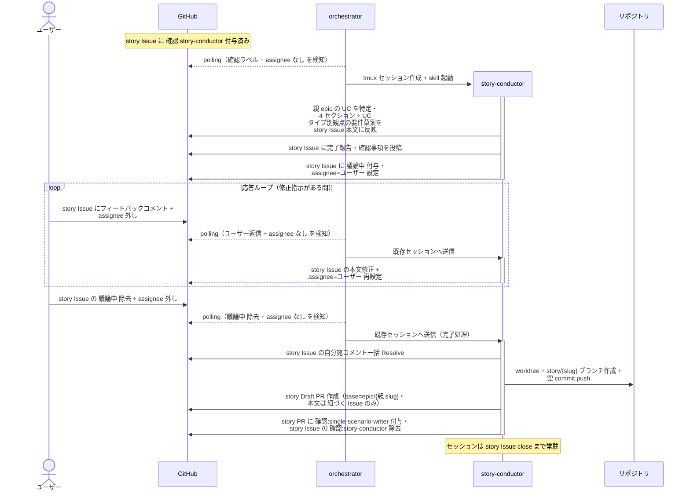

# story要件確定

story-conductor が story Issue の本文（前提条件 / 概要 / 背景 / ユースケース要件）を確定する単一ユースケース。

対応モニター: `story-conductor`（初回呼び出し）

## 正常シナリオ

### 前提条件

| No | セットアップ | 説明 | 補足 |
| --- | --- | --- | --- |
| 1 | story Issue | `layer:story` + `確認:story-conductor` 付きで存在 | 親 epic と Sub-issue リンク済み・本文は空 |
| 2 | 親 epic Issue | ユースケース一覧 + 横断要件 確定済み | UC 番号との対応を背景に書く元ネタ |
| 3 | assignee | 未設定 | モニター起動条件 |

### 図

**期待動作:**
- story Issue 本文に `## 前提条件` / `## 概要` / `## 背景` / `## ユースケース要件` が揃っている
- `## 背景` に「親 epic #N の UC No.X「{UC 名}」に対応」の 1 行が含まれる
- 横断要件を参照する要件行の補足に `epic 横断要件 #N に基づく` が明記されている
- story Draft PR（base=epic/{親 slug}・本文は `## 紐づく Issue` のみ）が作成され、`確認:single-scenario-writer` が付与されている

## 異常シナリオ（該当なし）

なし。
