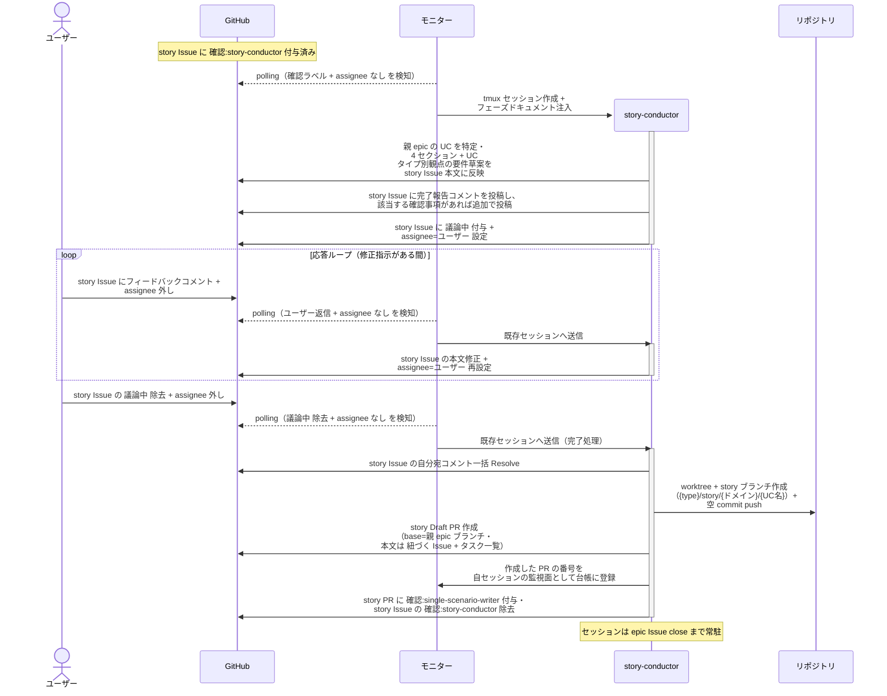
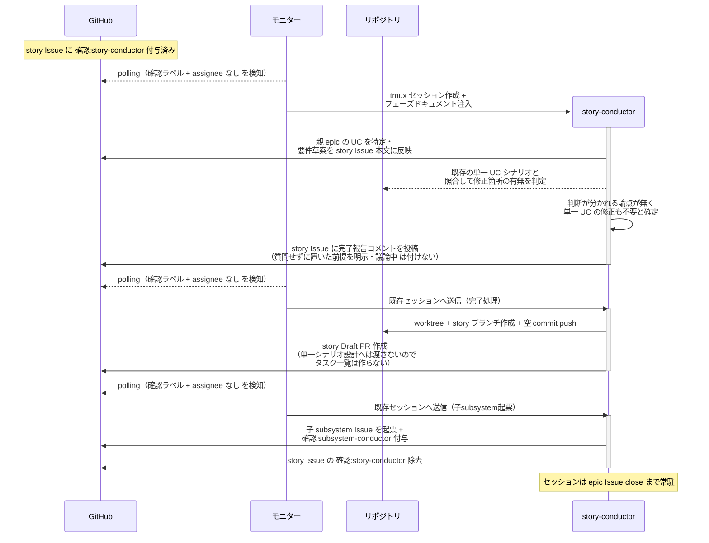
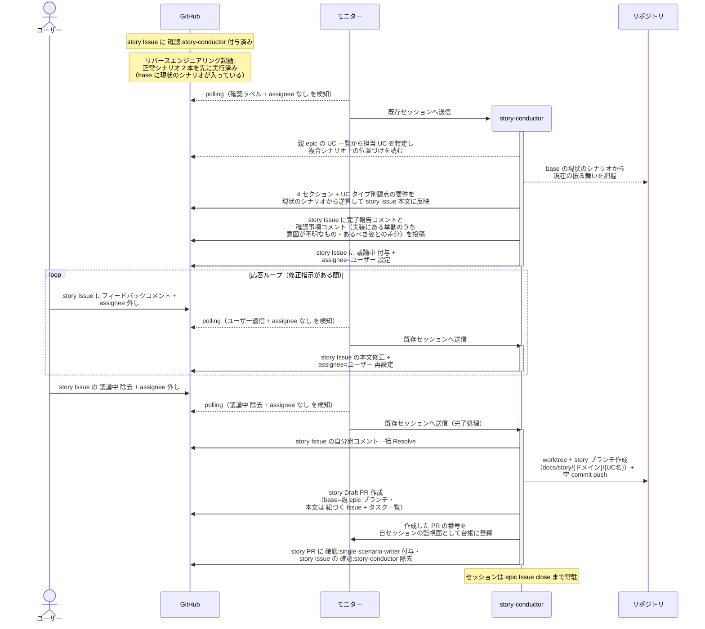

# story要件確定

story-conductor が story Issue の本文（概要 / 背景 / ユースケース要件）を確定する単一ユースケース。

対応エージェント: `story-conductor`（初回呼び出し）

- 対応テストファイル: `tests/e2e/単一ユースケース/test_story要件確定.py`

## 正常シナリオ

### セットアップ

| セットアップ | 説明 | 補足 |
| --- | --- | --- |
| Mock | なし（実環境で実行） | - |
| story Issue | `layer:story` + `確認:story-conductor` 付きで存在 | 親 epic と Sub-issue リンク済み・本文は空 |
| 親 epic Issue | ユースケース一覧 + 横断要件 確定済み | UC 番号との対応を背景に書く元ネタ |
| assignee | 未設定 | エージェント起動条件 |

### フロー

```mermaid
sequenceDiagram
  actor U as ユーザー
  participant GH as GitHub
  participant ORC as モニター

  Note over GH: story Issue に 確認:story-conductor 付与済み
  ORC-->>GH: polling（確認ラベル + assignee なし を検知）
  create participant MON as story-conductor
  ORC->>MON: tmux セッション作成 +<br>フェーズドキュメント注入
  participant REPO as リポジトリ
  activate MON
  MON->>GH: 親 epic の UC を特定・<br>4 セクション + UC<br>タイプ別観点の要件草案を<br>story Issue 本文に反映
  MON->>GH: story Issue に完了報告コメントを投稿し、<br>該当する確認事項があれば追加で投稿
  MON->>GH: story Issue に 議論中 付与 +<br>assignee=ユーザー 設定
  deactivate MON

  loop 応答ループ（修正指示がある間）
    U->>GH: story Issue にフィードバックコメント +<br>assignee 外し
    ORC-->>GH: polling（ユーザー返信 + assignee なし を検知）
    ORC->>MON: 既存セッションへ送信
    activate MON
    MON->>GH: story Issue の本文修正 +<br>assignee=ユーザー 再設定
    deactivate MON
  end

  U->>GH: story Issue の 議論中 除去 + assignee 外し
  ORC-->>GH: polling（議論中 除去 + assignee なし を検知）
  ORC->>MON: 既存セッションへ送信（完了処理）
  activate MON
  MON->>GH: story Issue の自分宛コメント一括 Resolve
  MON->>REPO: worktree + story ブランチ作成<br>（{type}/story/{ドメイン}/{UC名}）+<br>空 commit push
  MON->>GH: story Draft PR 作成<br>（base=親 epic ブランチ・<br>本文は 紐づく Issue + タスク一覧）
  MON->>ORC: 作成した PR の番号を<br>自セッションの監視面として台帳に登録
  MON->>GH: story PR に 確認:single-scenario-writer 付与・<br>story Issue の 確認:story-conductor 除去
  deactivate MON
  Note over MON: セッションは epic Issue close まで常駐
```

### 期待値

- story Issue 本文に `## 概要` / `## 背景` / `## ユースケース要件` が揃っている
- `## 背景` に「親 epic #N の UC「{UC 名}」に対応」の 1 行が含まれる
- `## 背景` に親 epic の ユースケース一覧 から読んだ担当 UC の `変更種別` が書き写されている（下位レイヤーが既存実装の調査要否を判断する材料）
- 横断要件を参照する要件行の補足に `epic 横断要件「{要件の要旨}」に基づく` が明記されている
- RE PR が先に作られてマージされ、base に現状のシナリオが入っている
- story Draft PR（base=親 epic ブランチ・本文に `## 紐づく Issue` と `## タスク一覧`）が作成され、`確認:single-scenario-writer` が付与されている
- `## タスク一覧` に単一 UC シナリオの作成 / 修正・シナリオ索引の更新・単一 UC E2E テストの実行が列挙され、全行が未チェック（チェックは各行を担当した作業者が入れる）
- 作成した PR の番号が自セッションの監視面（モニターの台帳）に登録されている

## 正常シナリオ（確認事項なし・単一 UC 影響なし）

### セットアップ

| セットアップ | 説明 | 補足 |
| --- | --- | --- |
| Mock | なし（実環境で実行） | - |
| story Issue | `layer:story` + `確認:story-conductor` 付きで存在 | 親 epic と Sub-issue リンク済み・本文は空 |
| 親 epic Issue | ユースケース一覧に複合 UC への影響なしと記録済み | 上位が素通しで降ろしてきた状態。担当 UC の `変更種別` は `変更` |
| 既存の設計書 | 対象の単一 UC シナリオが master に存在する | 修正箇所の有無を判定する材料 |
| assignee | 未設定 | エージェント起動条件 |

### フロー

```mermaid
sequenceDiagram
  participant GH as GitHub
  participant ORC as モニター
  participant REPO as リポジトリ

  Note over GH: story Issue に 確認:story-conductor 付与済み
  ORC-->>GH: polling（確認ラベル + assignee なし を検知）
  create participant MON as story-conductor
  ORC->>MON: tmux セッション作成 +<br>フェーズドキュメント注入
  activate MON
  MON->>GH: 親 epic の UC を特定・<br>要件草案を story Issue 本文に反映
  MON-->>REPO: 既存の単一 UC シナリオと<br>照合して修正箇所の有無を判定
  MON->>MON: 判断が分かれる論点が無く<br>単一 UC の修正も不要と確定
  MON->>GH: story Issue に完了報告コメントを投稿<br>（質問せずに置いた前提を明示・議論中 は付けない）
  deactivate MON

  ORC-->>GH: polling（確認ラベル + assignee なし を検知）
  ORC->>MON: 既存セッションへ送信（完了処理）
  activate MON
  MON->>REPO: worktree + story ブランチ作成 + 空 commit push
  MON->>GH: story Draft PR 作成<br>（単一シナリオ設計へは渡さないので<br>タスク一覧は作らない）
  deactivate MON

  ORC-->>GH: polling（確認ラベル + assignee なし を検知）
  ORC->>MON: 既存セッションへ送信（子subsystem起票）
  activate MON
  MON->>GH: 子 subsystem Issue を起票 +<br>確認:subsystem-conductor 付与
  MON->>GH: story Issue の 確認:story-conductor 除去
  deactivate MON
  Note over MON: セッションは epic Issue close まで常駐
```

### 期待値

- 確認事項コメントが 1 件も投稿されていない
- 担当 UC の `変更種別` が `変更` のため、既存の単一 UC シナリオと照合したうえで修正不要と判断している
- `議論中` が付与されず assignee も設定されていない（ユーザーを止めずに通り抜けている）
- 完了報告コメントに、質問せずに前提として置いた判断とその根拠が書かれている
- story Draft PR が作成され、`確認:single-scenario-writer` が付与されていない
- story PR の本文に `## タスク一覧` が無い（story PR 上で作業する担当が居ないため）
- 子 subsystem Issue が起票され `確認:subsystem-conductor` が付与されている
- story Issue から `確認:story-conductor` が除去されている

## 正常シナリオ（リバースエンジニアリング）

### セットアップ

| セットアップ | 説明 | 補足 |
| --- | --- | --- |
| Mock | なし（実環境で実行） | - |
| `リバースエンジニアリング` ラベル | 対象の Issue / PR に付与済み | 本経路を選ぶ判定材料。ユーザーが system Issue に付け、子 Issue へ引き継がれる |
| story Issue | `layer:story` + `type:docs` + `確認:story-conductor` 付きで存在 | 親 epic と Sub-issue リンク済み・本文は空 |
| 親 epic Issue | `type:docs` でユースケース一覧 + 横断要件 確定済み | 担当 UC の特定元 |
| 親 epic PR | 複合ユースケースシナリオが commit 済み | UC の位置づけの参照元 |
| assignee | 未設定 | エージェント起動条件 |
| 現状のシナリオ | 当該 UC のシナリオが現状の内容で base に存在 | RE PR がマージ済みであることが前提 |

### フロー

```mermaid
sequenceDiagram
  actor U as ユーザー
  participant GH as GitHub
  participant ORC as モニター

  Note over GH: story Issue に 確認:story-conductor 付与済み
  Note over GH: リバースエンジニアリング起動:<br>正常シナリオ 2 本を先に実行済み<br>（base に現状のシナリオが入っている）
  ORC-->>GH: polling（確認ラベル + assignee なし を検知）
  create participant MON as story-conductor
  ORC->>MON: 既存セッションへ送信
  participant REPO as リポジトリ
  activate MON
  MON-->>GH: 親 epic の UC 一覧から担当 UC を特定し<br>複合シナリオ上の位置づけを読む
  MON-->>REPO: base の現状のシナリオから<br>現在の振る舞いを把握
  MON->>GH: 4 セクション + UC タイプ別観点の要件を<br>現状のシナリオから逆算して story Issue 本文に反映
  MON->>GH: story Issue に完了報告コメントと<br>確認事項コメント（実装にある挙動のうち<br>意図が不明なもの・あるべき姿との差分）を投稿
  MON->>GH: story Issue に 議論中 付与 +<br>assignee=ユーザー 設定
  deactivate MON

  loop 応答ループ（修正指示がある間）
    U->>GH: story Issue にフィードバックコメント +<br>assignee 外し
    ORC-->>GH: polling（ユーザー返信 + assignee なし を検知）
    ORC->>MON: 既存セッションへ送信
    activate MON
    MON->>GH: story Issue の本文修正 +<br>assignee=ユーザー 再設定
    deactivate MON
  end

  U->>GH: story Issue の 議論中 除去 + assignee 外し
  ORC-->>GH: polling（議論中 除去 + assignee なし を検知）
  ORC->>MON: 既存セッションへ送信（完了処理）
  activate MON
  MON->>GH: story Issue の自分宛コメント一括 Resolve
  MON->>REPO: worktree + story ブランチ作成<br>（docs/story/{ドメイン}/{UC名}）+<br>空 commit push
  MON->>GH: story Draft PR 作成<br>（base=親 epic ブランチ・<br>本文は 紐づく Issue + タスク一覧）
  MON->>ORC: 作成した PR の番号を<br>自セッションの監視面として台帳に登録
  MON->>GH: story PR に 確認:single-scenario-writer 付与・<br>story Issue の 確認:story-conductor 除去
  deactivate MON
  Note over MON: セッションは epic Issue close まで常駐
```

### 期待値

- story Issue 本文に `## 概要` / `## 背景` / `## ユースケース要件` が揃っている
- `## 背景` に「親 epic #N の UC「{UC 名}」に対応」の 1 行が含まれる
- `## 背景` に親 epic の ユースケース一覧 から読んだ担当 UC の `変更種別` が書き写されている（下位レイヤーが既存実装の調査要否を判断する材料）
- `## ユースケース要件` の各行が現状のシナリオの振る舞い、またはユーザーが承認したあるべき姿になっている
- story-conductor が実装コードを読み出した記録がない（入力は親 epic の UC 一覧と base のシナリオに閉じる）
- 現状のシナリオから意図が読み取れなかった挙動が確認事項コメントに挙がり、ユーザー判断が本文に反映されている
- story Draft PR（base=親 epic ブランチ・本文に `## 紐づく Issue` と `## タスク一覧`）が作成され、`確認:single-scenario-writer` が付与されている
- `## タスク一覧` に単一 UC シナリオの作成 / 修正・シナリオ索引の更新・単一 UC E2E テストの実行が列挙され、全行が未チェック（チェックは各行を担当した作業者が入れる）
- 作成した PR の番号が自セッションの監視面（モニターの台帳）に登録されている

## 異常シナリオ

なし
