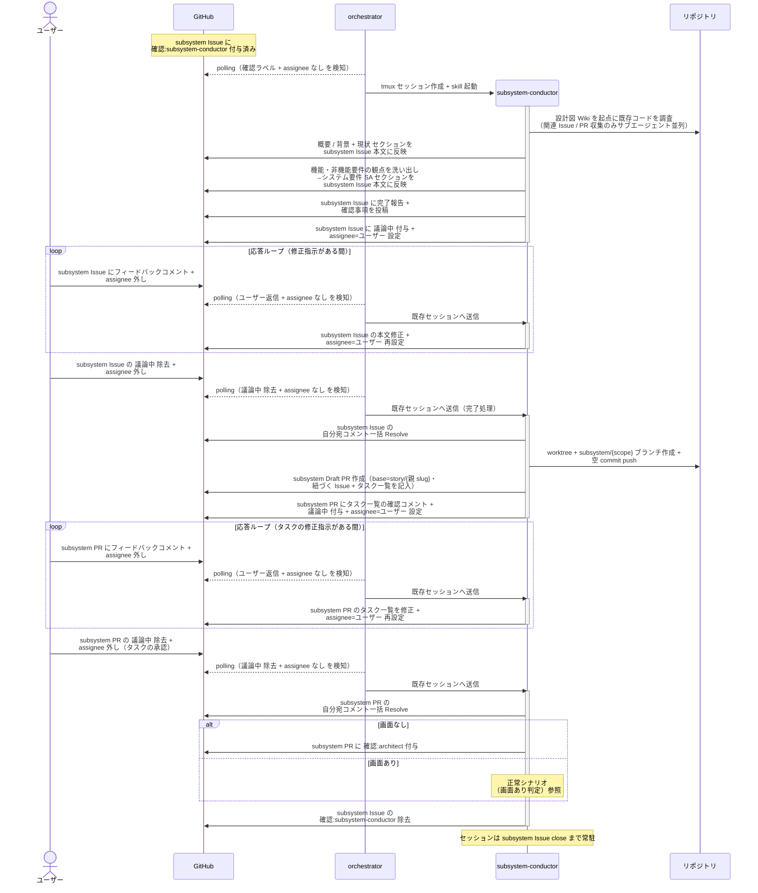
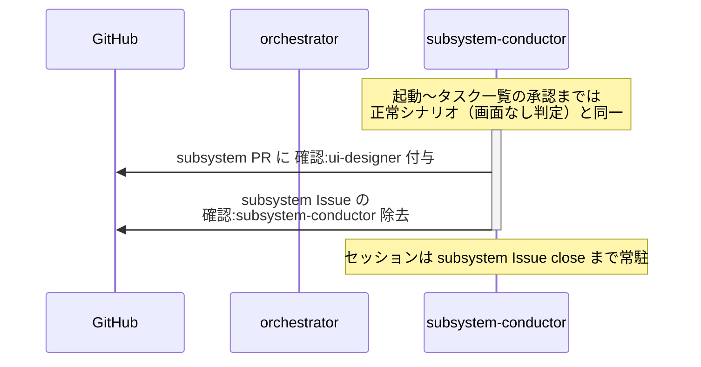

# subsystem要件確定

subsystem-conductor が subsystem Issue の本文整形 + 現状調査（既存コード・関連テスト・関連 Issue/PR・再現ログ）+ システム要件（機能 / 非機能 / スコープ外）確定を行い、完了時に subsystem Draft PR を作成して画面あり / なしで次モニターを振り分ける単一ユースケース。

対応モニター: `subsystem-conductor`

## 正常シナリオ（画面なし判定）

### 前提条件

| No | セットアップ | 説明 | 補足 |
| --- | --- | --- | --- |
| 1 | subsystem Issue | `layer:subsystem` + `確認:subsystem-conductor` 付きで存在 | 親 story と Sub-issue リンク済み・本文は空 |
| 2 | 親 story Issue | ユースケース要件 + 単一 UC シナリオ確定済み | 担当範囲の元ネタ |
| 3 | assignee | 未設定 | モニター起動条件 |

### 図

**期待動作:**
- 本文に `## 現状`（関連実装コード / 関連テスト / 関連 Issue/PR / 関連ドキュメント）と `## システム要件（SA）`（機能要件 / 非機能要件 / スコープ外）が揃っている
- バグ Issue の場合は `### 再現手順` と `### 既存テスト実行結果` も記録されている
- subsystem Draft PR（base=story/{親 slug}）が作成され、本文に `## 紐づく Issue` と `## タスク一覧`（Wiki 修正・実装・テスト実行の To Do）が記入されている
- タスク一覧の確認コメントが投稿され、ユーザー承認（`議論中` 除去）後に最初の工程の `確認:architect` が付与されている（画面なし判定）

### 補足

- 関連 Issue / PR の収集は `related-issue-finder` / `related-pr-finder` サブエージェントを並列起動（コードベース調査・要件観点の洗い出しはメインエージェントが直接実施）

## 正常シナリオ（画面あり判定）

### 前提条件

| No | セットアップ | 説明 | 補足 |
| --- | --- | --- | --- |
| 1 | タスク一覧の承認まで完了 | 本文確定・PR 作成・タスク一覧承認済み（正常シナリオ（画面なし判定）と同一の経過） | - |
| 2 | 対象 subsystem | 画面実装を含む（FE 担当の実装単位） | 画面あり判定を誘発 |

### 図

**期待動作:**
- subsystem Draft PR に `確認:ui-designer` が付与されている（UI設計 UC を経由してから SS 設計に進む）

## 異常シナリオ（該当なし）

なし。
