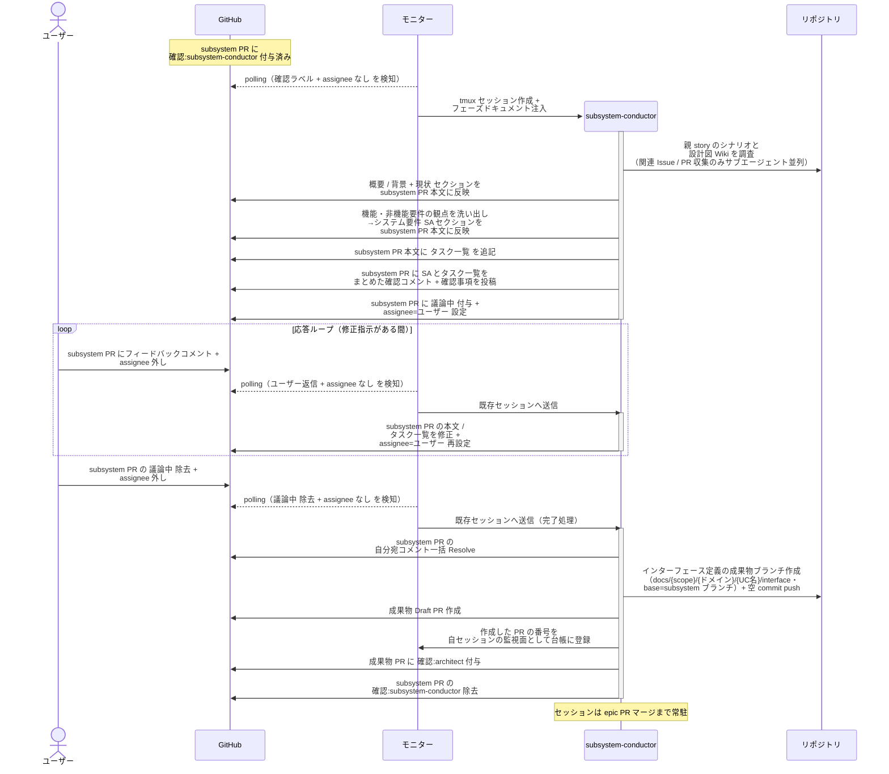
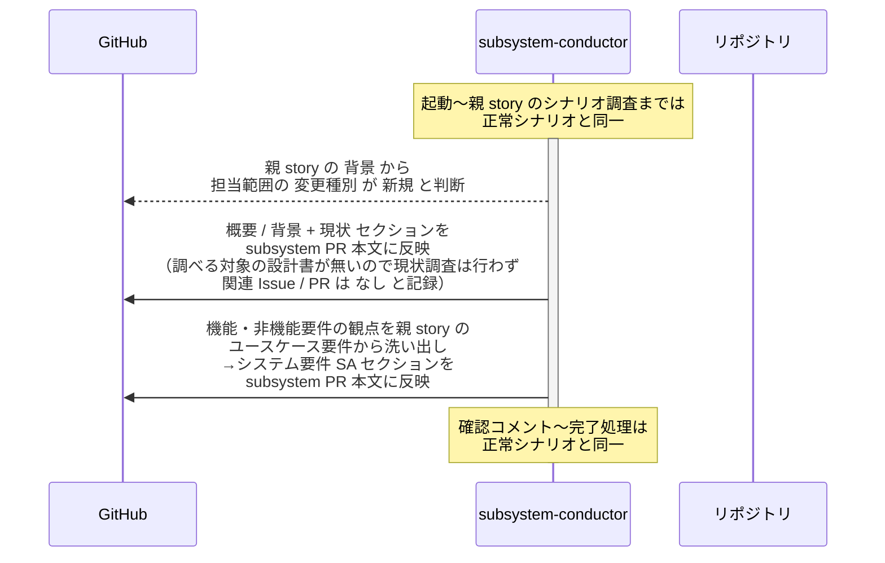
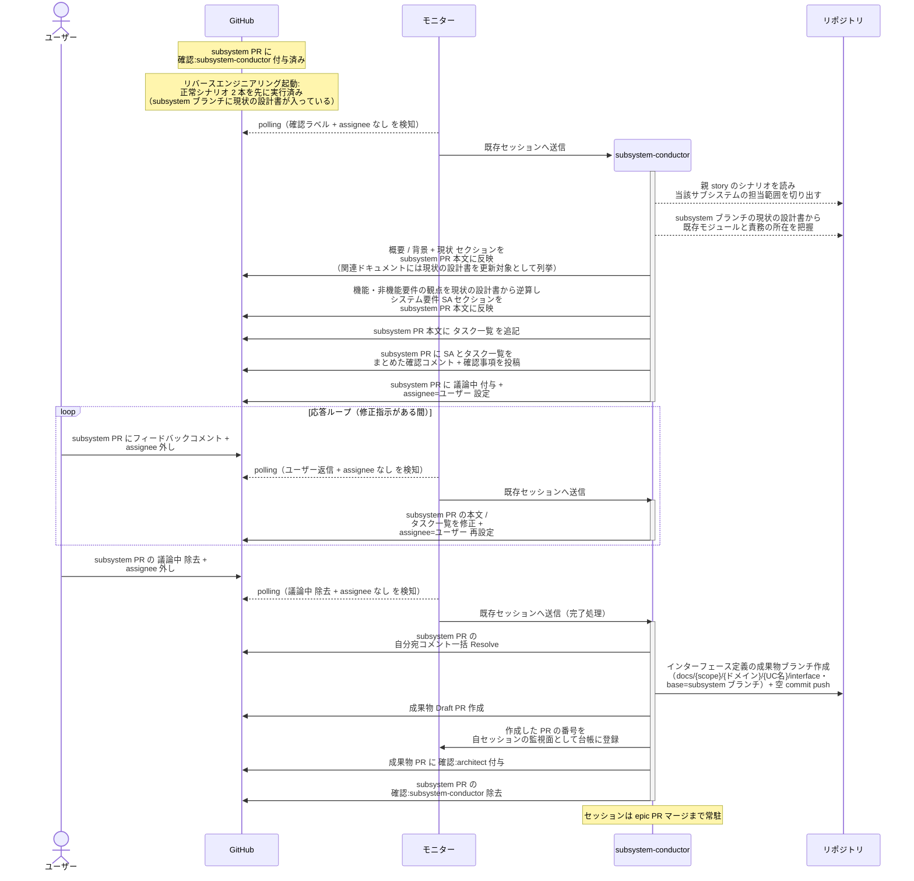

# subsystem要件確定

subsystem-conductor が subsystem PR の本文整形 + 現状調査（関連 Issue/PR・関連ドキュメント）+ システム要件（機能 / 非機能 / スコープ外）確定を行い、完了時に SS設計の成果物ブランチを作って architect に設計を引き渡す単一ユースケース。

対応エージェント: `subsystem-conductor`

- 対応テストファイル: `tests/e2e/単一ユースケース/test_subsystem要件確定.py`

## 正常シナリオ

### セットアップ

| セットアップ | 説明 | 補足 |
| --- | --- | --- |
| Mock | なし（実環境で実行） | - |
| subsystem PR | `layer:subsystem` + `確認:subsystem-conductor` 付きの Draft PR が存在 | ブランチと PR は story-conductor が作成済み・本文は `## 紐づく Issue` のみ |
| 親 story PR | ユースケース要件 + 単一 UC シナリオ確定済み | 担当範囲の元ネタ。`## 背景` の `変更種別` は `変更` |
| assignee | 未設定 | エージェント起動条件 |

### フロー

```mermaid
sequenceDiagram
  actor U as ユーザー
  participant GH as GitHub
  participant ORC as モニター

  Note over GH: subsystem PR に<br>確認:subsystem-conductor 付与済み
  ORC-->>GH: polling（確認ラベル + assignee なし を検知）
  create participant MON as subsystem-conductor
  ORC->>MON: tmux セッション作成 +<br>フェーズドキュメント注入
  participant REPO as リポジトリ
  activate MON
  MON->>REPO: 親 story のシナリオと<br>設計図 Wiki を調査<br>（関連 Issue / PR 収集のみサブエージェント並列）
  MON->>GH: 概要 / 背景 + 現状 セクションを<br>subsystem PR 本文に反映
  MON->>GH: 機能・非機能要件の観点を洗い出し<br>→システム要件 SA セクションを<br>subsystem PR 本文に反映
  MON->>GH: subsystem PR 本文に タスク一覧 を追記
  MON->>GH: subsystem PR に SA とタスク一覧を<br>まとめた確認コメント + 確認事項を投稿
  MON->>GH: subsystem PR に 議論中 付与 +<br>assignee=ユーザー 設定
  deactivate MON

  loop 応答ループ（修正指示がある間）
    U->>GH: subsystem PR にフィードバックコメント +<br>assignee 外し
    ORC-->>GH: polling（ユーザー返信 + assignee なし を検知）
    ORC->>MON: 既存セッションへ送信
    activate MON
    MON->>GH: subsystem PR の本文 /<br>タスク一覧を修正 +<br>assignee=ユーザー 再設定
    deactivate MON
  end

  U->>GH: subsystem PR の 議論中 除去 +<br>assignee 外し
  ORC-->>GH: polling（議論中 除去 + assignee なし を検知）
  ORC->>MON: 既存セッションへ送信（完了処理）
  activate MON
  MON->>GH: subsystem PR の<br>自分宛コメント一括 Resolve
  MON->>REPO: インターフェース定義の成果物ブランチ作成<br>（docs/{scope}/{ドメイン}/{UC名}/interface・<br>base=subsystem ブランチ）+ 空 commit push
  MON->>GH: 成果物 Draft PR 作成
  MON->>ORC: 作成した PR の番号を<br>自セッションの監視面として台帳に登録
  MON->>GH: 成果物 PR に 確認:architect 付与
  MON->>GH: subsystem PR の<br>確認:subsystem-conductor 除去
  deactivate MON
  Note over MON: セッションは epic PR マージまで常駐
```

### 期待値

- subsystem PR 本文に `## 現状`（関連 Issue/PR / 関連ドキュメント）と `## システム要件（SA）`（機能要件 / 非機能要件 / スコープ外）が揃っている
- 親 story の `変更種別` が `変更` のため現状調査を行い、`## 現状` に関連 Issue / PR と関連ドキュメントが記録されている
- バグ Issue の場合は `### 再現手順` も記録されている
- 実装コード・テストコードを読み出した記録がない（要件の判断材料は親 story と設計 Wiki に閉じる）
- subsystem PR 本文に `## タスク一覧`（Wiki 修正・実装・テスト実行の To Do）が記入されている
- SA とタスク一覧をまとめた確認コメントが 1 件だけ投稿され、待機も 1 回だけ（面が PR 1 つになったため、要件とタスク一覧で 2 回止めない）
- インターフェース定義の成果物ブランチと Draft PR（base=subsystem ブランチ）が作成され、`確認:architect` が付与されている
- 作成した PR の番号が自セッションの監視面（モニターの台帳）に登録されている
- subsystem PR から `確認:subsystem-conductor` が除去されている

## 正常シナリオ（変更種別が新規・現状調査なし）

### セットアップ

| セットアップ | 説明 | 補足 |
| --- | --- | --- |
| Mock | なし（実環境で実行） | - |
| subsystem PR | `layer:subsystem` + `確認:subsystem-conductor` 付きの Draft PR が存在 | 本文は `## 紐づく Issue` のみ |
| 親 story PR | ユースケース要件 + 単一 UC シナリオ確定済み | `## 背景` の `変更種別` が `新規`。現状調査なしの分岐を決定的に誘発 |
| 既存の設計書 | 担当範囲に対応するインターフェース定義 / モジュール構成が subsystem ブランチに存在しない | `新規` の記入と設計書の状態が一致している |
| assignee | 未設定 | エージェント起動条件 |

### フロー

```mermaid
sequenceDiagram
  participant GH as GitHub
  participant MON as subsystem-conductor
  participant REPO as リポジトリ

  Note over MON: 起動〜親 story のシナリオ調査までは<br>正常シナリオと同一
  activate MON
  MON-->>GH: 親 story の 背景 から<br>担当範囲の 変更種別 が 新規 と判断
  MON->>GH: 概要 / 背景 + 現状 セクションを<br>subsystem PR 本文に反映<br>（調べる対象の設計書が無いので現状調査は行わず<br>関連 Issue / PR は なし と記録）
  MON->>GH: 機能・非機能要件の観点を親 story の<br>ユースケース要件から洗い出し<br>→システム要件 SA セクションを<br>subsystem PR 本文に反映
  Note over MON: 確認コメント〜完了処理は<br>正常シナリオと同一
  deactivate MON
```

### 期待値

- `## 現状` の `### 関連 Issue / PR` と `### 関連ドキュメント` が `なし` で記録されている（`変更種別` が `新規` なので調べる対象の設計書が無い）
- 関連 Issue / PR の収集をサブエージェントで走らせた記録がない（`変更種別` を読んで調査自体を省いている）
- subsystem-conductor が実装コードを読み出した記録がない（`新規` の判断も親 story の `## 背景` から行っており、実装の有無を見に行っていない）
- `## システム要件（SA）` が親 story のユースケース要件だけから書かれている
- `## タスク一覧` の Wiki 修正が既存ページの更新ではなく新規作成として並んでいる
- インターフェース定義の成果物 PR に `確認:architect` が付与され、subsystem PR から `確認:subsystem-conductor` が除去されている

## 正常シナリオ（リバースエンジニアリング）

### セットアップ

| セットアップ | 説明 | 補足 |
| --- | --- | --- |
| Mock | なし（実環境で実行） | - |
| `リバースエンジニアリング` ラベル | 対象の PR に付与済み | 本経路を選ぶ判定材料。ユーザーが立ち上げ Issue に付け、子 PR へ引き継がれる |
| subsystem PR | `layer:subsystem` + `type:docs` + `確認:subsystem-conductor` 付きで存在 | 本文は `## 紐づく Issue` のみ |
| 親 story PR | `type:docs` でユースケース要件 + 単一 UC シナリオ確定済み | 担当範囲の元ネタ |
| assignee | 未設定 | エージェント起動条件 |
| 現状の設計書 | 当該サブシステムの結合 / モジュール構成が現状の内容で subsystem ブランチに存在 | RE PR がマージ済みであることが前提 |

### フロー

```mermaid
sequenceDiagram
  actor U as ユーザー
  participant GH as GitHub
  participant ORC as モニター

  Note over GH: subsystem PR に<br>確認:subsystem-conductor 付与済み
  Note over GH: リバースエンジニアリング起動:<br>正常シナリオ 2 本を先に実行済み<br>（subsystem ブランチに現状の設計書が入っている）
  ORC-->>GH: polling（確認ラベル + assignee なし を検知）
  create participant MON as subsystem-conductor
  ORC->>MON: 既存セッションへ送信
  participant REPO as リポジトリ
  activate MON
  MON-->>REPO: 親 story のシナリオを読み<br>当該サブシステムの担当範囲を切り出す
  MON-->>REPO: subsystem ブランチの現状の設計書から<br>既存モジュールと責務の所在を把握
  MON->>GH: 概要 / 背景 + 現状 セクションを<br>subsystem PR 本文に反映<br>（関連ドキュメントには現状の設計書を更新対象として列挙）
  MON->>GH: 機能・非機能要件の観点を現状の設計書から逆算し<br>システム要件 SA セクションを<br>subsystem PR 本文に反映
  MON->>GH: subsystem PR 本文に タスク一覧 を追記
  MON->>GH: subsystem PR に SA とタスク一覧を<br>まとめた確認コメント + 確認事項を投稿
  MON->>GH: subsystem PR に 議論中 付与 +<br>assignee=ユーザー 設定
  deactivate MON

  loop 応答ループ（修正指示がある間）
    U->>GH: subsystem PR にフィードバックコメント +<br>assignee 外し
    ORC-->>GH: polling（ユーザー返信 + assignee なし を検知）
    ORC->>MON: 既存セッションへ送信
    activate MON
    MON->>GH: subsystem PR の本文 /<br>タスク一覧を修正 +<br>assignee=ユーザー 再設定
    deactivate MON
  end

  U->>GH: subsystem PR の 議論中 除去 +<br>assignee 外し
  ORC-->>GH: polling（議論中 除去 + assignee なし を検知）
  ORC->>MON: 既存セッションへ送信（完了処理）
  activate MON
  MON->>GH: subsystem PR の<br>自分宛コメント一括 Resolve
  MON->>REPO: インターフェース定義の成果物ブランチ作成<br>（docs/{scope}/{ドメイン}/{UC名}/interface・<br>base=subsystem ブランチ）+ 空 commit push
  MON->>GH: 成果物 Draft PR 作成
  MON->>ORC: 作成した PR の番号を<br>自セッションの監視面として台帳に登録
  MON->>GH: 成果物 PR に 確認:architect 付与
  MON->>GH: subsystem PR の<br>確認:subsystem-conductor 除去
  deactivate MON
  Note over MON: セッションは epic PR マージまで常駐
```

### 期待値

- subsystem PR 本文に `## 現状`（関連 Issue/PR / 関連ドキュメント）と `## システム要件（SA）`（機能要件 / 非機能要件 / スコープ外）が揃っている
- `### 関連ドキュメント` に subsystem ブランチの現状の設計書が更新対象として列挙されている
- `## システム要件（SA）` の各行が現状の設計書の責務、またはユーザーが承認したあるべき姿になっている
- subsystem-conductor が実装コードを読み出した記録がない（入力は親 story のシナリオと subsystem ブランチの設計書に閉じる）
- subsystem PR 本文に `## タスク一覧` が記入され、設計 Wiki の新規作成タスクとテスト作成 / 実行タスクが並んでいる
- リファクタが必要と判断した場合のみ実装タスクが並んでいる（不要なら実装タスクは無い）
- インターフェース定義の成果物ブランチと Draft PR が作成され、`確認:architect` が付与されている
- 作成した PR の番号が自セッションの監視面（モニターの台帳）に登録されている
- subsystem PR から `確認:subsystem-conductor` が除去されている

## 異常シナリオ

なし
