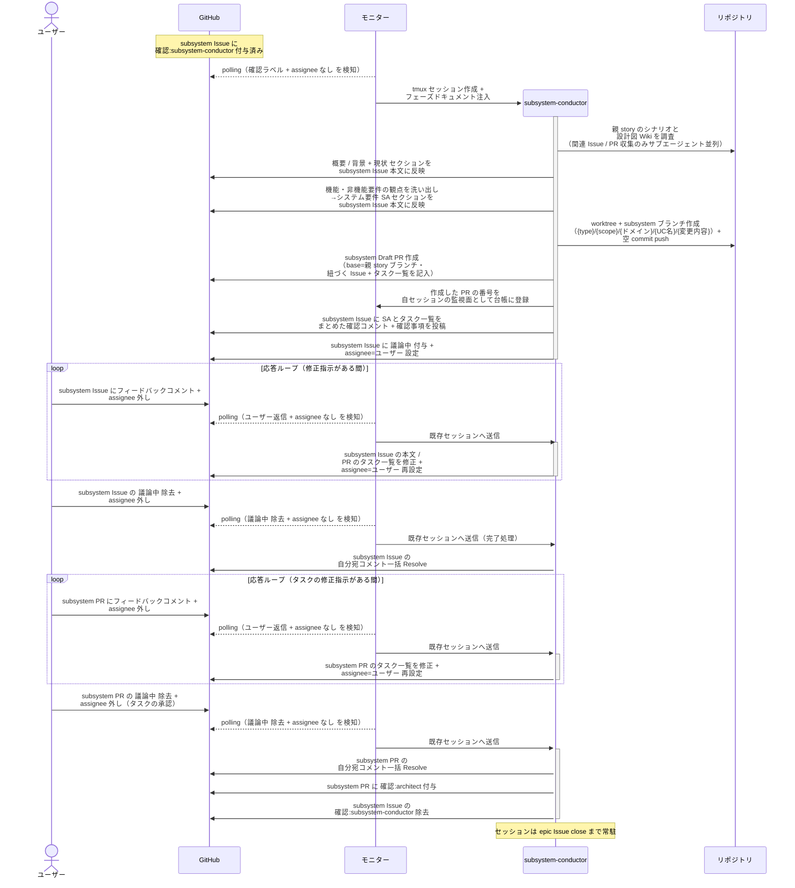
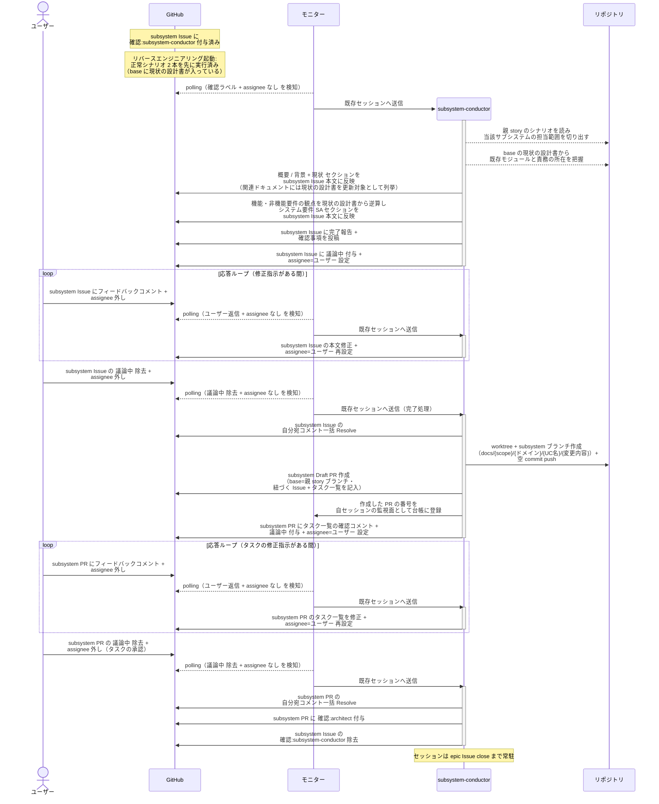

# subsystem要件確定

subsystem-conductor が subsystem Issue の本文整形 + 現状調査（関連 Issue/PR・関連ドキュメント）+ システム要件（機能 / 非機能 / スコープ外）確定を行い、完了時に subsystem Draft PR を作成して architect に設計を引き渡す単一ユースケース。

対応エージェント: `subsystem-conductor`

- 対応テストファイル: `tests/e2e/単一ユースケース/test_subsystem要件確定.py`

## 正常シナリオ

### セットアップ

| セットアップ | 説明 | 補足 |
| --- | --- | --- |
| Mock | なし（実環境で実行） | - |
| subsystem Issue | `layer:subsystem` + `確認:subsystem-conductor` 付きで存在 | 親 story と Sub-issue リンク済み・本文は空 |
| 親 story Issue | ユースケース要件 + 単一 UC シナリオ確定済み | 担当範囲の元ネタ |
| assignee | 未設定 | エージェント起動条件 |

### フロー

```mermaid
sequenceDiagram
  actor U as ユーザー
  participant GH as GitHub
  participant ORC as モニター

  Note over GH: subsystem Issue に<br>確認:subsystem-conductor 付与済み
  ORC-->>GH: polling（確認ラベル + assignee なし を検知）
  create participant MON as subsystem-conductor
  ORC->>MON: tmux セッション作成 +<br>フェーズドキュメント注入
  participant REPO as リポジトリ
  activate MON
  MON->>REPO: 親 story のシナリオと<br>設計図 Wiki を調査<br>（関連 Issue / PR 収集のみサブエージェント並列）
  MON->>GH: 概要 / 背景 + 現状 セクションを<br>subsystem Issue 本文に反映
  MON->>GH: 機能・非機能要件の観点を洗い出し<br>→システム要件 SA セクションを<br>subsystem Issue 本文に反映
  MON->>REPO: worktree + subsystem ブランチ作成<br>（{type}/{scope}/{ドメイン}/{UC名}/{変更内容}）+<br>空 commit push
  MON->>GH: subsystem Draft PR 作成<br>（base=親 story ブランチ・<br>紐づく Issue + タスク一覧を記入）
  MON->>ORC: 作成した PR の番号を<br>自セッションの監視面として台帳に登録
  MON->>GH: subsystem Issue に SA とタスク一覧を<br>まとめた確認コメント + 確認事項を投稿
  MON->>GH: subsystem Issue に 議論中 付与 +<br>assignee=ユーザー 設定
  deactivate MON

  loop 応答ループ（修正指示がある間）
    U->>GH: subsystem Issue にフィードバックコメント +<br>assignee 外し
    ORC-->>GH: polling（ユーザー返信 + assignee なし を検知）
    ORC->>MON: 既存セッションへ送信
    activate MON
    MON->>GH: subsystem Issue の本文 /<br>PR のタスク一覧を修正 +<br>assignee=ユーザー 再設定
    deactivate MON
  end

  U->>GH: subsystem Issue の 議論中 除去 +<br>assignee 外し
  ORC-->>GH: polling（議論中 除去 + assignee なし を検知）
  ORC->>MON: 既存セッションへ送信（完了処理）
  activate MON
  MON->>GH: subsystem Issue の<br>自分宛コメント一括 Resolve

  loop 応答ループ（タスクの修正指示がある間）
    U->>GH: subsystem PR にフィードバックコメント +<br>assignee 外し
    ORC-->>GH: polling（ユーザー返信 + assignee なし を検知）
    ORC->>MON: 既存セッションへ送信
    activate MON
    MON->>GH: subsystem PR のタスク一覧を修正 +<br>assignee=ユーザー 再設定
    deactivate MON
  end

  U->>GH: subsystem PR の 議論中 除去 +<br>assignee 外し（タスクの承認）
  ORC-->>GH: polling（議論中 除去 + assignee なし を検知）
  ORC->>MON: 既存セッションへ送信
  activate MON
  MON->>GH: subsystem PR の<br>自分宛コメント一括 Resolve
  MON->>GH: subsystem PR に 確認:architect 付与
  MON->>GH: subsystem Issue の<br>確認:subsystem-conductor 除去
  deactivate MON
  Note over MON: セッションは epic Issue close まで常駐
```

### 期待値

- 本文に `## 現状`（関連 Issue/PR / 関連ドキュメント）と `## システム要件（SA）`（機能要件 / 非機能要件 / スコープ外）が揃っている
- バグ Issue の場合は `### 再現手順` も記録されている
- 実装コード・テストコードを読み出した記録がない（要件の判断材料は親 story と設計 Wiki に閉じる）
- subsystem Draft PR（base=親 story ブランチ）が作成され、本文に `## 紐づく Issue` と `## タスク一覧`（Wiki 修正・実装・テスト実行の To Do）が記入されている
- 作成した PR の番号が自セッションの監視面（モニターの台帳）に登録されている
- SA とタスク一覧をまとめた確認コメントが 1 件だけ投稿されている（SA とタスク一覧で 2 回待機していない）
- subsystem PR に `確認:architect` が付与され、`確認:subsystem-conductor` が除去されている

## 正常シナリオ（リバースエンジニアリング）

### セットアップ

| セットアップ | 説明 | 補足 |
| --- | --- | --- |
| Mock | なし（実環境で実行） | - |
| `リバースエンジニアリング` ラベル | 対象の Issue / PR に付与済み | 本経路を選ぶ判定材料。ユーザーが system Issue に付け、子 Issue へ引き継がれる |
| subsystem Issue | `layer:subsystem` + `type:docs` + `確認:subsystem-conductor` 付きで存在 | 親 story と Sub-issue リンク済み・本文は空 |
| 親 story Issue | `type:docs` でユースケース要件 + 単一 UC シナリオ確定済み | 担当範囲の元ネタ |
| assignee | 未設定 | エージェント起動条件 |
| 現状の設計書 | 当該サブシステムの結合 / モジュール構成が現状の内容で base に存在 | RE PR がマージ済みであることが前提 |

### フロー

```mermaid
sequenceDiagram
  actor U as ユーザー
  participant GH as GitHub
  participant ORC as モニター

  Note over GH: subsystem Issue に<br>確認:subsystem-conductor 付与済み
  Note over GH: リバースエンジニアリング起動:<br>正常シナリオ 2 本を先に実行済み<br>（base に現状の設計書が入っている）
  ORC-->>GH: polling（確認ラベル + assignee なし を検知）
  create participant MON as subsystem-conductor
  ORC->>MON: 既存セッションへ送信
  participant REPO as リポジトリ
  activate MON
  MON-->>REPO: 親 story のシナリオを読み<br>当該サブシステムの担当範囲を切り出す
  MON-->>REPO: base の現状の設計書から<br>既存モジュールと責務の所在を把握
  MON->>GH: 概要 / 背景 + 現状 セクションを<br>subsystem Issue 本文に反映<br>（関連ドキュメントには現状の設計書を更新対象として列挙）
  MON->>GH: 機能・非機能要件の観点を現状の設計書から逆算し<br>システム要件 SA セクションを<br>subsystem Issue 本文に反映
  MON->>GH: subsystem Issue に完了報告 +<br>確認事項を投稿
  MON->>GH: subsystem Issue に 議論中 付与 +<br>assignee=ユーザー 設定
  deactivate MON

  loop 応答ループ（修正指示がある間）
    U->>GH: subsystem Issue にフィードバックコメント +<br>assignee 外し
    ORC-->>GH: polling（ユーザー返信 + assignee なし を検知）
    ORC->>MON: 既存セッションへ送信
    activate MON
    MON->>GH: subsystem Issue の本文修正 +<br>assignee=ユーザー 再設定
    deactivate MON
  end

  U->>GH: subsystem Issue の 議論中 除去 +<br>assignee 外し
  ORC-->>GH: polling（議論中 除去 + assignee なし を検知）
  ORC->>MON: 既存セッションへ送信（完了処理）
  activate MON
  MON->>GH: subsystem Issue の<br>自分宛コメント一括 Resolve
  MON->>REPO: worktree + subsystem ブランチ作成<br>（docs/{scope}/{ドメイン}/{UC名}/{変更内容}）+<br>空 commit push
  MON->>GH: subsystem Draft PR 作成<br>（base=親 story ブランチ・<br>紐づく Issue + タスク一覧を記入）
  MON->>ORC: 作成した PR の番号を<br>自セッションの監視面として台帳に登録
  MON->>GH: subsystem PR にタスク一覧の確認コメント +<br>議論中 付与 + assignee=ユーザー 設定
  deactivate MON

  loop 応答ループ（タスクの修正指示がある間）
    U->>GH: subsystem PR にフィードバックコメント +<br>assignee 外し
    ORC-->>GH: polling（ユーザー返信 + assignee なし を検知）
    ORC->>MON: 既存セッションへ送信
    activate MON
    MON->>GH: subsystem PR のタスク一覧を修正 +<br>assignee=ユーザー 再設定
    deactivate MON
  end

  U->>GH: subsystem PR の 議論中 除去 +<br>assignee 外し（タスクの承認）
  ORC-->>GH: polling（議論中 除去 + assignee なし を検知）
  ORC->>MON: 既存セッションへ送信
  activate MON
  MON->>GH: subsystem PR の<br>自分宛コメント一括 Resolve
  MON->>GH: subsystem PR に 確認:architect 付与
  MON->>GH: subsystem Issue の<br>確認:subsystem-conductor 除去
  deactivate MON
  Note over MON: セッションは epic Issue close まで常駐
```

### 期待値

- 本文に `## 現状`（関連 Issue/PR / 関連ドキュメント）と `## システム要件（SA）`（機能要件 / 非機能要件 / スコープ外）が揃っている
- `### 関連ドキュメント` に base の現状の設計書が更新対象として列挙されている
- `## システム要件（SA）` の各行が現状の設計書の責務、またはユーザーが承認したあるべき姿になっている
- subsystem-conductor が実装コードを読み出した記録がない（入力は親 story のシナリオと base の設計書に閉じる）
- subsystem Draft PR（base=親 story ブランチ）が作成され、本文に `## 紐づく Issue` と `## タスク一覧` が記入されている
- タスク一覧に設計 Wiki の新規作成タスクとテスト作成 / 実行タスクが並んでいる
- リファクタが必要と判断した場合のみ実装タスクが並んでいる（不要なら実装タスクは無い）
- 作成した PR の番号が自セッションの監視面（モニターの台帳）に登録されている
- subsystem PR に `確認:architect` が付与され、`確認:subsystem-conductor` が除去されている

## 異常シナリオ

なし
