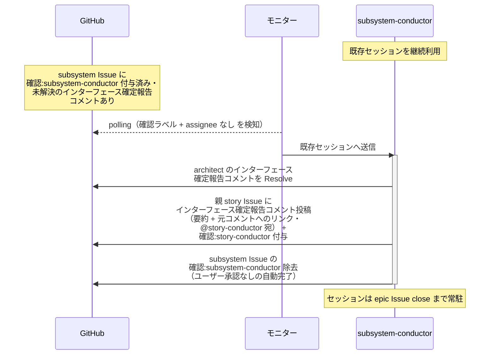

# インターフェース確定の中継

subsystem-conductor（復帰呼び出し）が architect のインターフェース確定報告を受けて、親 story Issue の story-conductor へ中継する単一ユースケース。

対応エージェント: `subsystem-conductor`（architect のインターフェース確定報告コメントで復帰）

- 対応テストファイル: `tests/e2e/単一ユースケース/test_インターフェース確定の中継.py`

## 正常シナリオ

### セットアップ

| セットアップ | 説明 | 補足 |
| --- | --- | --- |
| Mock | なし（実環境で実行） | - |
| subsystem Issue | `確認:subsystem-conductor` 付与済み + architect のインターフェース確定報告コメント（自分宛・未解決）あり | やり取りの面はこちら |
| subsystem PR | `確認:architect` 付与済み | architect が設計続行中。本 UC では触らない |
| 親 story Issue | 本文の依存順に `未起票` の後続 subsystem が残っている | - |
| assignee | PR に未設定 | エージェント起動条件 |

### フロー

### 期待値

- architect のインターフェース確定報告コメントが Resolve 済み
- 親 story Issue に `確認:story-conductor` + インターフェース確定報告コメント（@story-conductor 宛・未解決）が付与・投稿されている
- subsystem Issue の `確認:subsystem-conductor` が除去されている
- subsystem PR は `確認:architect` のまま変わっていない（設計は止まらない）

## 異常シナリオ

なし
