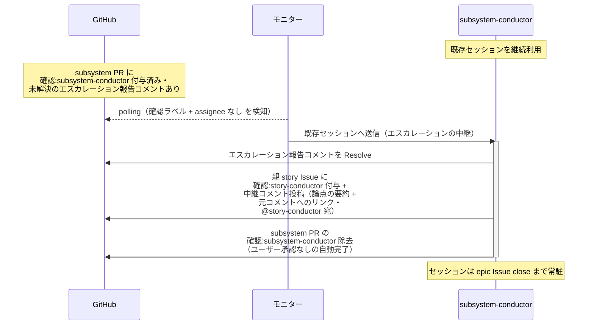

# エスカレーションの中継

conductor（復帰呼び出し）が、配下から上がってきた「自レイヤーで判断できない論点」を 1 つ上位の conductor へ渡す単一ユースケース。
中継役は判断せず、要約 + 元コメントへのリンクを添えて渡すだけで自ターンを終える（担当面は保留のまま待機し、再開指示は論点のレイヤーの conductor から降りてくる）。
図は subsystem レベルで代表し、story レベルは読み替え表で対応する。

対応エージェント: `subsystem-conductor` / `story-conductor`（配下のエスカレーション報告コメントで復帰）

## 正常シナリオ

### セットアップ

| セットアップ | 説明 | 補足 |
| --- | --- | --- |
| Mock | なし（実環境で実行） | - |
| subsystem PR | `確認:subsystem-conductor` 付与済み + architect のエスカレーション報告コメント（経緯 + 論点・自分宛・未解決）あり | `確認:architect` + `議論中` は保持されたまま（担当面は保留） |
| 親 story Issue | open | 中継先 |
| assignee | PR に未設定 | エージェント起動条件 |

### フロー

### 期待値

- architect のエスカレーション報告コメントが Resolve 済み
- 親 story Issue に `確認:story-conductor` + 中継コメント（論点の要約 + 元コメントへのリンク・@story-conductor 宛・未解決）が付与・投稿されている
- subsystem PR の `確認:subsystem-conductor` が除去され、`確認:architect` と `議論中` は保持されたまま（設計は保留）
- 論点のレイヤーを飛び越した Issue（epic Issue 等）へのラベル付与・コメント投稿が発生していない

### 補足

- レイヤーごとの読み替え

  | レイヤー | 起動する面 | 報告元 | 中継先 | 付与する確認ラベル |
  | --- | --- | --- | --- | --- |
  | subsystem | subsystem PR | architect | 親 story Issue | `確認:story-conductor` |
  | story | story Issue | subsystem-conductor | 親 epic Issue | `確認:epic-conductor` |

- 論点が自レイヤーで判断できる場合は本 UC ではなく、そのレイヤーの conductor が自分のフェーズで応答する

## 異常シナリオ

なし
