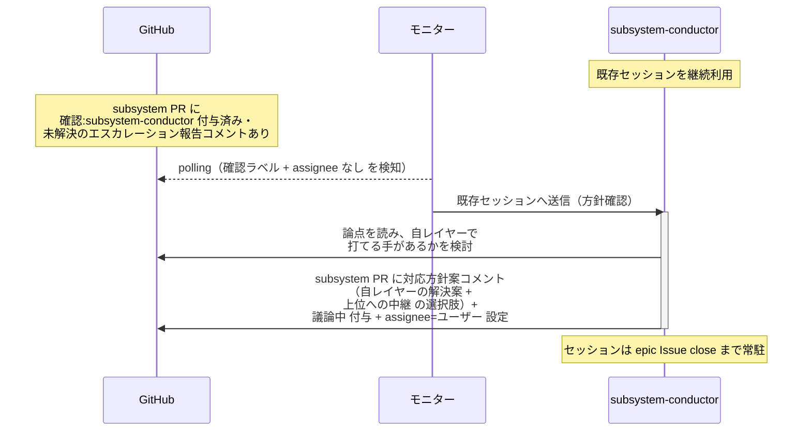
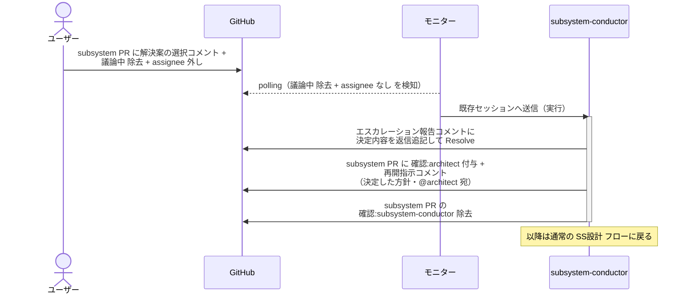
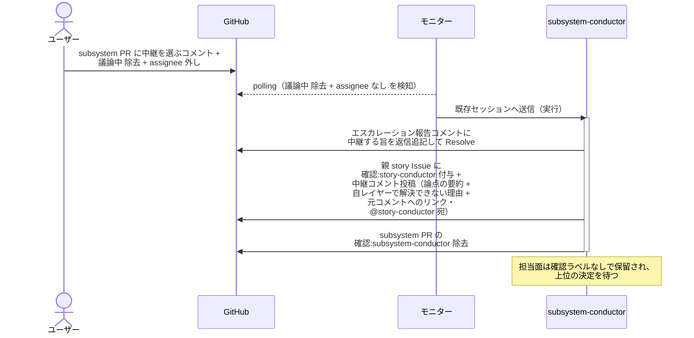
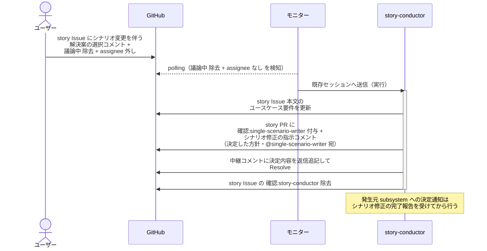
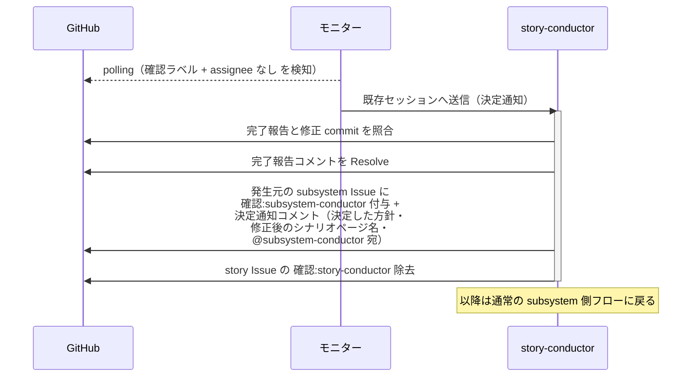
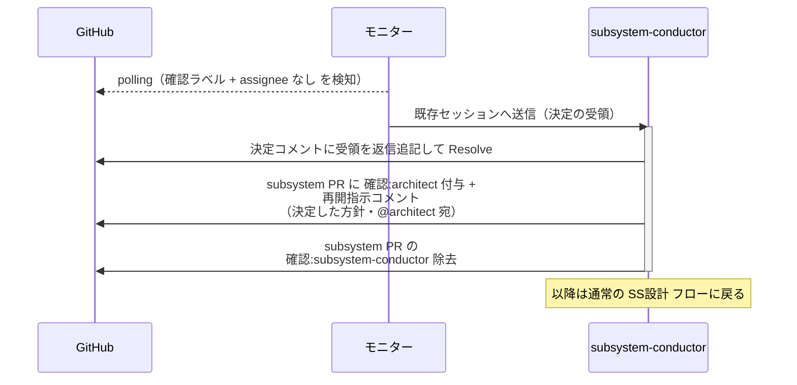

# エスカレーション対応

配下から「自レイヤーでは解決できない」と上がってきた論点を受けた conductor が、自レイヤーで打てる手の案と 1 段上位への中継を選択肢にしてユーザーへ確認し、選ばれた方針で下位へ再開指示を出す（または 1 段上位へ渡す）単一ユースケース。
どの段でも素通しせず必ずユーザー確認を挟む（そのレイヤーでしか気づけない解決策を取りこぼさないため）。
論点の種類は問わない（ライブラリの適合候補ゼロ・要件の矛盾・外部制約による UC 不成立 等）。
図は subsystem レベルで代表し、story / epic レベルは読み替え表で対応する。

対応エージェント: `subsystem-conductor` / `story-conductor` / `epic-conductor`

- 対応テストファイル: `tests/e2e/単一ユースケース/test_エスカレーション対応.py`

## 正常シナリオ（方針確認）

### セットアップ

| セットアップ | 説明 | 補足 |
| --- | --- | --- |
| Mock | なし（実環境で実行） | - |
| subsystem PR | `確認:subsystem-conductor` 付与済み + architect のエスカレーション報告コメント（経緯 + 論点・自分宛・未解決）あり | `確認:architect` は除去済み・`議論中` なし |
| 対応方針案コメント | 未投稿 | 未作業 |
| assignee | PR に未設定 | エージェント起動条件 |

### フロー

### 期待値

- subsystem PR に対応方針案コメント（自レイヤーの解決案 + 上位への中継 を並べた選択肢・ユーザー宛）が投稿されている
- subsystem PR に `議論中` + `assignee=ユーザー` が設定されている
- `確認:subsystem-conductor` は保持されたまま（選択後の実行で復帰するため）
- 上位 Issue へのラベル付与・コメント投稿がまだ発生していない（ユーザーの選択前に上げない）

## 正常シナリオ（自レイヤーで解決）

### セットアップ

| セットアップ | 説明 | 補足 |
| --- | --- | --- |
| Mock | なし（実環境で実行） | - |
| 方針確認まで完了 | 対応方針案コメント投稿済み・`議論中` + `assignee=ユーザー` で待機中 | 正常シナリオ（方針確認）と同一の経過 |
| ユーザー操作 | 自レイヤーの解決案を選ぶコメント + `議論中` 除去 + assignee 外し | 分岐を決定的に誘発 |

### フロー

### 期待値

- エスカレーション報告コメントのスレッドに決定内容が返信追記され、Resolve 済み
- subsystem PR に `確認:architect` + 再開指示コメント（決定した方針・@architect 宛・未解決）が付与・投稿されている
- `確認:subsystem-conductor` が除去されている
- 上位 Issue へのラベル付与・コメント投稿が発生していない

## 正常シナリオ（上位への中継）

### セットアップ

| セットアップ | 説明 | 補足 |
| --- | --- | --- |
| Mock | なし（実環境で実行） | - |
| 方針確認まで完了 | 対応方針案コメント投稿済み・`議論中` + `assignee=ユーザー` で待機中 | 正常シナリオ（方針確認）と同一の経過 |
| ユーザー操作 | 上位への中継を選ぶコメント + `議論中` 除去 + assignee 外し | 分岐を決定的に誘発 |

### フロー

### 期待値

- 親 story Issue に `確認:story-conductor` + 中継コメント（論点の要約 + 自レイヤーで解決できない理由 + 元コメントへのリンク・@story-conductor 宛・未解決）が付与・投稿されている
- エスカレーション報告コメントが Resolve 済み
- subsystem PR に `確認:*` が 1 つも残っていない（上位の決定まで保留）
- 論点のレイヤーを飛び越した Issue（epic Issue 等）へのラベル付与・コメント投稿が発生していない

## 正常シナリオ（シナリオ修正を伴う解決）

### セットアップ

| セットアップ | 説明 | 補足 |
| --- | --- | --- |
| Mock | なし（実環境で実行） | - |
| 方針確認まで完了 | story Issue に対応方針案コメント投稿済み・`議論中` + `assignee=ユーザー` で待機中 | - |
| ユーザー操作 | 単一 UC シナリオの変更を伴う解決案を選ぶコメント + `議論中` 除去 + assignee 外し | 分岐を決定的に誘発 |

### フロー

### 期待値

- story Issue 本文が決定内容で更新されている
- story PR に `確認:single-scenario-writer` + シナリオ修正の指示コメント（@single-scenario-writer 宛・未解決）が付与・投稿されている
- 下位の subsystem Issue へのラベル付与・コメント投稿がまだ発生していない（シナリオ確定前に降ろさない）
- `確認:story-conductor` が除去されている

## 正常シナリオ（シナリオ修正完了後の決定通知）

### セットアップ

| セットアップ | 説明 | 補足 |
| --- | --- | --- |
| Mock | なし（実環境で実行） | - |
| story Issue | `確認:story-conductor` 付与済み + single-scenario-writer のシナリオ修正完了報告（エスカレーション対応由来・自分宛・未解決）あり | - |
| 単一 UC シナリオ | 修正 commit が story ブランチに積まれている | - |
| assignee | 未設定 | エージェント起動条件 |

### フロー

### 期待値

- single-scenario-writer の完了報告コメントが Resolve 済み
- 発生元の subsystem Issue に `確認:subsystem-conductor` + 決定通知コメント（決定した方針 + 修正後のシナリオページ名・@subsystem-conductor 宛・未解決）が付与・投稿されている
- `確認:story-conductor` が除去されている

## 正常シナリオ（上位の決定の受領）

### セットアップ

| セットアップ | 説明 | 補足 |
| --- | --- | --- |
| Mock | なし（実環境で実行） | - |
| subsystem PR | `確認:subsystem-conductor` 付与済み + story-conductor のエスカレーション決定コメント（決定内容・自分宛・未解決）あり | 上位への中継後に降りてきた状態 |
| assignee | PR に未設定 | エージェント起動条件 |

### フロー

### 期待値

- 上位の決定コメントのスレッドに受領が返信追記され、Resolve 済み
- subsystem PR に `確認:architect` + 再開指示コメント（決定した方針・@architect 宛・未解決）が付与・投稿されている
- `確認:subsystem-conductor` が除去されている

## 異常シナリオ

なし
