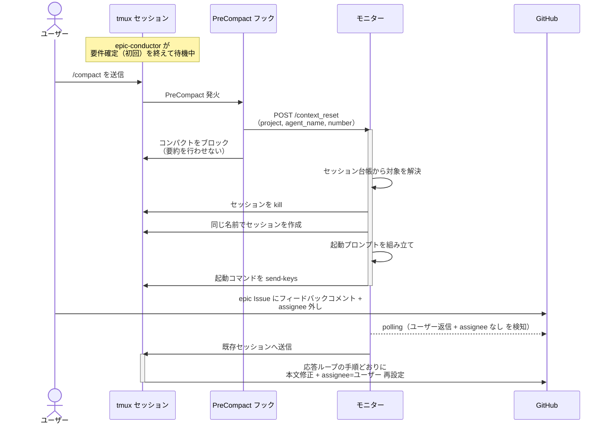
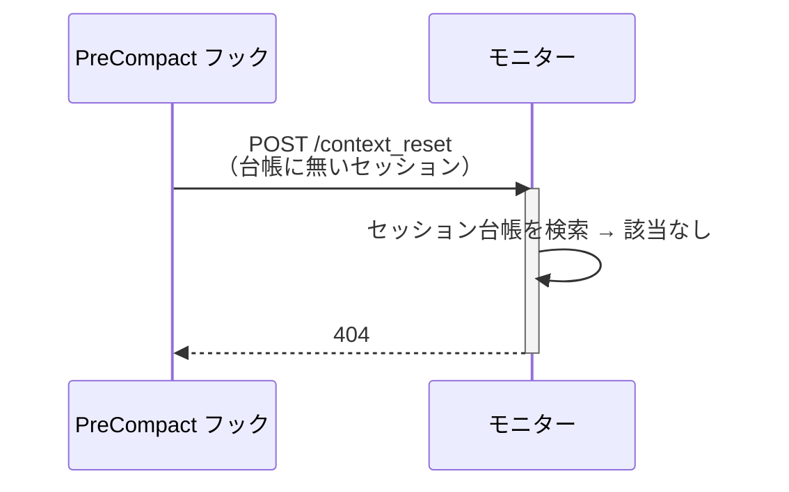

# コンテキスト上限時のリセット

稼働中のエージェントのコンテキストが上限に達したとき、コンパクトを行わずにセッションをリセットし、エージェントが手順を保ったまま作業を続けられることを確認する単一ユースケース。

対応エージェント: 全エージェント共通（代表: `epic-conductor`）

- 対応テストファイル: `tests/e2e/単一ユースケース/test_コンテキスト上限時のリセット.py`

## 正常シナリオ

### セットアップ

| セットアップ | 説明 | 補足 |
| --- | --- | --- |
| Mock | なし（実環境で実行） | - |
| epic Issue | 本文空 + `layer:epic` + `確認:epic-conductor` 付きで存在 | 親 intake と Sub-issue リンク済み。工程が最も軽く、サブエージェントを起動しない |
| エージェント | 要件確定（初回）を終えて `議論中` + `assignee=ユーザー` で待機中 | セッションが稼働している状態を作る |
| Wiki ベース | ai-monitor 側 / sandbox 側とも各ローカルクローンの `docs/wiki` を指す | E2E はローカル読みで統一する |
| ユーザー役 | `/compact` の送信とフィードバック返信を pytest が実施 | - |

### フロー

### 期待値

- コンパクトが行われていない（会話履歴に要約が作られていない）
- モニターがリセット要求を受理している（`POST /context_reset` が `200` を返している）
- 対象セッションが同じ名前で作り直され、フェーズ本文・参考資料・Wiki 索引を追記システムプロンプトに載せて claude が立ち上がっている
- リセット後のターンで、エージェントが応答ループの手順どおりに動いている（フィードバックの本文反映 + `assignee=ユーザー` 再設定）
- `議論中` が保持されたままである（承認扱いにならない）

## 異常シナリオ（解放済みセッションからの通知）

### セットアップ

| セットアップ | 説明 | 補足 |
| --- | --- | --- |
| Mock | なし（実環境で実行） | - |
| セッション | 台帳から除去済み（epic 完了などで解放された後） | 拒否を決定的に誘発 |
| 通知 | 解放済みのエージェント名 + 番号でリセット要求を送る | - |

### フロー

### 期待値

- `404` が返る
- tmux への送信が発生していない（モニターが落ちない）
