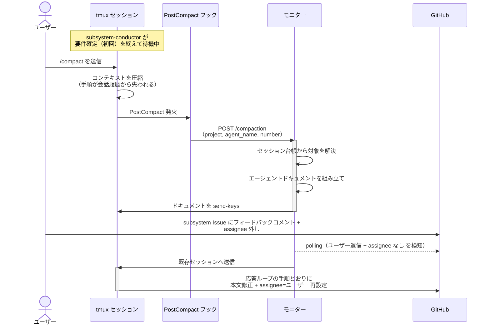
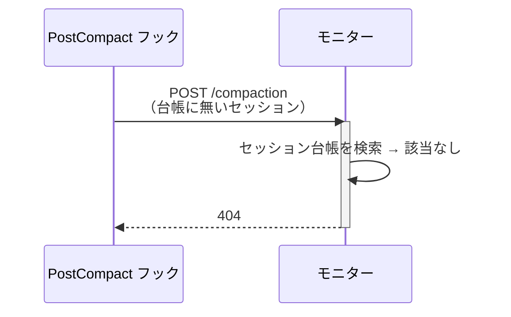

# コンパクト後の手順復元

稼働中のエージェントのコンテキストがコンパクトされたとき、モニターがエージェントドキュメント（フェーズ + 参考資料 + Wiki 索引）を再送し、エージェントが手順を保ったまま作業を続けられることを確認する単一ユースケース。

エージェントの手順は起動プロンプトに全文で載る。
コンパクトは会話履歴を圧縮するため、何もしないと手順が失われて以降のターンが崩れる。
Claude Code の `PostCompact` フックがモニターへ通知し、モニターが再送することで復元する。

コンパクトは `/compact` で手動発火できるため、本 UC は本番と同じ経路で検証できる。

対応エージェント: 全エージェント共通（代表: `subsystem-conductor`）

- 対応テストファイル: `tests/e2e/単一ユースケース/test_コンパクト後の手順復元.py`

## 正常シナリオ

### セットアップ

| セットアップ | 説明 | 補足 |
| --- | --- | --- |
| Mock | なし（実環境で実行） | - |
| subsystem Issue | `layer:subsystem` + `確認:subsystem-conductor` 付きで存在 | 親 story と Sub-issue リンク済み |
| エージェント | 要件確定（初回）を終えて `議論中` + `assignee=ユーザー` で待機中 | セッションが稼働している状態を作る |
| Wiki ベース | ai-monitor 側 / sandbox 側とも各ローカルクローンの `docs/wiki` を指す | E2E はローカル読みで統一する |
| ユーザー役 | `/compact` の送信とフィードバック返信を pytest が実施 | - |

### フロー

### 期待値

- モニターがコンパクト通知を受理している（`POST /compaction` が `200` を返している）
- 対象セッションへエージェントドキュメント（フェーズ本文・参考資料・Wiki 索引）が再送されている
- コンパクト後のターンで、エージェントが応答ループの手順どおりに動いている（フィードバックの本文反映 + `assignee=ユーザー` 再設定）
- `議論中` が保持されたままである（承認扱いにならない）

### 補足

- `/compact` は手動コンパクト（`PostCompact` の `trigger` が `manual`）。
  自動コンパクトとフックの発火経路は同じため、本 UC で自動側も担保する
- 再送の確認は、エージェントの会話ログ（`~/.claude/projects/` 配下の jsonl）にドキュメントの見出しが現れることで行う

## 異常シナリオ（解放済みセッションからの通知）

### セットアップ

| セットアップ | 説明 | 補足 |
| --- | --- | --- |
| Mock | なし（実環境で実行） | - |
| セッション | 台帳から除去済み（epic 完了などで解放された後） | 拒否を決定的に誘発 |
| 通知 | 解放済みのエージェント名 + 番号でコンパクト通知を送る | - |

### フロー

### 期待値

- `404` が返る
- tmux への送信が発生していない（モニターが落ちない）
