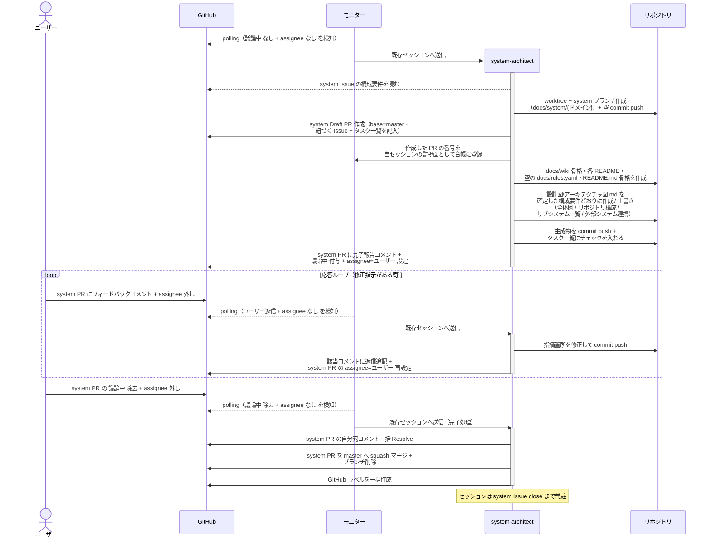

# システム土台生成

system-architect が確定した構成をもとに `設計図/アーキテクチャ図.md`・`docs/wiki/` の骨格・`docs/rules.yaml`・`README.md` の骨格を生成し、ユーザー承認を経てマージする単一ユースケース。
以降の全エージェントが参照する土台を、プロジェクトごとに 1 回だけ作る。
新規プロジェクトでも既存プロジェクトの移行でも同じ経路を通る（入力の構成要件が違うだけ）。

対応エージェント: `system-architect`

- 対応テストファイル: `tests/e2e/単一ユースケース/test_システム土台生成.py`

## 正常シナリオ

### セットアップ

| セットアップ | 説明 | 補足 |
| --- | --- | --- |
| Mock | なし（実環境で実行） | - |
| system Issue | `確認:system-architect` 付与済み・本文の構成要件が確定済み | [システム構成確定](./システム構成確定.md) の完了状態 |
| assignee | 未設定 | エージェント起動条件 |
| `議論中` | 未付与 | 構成が承認済みであることの印 |
| 対象リポジトリ | `README.md` も `docs/` も無い | 土台を新規生成する条件 |
| モニター | 対象リポを polling 中 | - |

### フロー

### 期待値

- master に `README.md`・`docs/rules.yaml`・`docs/wiki/` の骨格が反映され、全ディレクトリに `README.md` が併置されている
- `設計図/アーキテクチャ図.md` の全体図・サブシステム一覧・外部システム連携が、system Issue の `## 構成要件` の各行と対応している
- `リバースエンジニアリング` ラベルがある場合、本 PR の Files changed がアーキテクチャ図の現状からあるべき姿への変更範囲になっている
- サブシステム一覧の `scope` 列の値が `constants.env` の `scope:*` と一致している
- 銘柄未定の外部システムが `{種別}（銘柄未定）` の形で記録され、詳細列と対応疎通テスト列が `-` になっている
- `docs/rules.yaml` が空の索引（`rules: []`）として存在する
- `テスト/テスト実行方法.md` は見出しのみで本文が `未確定`
- `外部API/README.md` と `外部ライブラリ/README.md` が空の索引として存在する
- system PR が merged・ブランチが削除済み・タスク一覧が全てチェック済み
- `constants.env` の全ラベルが対象リポジトリに作成されている
- 自分宛コメントが全て Resolve 済み

## 異常シナリオ

なし
