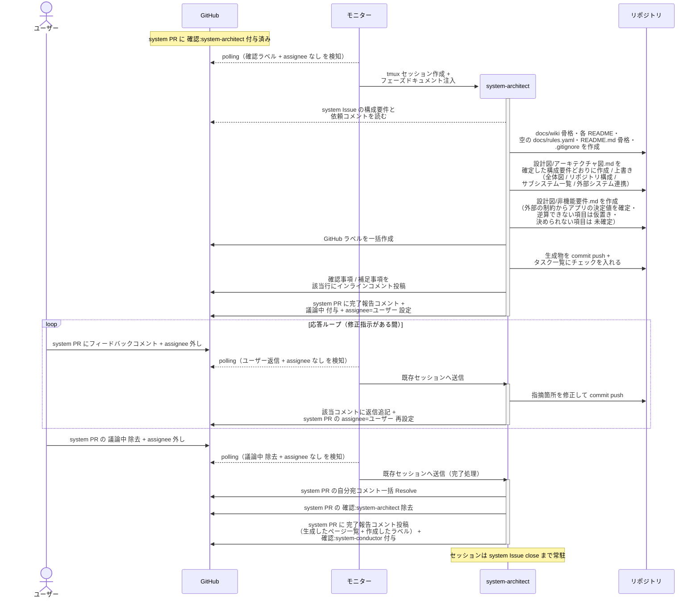

# システム土台生成

system-architect が確定した構成をもとに `設計図/アーキテクチャ図.md`・`docs/wiki/` の骨格・`docs/rules.yaml`・`README.md` の骨格・`.gitignore` を system PR 上で生成し、ユーザー承認を経て system-conductor に完了報告する単一ユースケース。
以降の全エージェントが参照する土台を、プロジェクトごとに 1 回だけ作る。

対応エージェント: `system-architect`

- 対応テストファイル: `tests/e2e/単一ユースケース/test_システム土台生成.py`

## 正常シナリオ

### セットアップ

| セットアップ | 説明 | 補足 |
| --- | --- | --- |
| Mock | なし（実環境で実行） | - |
| system Draft PR | `確認:system-architect` 付与済み + system-conductor の依頼コメント（自分宛・未解決）あり | [システム構成確定](./システム構成確定.md) の完了状態 |
| system Issue | 本文の構成要件が確定済み | 生成の元ネタ |
| assignee | PR に未設定 | エージェント起動条件 |
| 対象リポジトリ | `README.md` も `docs/` も無い | 土台を新規生成する条件 |
| モニター | 対象リポを polling 中 | - |

### フロー

### 期待値

- system ブランチに `README.md`・`docs/rules.yaml`・`docs/wiki/` の骨格が commit され、全ディレクトリに `README.md` が併置されている
- `設計図/アーキテクチャ図.md` の全体図・サブシステム一覧・外部システム連携が、system Issue の `## 構成要件` の各行と対応している
- `リバースエンジニアリング` ラベルがある場合、本 PR の Files changed がアーキテクチャ図の現状からあるべき姿への変更範囲になっている
- 銘柄未定の外部システムが `{種別}（銘柄未定）` の形で記録され、詳細列と対応非機能要件テスト列が `-` になっている
- `docs/rules.yaml` が空の索引（`rules: []`）として存在する
- `.gitignore` が存在し、`.claude/worktrees/` と環境変数ファイルが追跡対象から外れている（構成要件の実装言語に応じた依存・キャッシュの除外も入っている）
- `設計図/非機能要件.md` の `## 一覧` の各行に 外部の制約 / 出所 / アプリの決定値 / 根拠 が揃っている
- 一覧の各行が詳細セクションへのリンクになっていて、対応する `## {項目名}` が存在する
- 銘柄未定など決められない項目は決定値列が `未確定` で、根拠列に決める条件が入っている
- 外部の制約から逆算できない項目（コスト予算 等）に対する確認事項がインラインコメントで投稿されている
- `テスト/テスト実行方法.md` は見出しのみで本文が `未確定`
- `外部API/README.md` と `外部ライブラリ/README.md` が空の索引として存在する
- `## タスク一覧` が全てチェック済み
- `constants.env` の全ラベルが対象リポジトリに作成されている
- system PR に `確認:system-conductor` + 完了報告コメント（未解決）が付与・投稿され、`確認:system-architect` が除去されている
- 自分宛コメントが全て Resolve 済み
- commit した内容に対する補足事項がインラインコメントで残っている（判断を仰ぐ論点がある場合は `@ユーザー` 宛の確認事項として投稿されている）

## 異常シナリオ

なし
