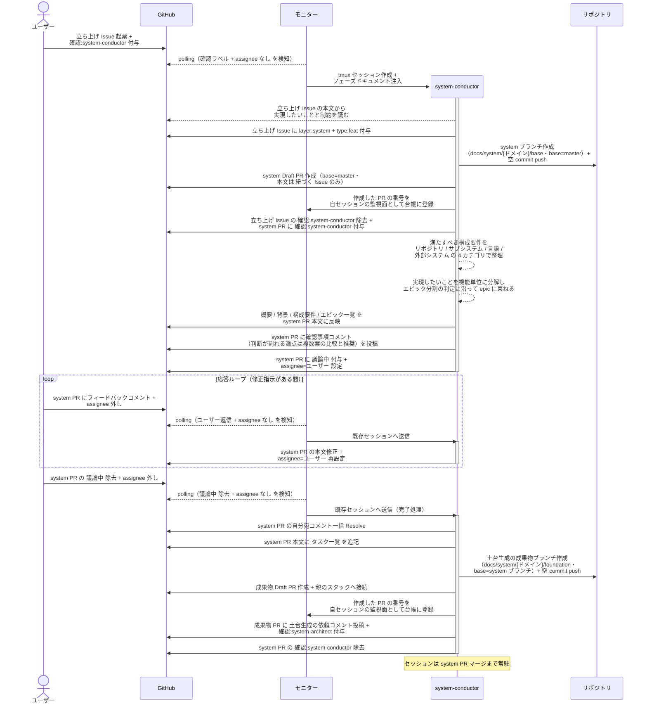
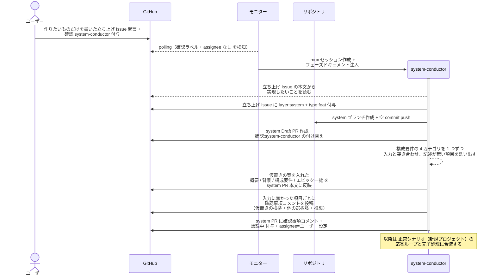
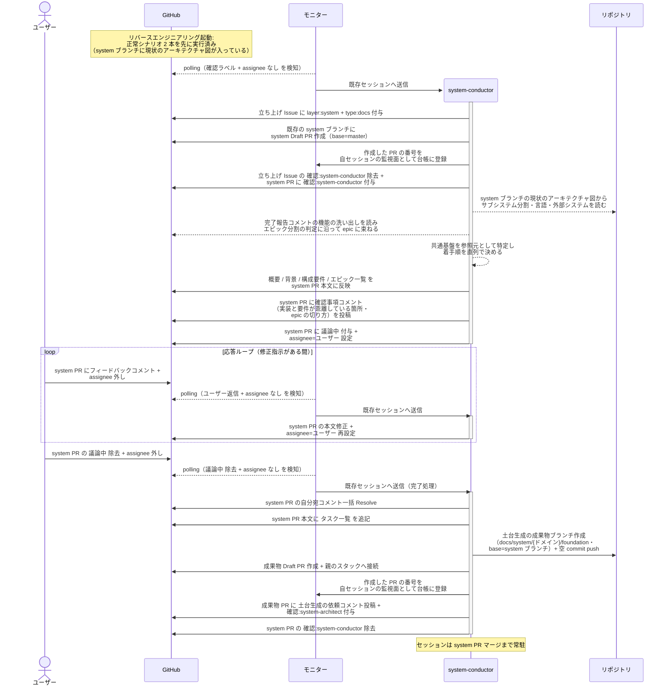

# システム構成確定

system-conductor が立ち上げ Issue から system ブランチ + Draft PR を作り、その本文（概要 / 背景 / 構成要件 / エピック一覧）を確定して system-architect に土台生成を引き渡す単一ユースケース。

対応エージェント: `system-conductor`（初回呼び出し）

- 対応テストファイル: `tests/e2e/単一ユースケース/test_システム構成確定.py`

## 正常シナリオ（新規プロジェクト）

### セットアップ

| セットアップ | 説明 | 補足 |
| --- | --- | --- |
| Mock | なし（実環境で実行） | - |
| 立ち上げ Issue | 作りたいものを書いた Issue に `確認:system-conductor` 付与済み | ユーザーが直接起票。ユーザーが付けるのは確認ラベルだけで `layer:system` はエージェントが付与する |
| assignee | 未設定 | エージェント起動条件 |
| 対象リポジトリ | 実装コードも `docs/` も無い空のリポジトリ | コードを読まない条件 |
| モニター | 対象リポを polling 中 | - |

### フロー

### 期待値

- system ブランチ（base=master）と Draft PR が作成されている
- system PR 本文に `## 概要` / `## 背景` / `## 構成要件` / `## エピック一覧` が揃っている
- system PR 本文の `## 紐づく Issue` に立ち上げ Issue の番号が入っている
- 立ち上げ Issue に `layer:system` と `type:feat` が付与されている（ユーザーは確認ラベルしか付けていない）
- 立ち上げ Issue から `確認:system-conductor` が外れ、以降のやり取りは system PR 上で行われている
- `## 構成要件` の各行が銘柄ではなく満たすべき性質で書かれている（`認証は外部 IdP に委譲する` の形）
- `## エピック一覧` の各行に所属ユースケースと着手順が入り、`対応 PR` 列が全行 `未作成`
- 着手順に重複がない
- system PR 本文の `## タスク一覧` に `.gitignore` の作成と `.claude/settings.json` へのルール索引の宣言が含まれている
- 土台生成の成果物ブランチと Draft PR（base=system ブランチ）が作成され、`確認:system-architect` と依頼コメント（未解決）が付与・投稿されている
- 作成した PR の番号が自セッションの監視面（モニターの台帳）に登録されている
- 自分宛コメントが全て Resolve 済み

## 正常シナリオ（構成の情報が不足した新規プロジェクト）

### セットアップ

| セットアップ | 説明 | 補足 |
| --- | --- | --- |
| Mock | なし（実環境で実行） | - |
| 立ち上げ Issue | 作りたいものだけを書いた Issue に `確認:system-conductor` 付与済み | 技術構成（リポジトリ / サブシステム / 言語 / 外部システム）に一切触れていない本文。不足の洗い出しを決定的に誘発する |
| assignee | 未設定 | エージェント起動条件 |
| 対象リポジトリ | 実装コードも `docs/` も無い空のリポジトリ | コードを読まない条件 |
| モニター | 対象リポを polling 中 | - |

### フロー

### 期待値

- 構成要件の 4 カテゴリのうち、ユーザーの説明に無かったカテゴリごとに確認事項コメントが投稿されている
- 各確認事項に 他に取り得た選択肢 と 推奨 が含まれている
- `## 構成要件` が空欄ではなく仮置きの案で埋まっている（質問だけを投げて本文を空にしていない）
- system PR に `議論中` + `assignee=ユーザー` が設定されている
- 土台生成の成果物ブランチはまだ作成されていない

## 正常シナリオ（既存プロジェクトの移行）

### セットアップ

| セットアップ | 説明 | 補足 |
| --- | --- | --- |
| Mock | なし（実環境で実行） | - |
| 立ち上げ Issue | 移行したい旨を書いた Issue に `リバースエンジニアリング` + `確認:system-conductor` 付与済み | ユーザーが直接起票。ユーザーが付けるのはこの 2 ラベルだけで `layer:system` はエージェントが付与する |
| system ブランチ | `docs/system/{ドメイン}/base`（base=master）が作成済み | [リバースエンジニアリング起動](./リバースエンジニアリング起動.md) の成果物。新規に切らずこのブランチへ PR を作る |
| assignee | 未設定 | エージェント起動条件 |
| 現状のアーキテクチャ図 | `設計図/アーキテクチャ図.md` が現状の内容で system ブランチに存在 | RE PR がマージ済みであることが前提 |
| 機能の洗い出し | `architecture-reverse-engineer` の完了報告コメントに残っている | エピック一覧の材料 |
| モニター | 対象リポを polling 中 | - |

### フロー

### 期待値

- system PR 本文に `## 概要` / `## 背景` / `## 構成要件` / `## エピック一覧` が揃っている
- system PR が既存の system ブランチ（RE PR のマージ先）に作られており、ブランチが新しく切り直されていない
- 立ち上げ Issue に `layer:system` と `type:docs` が付与されている（ユーザーは確認ラベルと `リバースエンジニアリング` しか付けていない）
- `## 構成要件` のサブシステム分割が現状のアーキテクチャ図のサブシステム一覧と一致している
- system-conductor が実装コードを読み出した記録がない（入力は現状のアーキテクチャ図と機能の洗い出しに閉じる）
- `## エピック一覧` の各行に所属ユースケースと着手順が入り、`対応 PR` 列が全行 `未作成`
- 着手順に重複がなく、共通基盤の epic が先頭に置かれている
- system PR 本文の `## タスク一覧` に `.gitignore` の作成と `.claude/settings.json` へのルール索引の宣言が含まれている
- 土台生成の成果物ブランチと Draft PR が作成され、`確認:system-architect` と依頼コメント（未解決）が付与・投稿されている
- 自分宛コメントが全て Resolve 済み

## 異常シナリオ

なし
