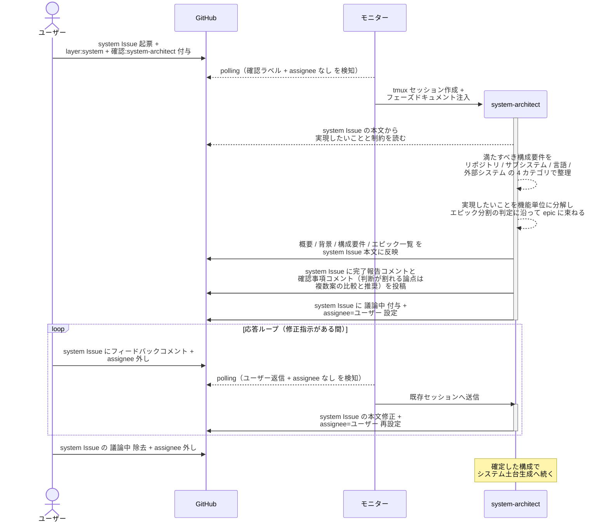
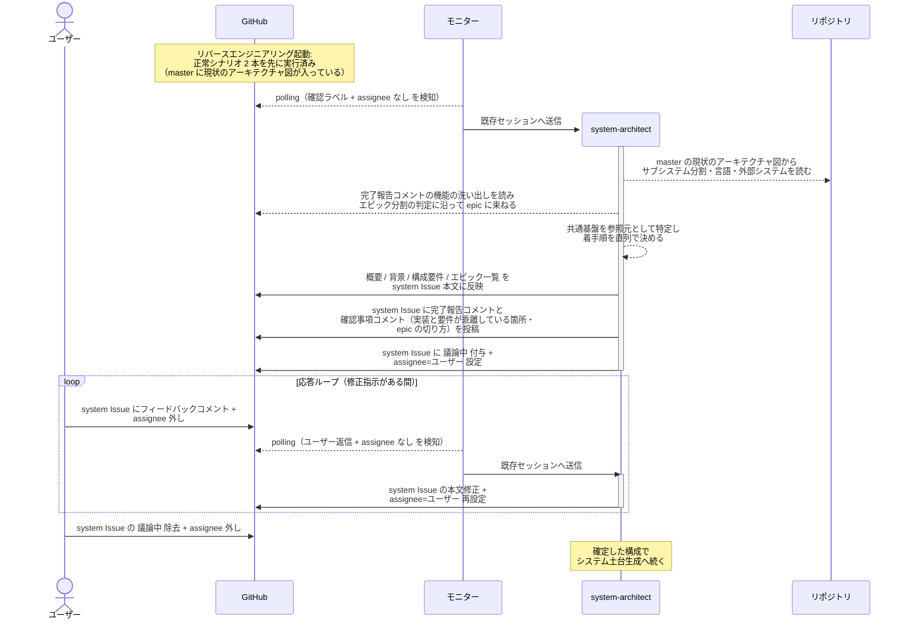

# システム構成確定

system-architect が system Issue の本文（概要 / 背景 / 構成要件 / エピック一覧）を確定する単一ユースケース。
新規プロジェクトの立ち上げでも既存プロジェクトの移行でも通り、違いは入力源だけ（ユーザーの説明か既存コードか）。

対応エージェント: `system-architect`（初回呼び出し）

- 対応テストファイル: `tests/e2e/単一ユースケース/test_システム構成確定.py`

## 正常シナリオ（新規プロジェクト）

### セットアップ

| セットアップ | 説明 | 補足 |
| --- | --- | --- |
| Mock | なし（実環境で実行） | - |
| system Issue | 作りたいものを書いた Issue に `layer:system` + `確認:system-architect` 付与済み | ユーザーが直接起票（intake を経由しない）。`リバースエンジニアリング` ラベルは付けない |
| assignee | 未設定 | エージェント起動条件 |
| 対象リポジトリ | 実装コードも `docs/` も無い空のリポジトリ | コードを読まない条件 |
| モニター | 対象リポを polling 中 | - |

### フロー

### 期待値

- system Issue 本文に `## 概要` / `## 背景` / `## 構成要件` / `## エピック一覧` が揃っている
- `## 構成要件` の各行が銘柄ではなく満たすべき性質で書かれている（`認証は外部 IdP に委譲する` の形）
- `## エピック一覧` の各行に所属ユースケースと着手順が入り、`対応 Issue` 列が全行 `未起票`
- 着手順に重複がない
- `確認:system-architect` が残っている（次フェーズが同一エージェント）
- `議論中` が除去され assignee が未設定になっている

## 正常シナリオ（既存プロジェクトの移行）

### セットアップ

| セットアップ | 説明 | 補足 |
| --- | --- | --- |
| Mock | なし（実環境で実行） | - |
| system Issue | 移行したい旨を書いた Issue に `layer:system` + `リバースエンジニアリング` + `確認:system-architect` 付与済み | ユーザーが直接起票（intake を経由しない）。`リバースエンジニアリング` ラベルが本経路を選ぶ判定材料 |
| assignee | 未設定 | エージェント起動条件 |
| 現状のアーキテクチャ図 | `設計図/アーキテクチャ図.md` が現状の内容で master に存在 | RE PR がマージ済みであることが前提 |
| 機能の洗い出し | `architecture-reverse-engineer` の完了報告コメントに残っている | エピック一覧の材料 |
| モニター | 対象リポを polling 中 | - |

### フロー

### 期待値

- system Issue 本文に `## 概要` / `## 背景` / `## 構成要件` / `## エピック一覧` が揃っている
- `## 構成要件` のサブシステム分割が現状のアーキテクチャ図のサブシステム一覧と一致している
- system-architect が実装コードを読み出した記録がない（入力は現状のアーキテクチャ図と機能の洗い出しに閉じる）
- `## エピック一覧` の各行に所属ユースケースと着手順が入り、`対応 Issue` 列が全行 `未起票`
- 着手順に重複がなく、共通基盤の epic が先頭に置かれている
- `確認:system-architect` が残っている（次フェーズが同一エージェント）
- `議論中` が除去され assignee が未設定になっている

## 異常シナリオ

なし
