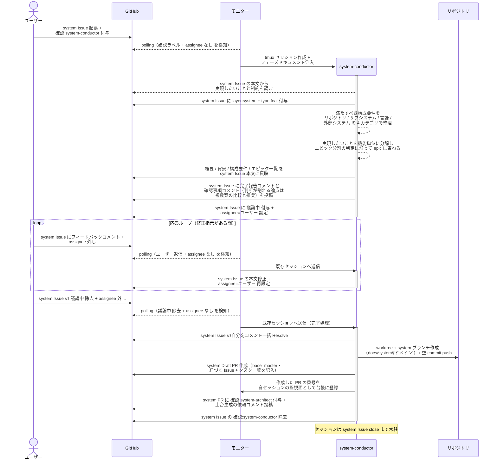
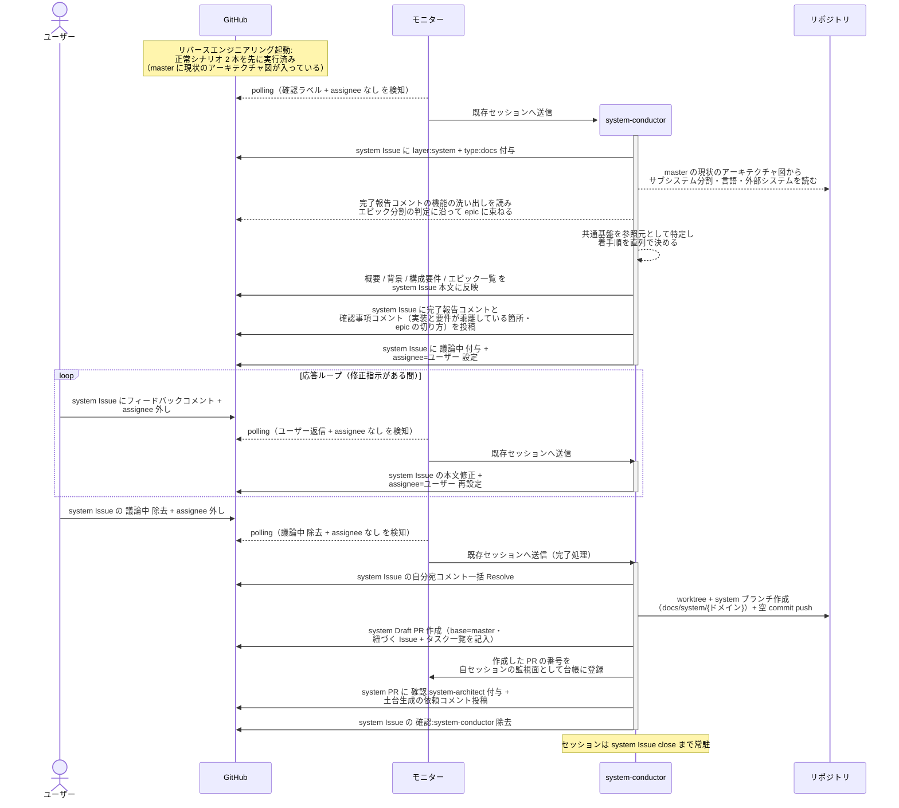

# システム構成確定

system-conductor が system Issue の本文（概要 / 背景 / 構成要件 / エピック一覧）を確定し、system Draft PR を作成して system-architect に土台生成を引き渡す単一ユースケース。
新規プロジェクトの立ち上げでも既存プロジェクトの移行でも通り、違いは入力源だけ（ユーザーの説明か既存コードか）。

対応エージェント: `system-conductor`（初回呼び出し）

- 対応テストファイル: `tests/e2e/単一ユースケース/test_システム構成確定.py`

## 正常シナリオ（新規プロジェクト）

### セットアップ

| セットアップ | 説明 | 補足 |
| --- | --- | --- |
| Mock | なし（実環境で実行） | - |
| system Issue | 作りたいものを書いた Issue に `確認:system-conductor` 付与済み | ユーザーが直接起票（intake を経由しない）。ユーザーが付けるのは確認ラベルだけで `layer:system` はエージェントが付与する |
| assignee | 未設定 | エージェント起動条件 |
| 対象リポジトリ | 実装コードも `docs/` も無い空のリポジトリ | コードを読まない条件 |
| モニター | 対象リポを polling 中 | - |

### フロー

### 期待値

- system Issue 本文に `## 概要` / `## 背景` / `## 構成要件` / `## エピック一覧` が揃っている
- system Issue に `layer:system` と `type:feat` が付与されている（ユーザーは確認ラベルしか付けていない）
- `## 構成要件` の各行が銘柄ではなく満たすべき性質で書かれている（`認証は外部 IdP に委譲する` の形）
- `## エピック一覧` の各行に所属ユースケースと着手順が入り、`対応 Issue` 列が全行 `未起票`
- 着手順に重複がない
- system Draft PR（base=master）が作成され、本文に `## 紐づく Issue` と `## タスク一覧` が記入されている
- 作成した PR の番号が自セッションの監視面（モニターの台帳）に登録されている
- system PR に `確認:system-architect` と依頼コメント（未解決）が付与・投稿されている
- system Issue の `確認:system-conductor` が除去されている
- 自分宛コメントが全て Resolve 済み

## 正常シナリオ（既存プロジェクトの移行）

### セットアップ

| セットアップ | 説明 | 補足 |
| --- | --- | --- |
| Mock | なし（実環境で実行） | - |
| system Issue | 移行したい旨を書いた Issue に `リバースエンジニアリング` + `確認:system-conductor` 付与済み | ユーザーが直接起票（intake を経由しない）。ユーザーが付けるのはこの 2 ラベルだけで `layer:system` はエージェントが付与する |
| assignee | 未設定 | エージェント起動条件 |
| 現状のアーキテクチャ図 | `設計図/アーキテクチャ図.md` が現状の内容で master に存在 | RE PR がマージ済みであることが前提 |
| 機能の洗い出し | `architecture-reverse-engineer` の完了報告コメントに残っている | エピック一覧の材料 |
| モニター | 対象リポを polling 中 | - |

### フロー

### 期待値

- system Issue 本文に `## 概要` / `## 背景` / `## 構成要件` / `## エピック一覧` が揃っている
- system Issue に `layer:system` と `type:docs` が付与されている（ユーザーは確認ラベルと `リバースエンジニアリング` しか付けていない）
- `## 構成要件` のサブシステム分割が現状のアーキテクチャ図のサブシステム一覧と一致している
- system-conductor が実装コードを読み出した記録がない（入力は現状のアーキテクチャ図と機能の洗い出しに閉じる）
- `## エピック一覧` の各行に所属ユースケースと着手順が入り、`対応 Issue` 列が全行 `未起票`
- 着手順に重複がなく、共通基盤の epic が先頭に置かれている
- system Draft PR（base=master）が作成され、本文に `## 紐づく Issue` と `## タスク一覧` が記入されている
- system PR に `確認:system-architect` と依頼コメント（未解決）が付与・投稿されている
- system Issue の `確認:system-conductor` が除去されている
- 自分宛コメントが全て Resolve 済み

## 異常シナリオ

なし
