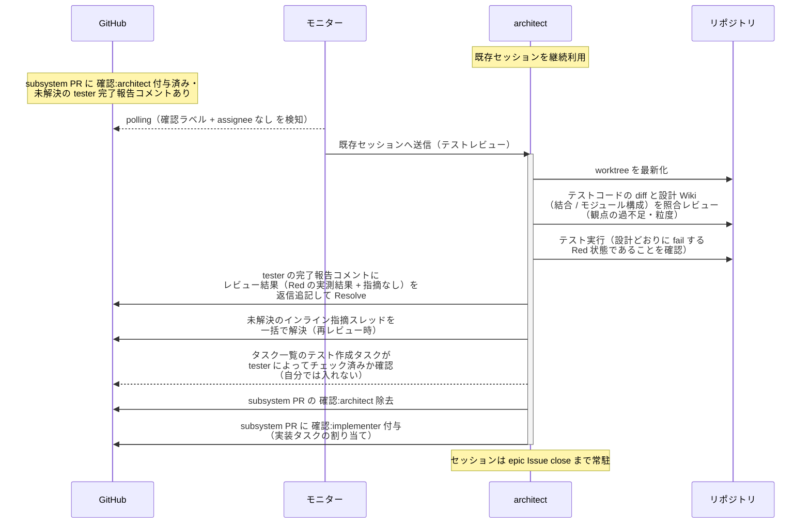
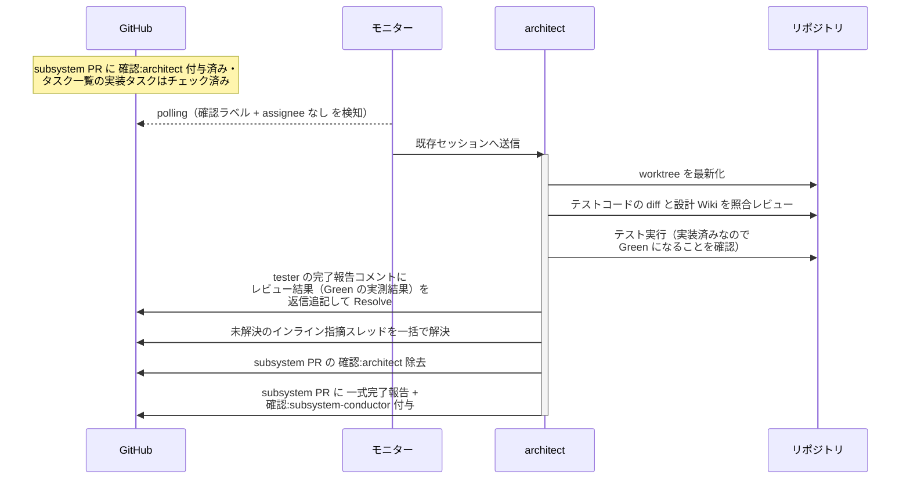
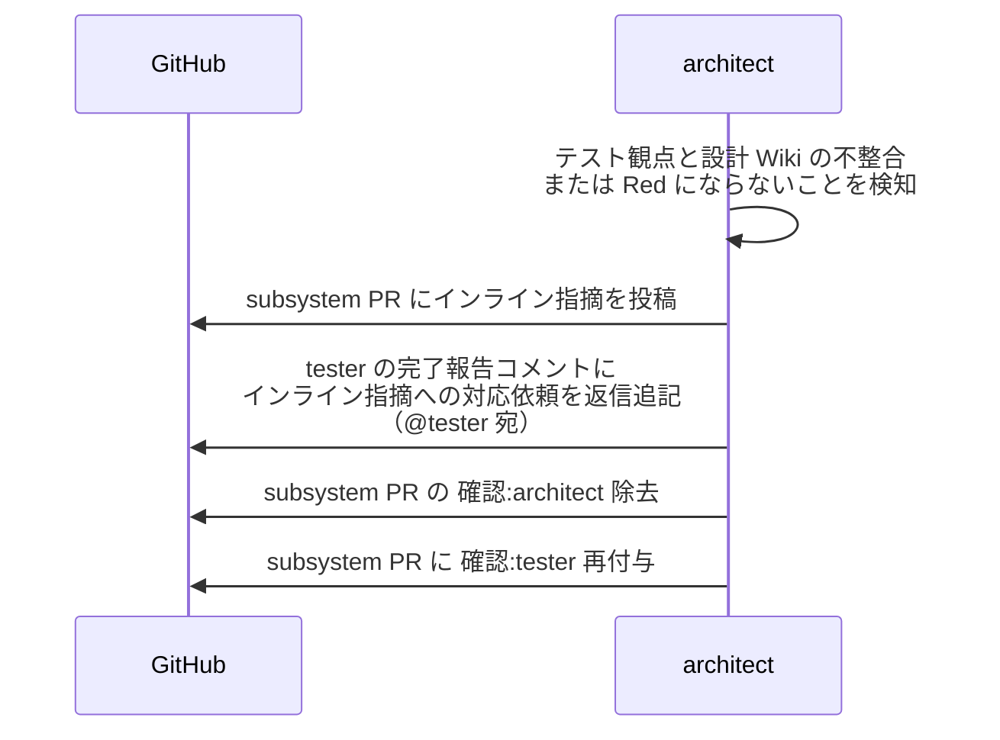

# テストレビュー

architect（設計 Wiki の作成者・内部パイプラインの指揮役）が tester の書いたテストコードの diff を設計 Wiki（結合 / モジュール構成）と照合し、テストを実行して Red を確認する単一ユースケース。

対応エージェント: `architect`

- 対応テストファイル: `tests/e2e/単一ユースケース/test_テストレビュー.py`

## 正常シナリオ

### セットアップ

| セットアップ | 説明 | 補足 |
| --- | --- | --- |
| Mock | なし（実環境で実行） | - |
| subsystem Draft PR | `確認:architect` 付与済み + tester の完了報告コメント（自分宛・未解決）あり | - |
| テストコード | commit 済み・テスト結果表にテストファイル名記入済み | 未実行（実行は本 UC で行う） |
| assignee | PR に未設定 | エージェント起動条件 |

### フロー

### 期待値

- テスト実行の結果が設計どおりの Red（実装が無いことによる fail を含む）
- tester の完了報告コメントのスレッドにレビュー結果（Red の実測結果 + 指摘なし）が返信追記され、Resolve 済み
- インライン指摘スレッドが残っていない（再レビュー時は解決済みになっている）
- `## タスク一覧` のテスト作成タスクが tester のチェックのまま変わっていない（architect はチェックを入れない）
- 実装の割り当てコメントに、実装の根拠になる設計 Wiki のページ名と各ページの commit 範囲が記載されている
- subsystem PR に `確認:implementer` が付与され、`確認:architect` が除去されている

## 正常シナリオ（実装後の再レビュー）

### セットアップ

| セットアップ | 説明 | 補足 |
| --- | --- | --- |
| Mock | なし（実環境で実行） | - |
| subsystem PR | `確認:architect` 付与済み・未解決の tester 完了報告コメントあり | 起動条件 |
| `## タスク一覧` | 実装タスクがチェック済み | 初回のテストレビューと区別する判定材料 |
| 差し戻しの経緯 | 実装レビューでテストコード側の問題と判定し tester へ差し戻した記録が残っている | 本ケースへ至る経路 |
| 実装コード | 修正前から変わっていない | 直すのはテストコードだけ |
| assignee | 未設定 | エージェント起動条件 |
| モニター | 対象リポを polling 中 | - |

### フロー

### 期待値

- テスト実行の結果が Green（実装済みなので Red は期待しない）
- tester の完了報告コメントのスレッドにレビュー結果（Green の実測結果）が返信追記され、Resolve 済み
- インライン指摘スレッドが残っていない
- `## タスク一覧` の実装タスクがチェック済みのまま変わっていない
- 実装の割り当てコメントが投稿されていない（implementer へ差し戻していない）
- subsystem PR に `確認:subsystem-conductor` と一式完了報告が付与・投稿されている

## 異常シナリオ（テストへの指摘あり）

### セットアップ

| セットアップ | 説明 | 補足 |
| --- | --- | --- |
| Mock | なし（実環境で実行） | - |
| レビューの途中 | テスト観点に設計 Wiki との不整合を発見、または Red にならない | 例: 結合ドキュメントの異常系がテストに存在しない・実装が無いのに pass する |

### フロー

### 期待値

- インライン指摘が subsystem PR に投稿されている
- tester の完了報告コメントのスレッドにインライン指摘への対応依頼（@tester 宛）が返信追記されている（スレッドは未解決のまま）
- インライン指摘スレッドが未解決のまま残っている（対応の往復は指摘したスレッド内で行う）
- subsystem PR に `確認:tester` が付与されている
- `確認:architect` が除去され、`## タスク一覧` のテスト作成タスクは tester のチェックのまま（差し戻しでも外さない。タスク一覧は作業をやったかを表し、品質はレビューとテスト結果表が担保する）
