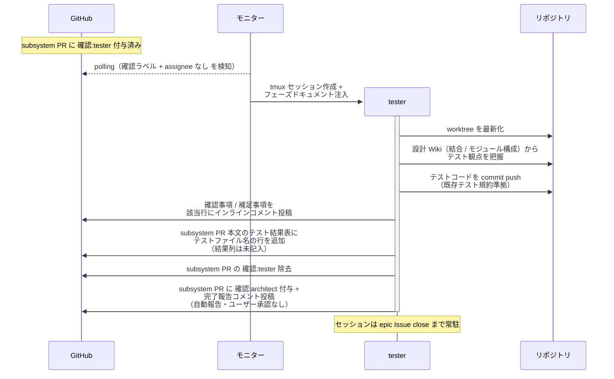
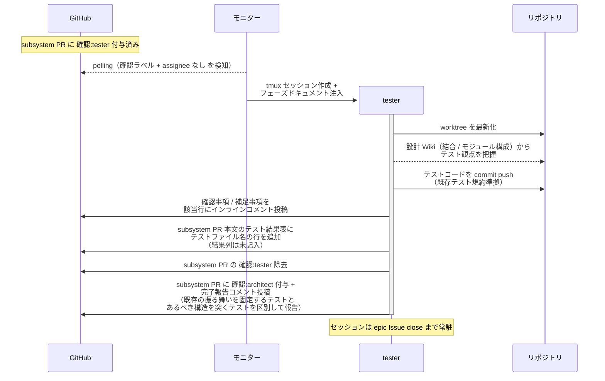
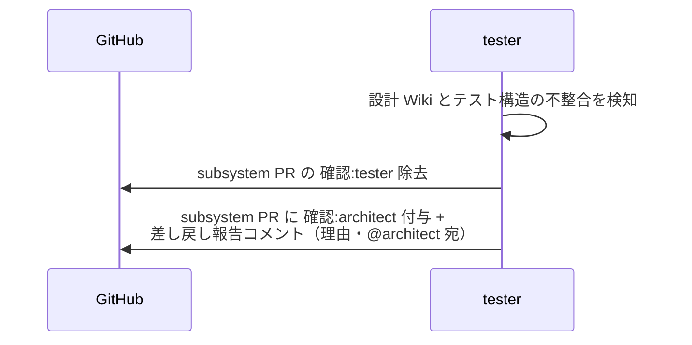

# テスト作成

tester が設計 Wiki（結合 / モジュール構成）を元にテストコードを作成し、テスト結果表にテストファイル名を記入する単一ユースケース。
作成するのはテストコードとテスト用 fixture のみで、テストの実行は行わない（実装コードは implementer・テスト実行は architect の領分）。

対応エージェント: `tester`

- 対応テストファイル: `tests/e2e/単一ユースケース/test_テスト作成.py`

## 正常シナリオ

### セットアップ

| セットアップ | 説明 | 補足 |
| --- | --- | --- |
| Mock | なし（実環境で実行） | - |
| subsystem Draft PR | `確認:tester` 付与済み・設計 Wiki 確定済み・`## タスク一覧` 承認済み | - |
| assignee | PR に未設定 | エージェント起動条件 |

### フロー

### 期待値

- テスト結果表にテストファイル名の行が追加されている（結果列は未記入・`## タスク一覧` のチェックは未変更）
- 設計 Wiki（結合 / モジュール構成）の全テスト観点に対応するテストが存在する
- commit に実装コード（データモデル・スタブ含む）が含まれていない（テストコードとテスト用 fixture のみ）
- tester がテストを実行した記録がない（実行は architect の担当）
- subsystem PR に `確認:architect` + 完了報告コメント（未解決）が付与・投稿されている（`議論中` 付与なし）
- `確認:tester` が除去されている
- commit した内容に対する補足事項がインラインコメントで残っている（判断を仰ぐ論点がある場合は `@ユーザー` 宛の確認事項として投稿されている）

## 正常シナリオ（リバースエンジニアリング）

### セットアップ

| セットアップ | 説明 | 補足 |
| --- | --- | --- |
| Mock | なし（実環境で実行） | - |
| `リバースエンジニアリング` ラベル | 対象の Issue / PR に付与済み | 本経路を選ぶ判定材料。ユーザーが system Issue に付け、子 Issue へ引き継がれる |
| subsystem Draft PR | `確認:tester` 付与済み・設計 Wiki 確定済み・`## タスク一覧` 承認済み | 設計 Wiki はあるべき構造で書かれている |
| assignee | PR に未設定 | エージェント起動条件 |
| 対象コード | 当該範囲が現状の構造で実装済み | 既存の振る舞いを固定する対象 |

### フロー

### 期待値

- テスト結果表にテストファイル名の行が追加されている（結果列は未記入・`## タスク一覧` のチェックは未変更）
- 設計 Wiki（結合 / モジュール構成）の全テスト観点に対応するテストが存在する
- 既存の振る舞いを固定するテストとあるべき構造を突くテストが完了報告コメントで区別されている
- commit に実装コードの変更が含まれていない（テストコードとテスト用 fixture のみ）
- tester がテストを実行した記録がない（実行は architect の担当）
- subsystem PR に `確認:architect` + 完了報告コメント（未解決）が付与・投稿されている（`議論中` 付与なし）
- `確認:tester` が除去されている
- commit した内容に対する補足事項がインラインコメントで残っている（判断を仰ぐ論点がある場合は `@ユーザー` 宛の確認事項として投稿されている）

## 異常シナリオ（設計の見直しが必要）

### セットアップ

| セットアップ | 説明 | 補足 |
| --- | --- | --- |
| Mock | なし（実環境で実行） | - |
| テストコード作成の途中 | 設計 Wiki どおりに書けない構造問題を発見 | 例: 設計にないモジュール分割が必要 |

### フロー

### 期待値

- subsystem PR に `確認:architect` + 差し戻し報告コメント（理由・未解決）が付与・投稿されている
- `確認:tester` が除去されている
