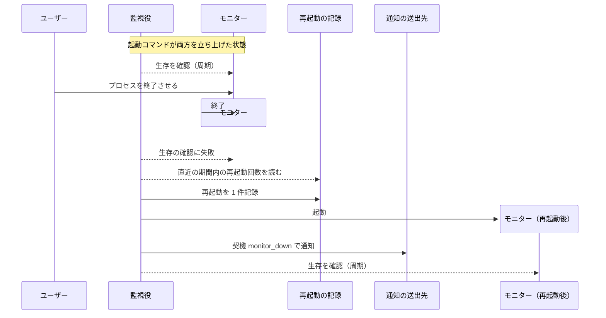
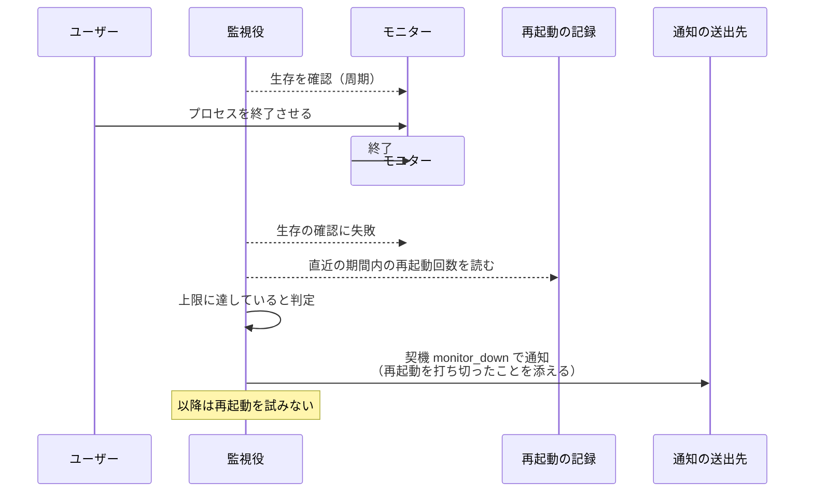
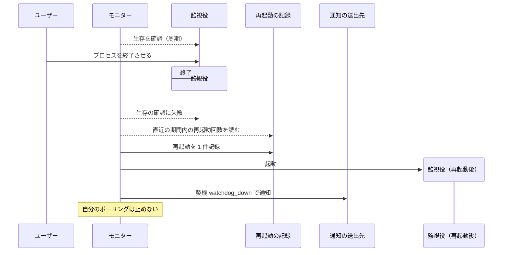
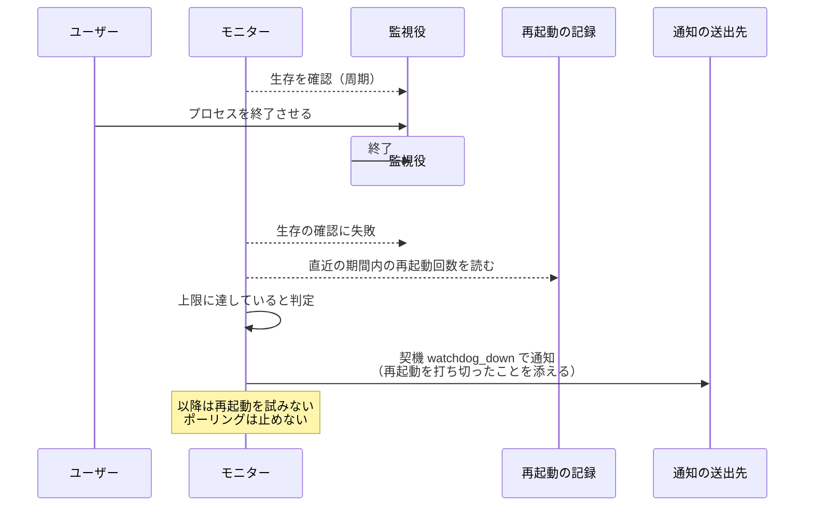
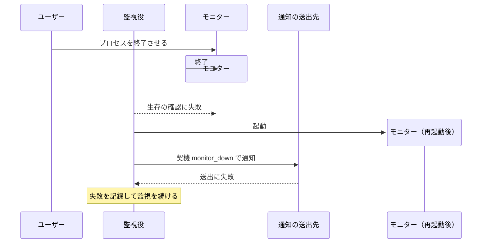

# プロセス死活監視

モニターと監視役がお互いの生存を見張り、相手が落ちたら再起動して通知する単一ユースケース。

モニターが落ちるとワークフロー全体が止まる。
稼働中のエージェントは MCP に繋がらなくなり、待機中の Issue / PR は誰にも拾われなくなる。
モニターの内側に仕掛けた検知はプロセスごと消えるため、外から見ている別プロセスだけが気づける。

生存は 3 つの材料で判定する。
プロセスの有無だけでは「HTTP は応答するがポーリングスレッドだけ死んだ」状態を拾えず、この状態はエージェントが動けるぶん気づきにくい。

| 材料 | 拾う障害 |
| --- | --- |
| pid の生存 | プロセスごと落ちた |
| HTTP の応答 | プロセスは生きているがサーバーがハングした |
| 最終ポーリング時刻の鮮度 | HTTP は生きているがポーリングが止まった |

再起動は無制限には行わない。
一定期間内に上限回数を超えたら、直せない不具合が起きていると判断して再起動をやめ、通知だけを送る。
回数は再起動をまたいで数える必要があるため、ファイルに残す。
数えるのは相手ごとに分ける（モニターを何回再起動したかと、監視役を何回再起動したかは別勘定）。

監視役はモニターの起動と同時に立ち上がる独立プロセスで、GitHub にも MCP にも触らない。
見るのはファイルとソケットだけで、依存が少ないぶんモニター本体より落ちにくい。

本 UC にはエージェントが登場せず、GitHub も tmux も使わない。
そのため E2E ハーネス（モニターを 1 本共有してエージェントを起動する作り）ではなく、実プロセスを起動する結合テストで検証する。

- 対応テストファイル: `tests/integration/monitor/test_プロセス死活監視.py`

## 正常シナリオ（モニターの異常終了）

### セットアップ

| セットアップ | 説明 | 補足 |
| --- | --- | --- |
| Mock | なし（実環境で実行） | - |
| モニターと監視役 | 起動コマンドで両方が立ち上がっている | 監視役はモニターの子プロセスにしない |
| 通知先 | 契機の送出先を 1 件設定 | 通知の到達を確認するため |
| 再起動の記録 | 直近の期間内に再起動なし | 上限に達していない状態を作る |
| 誘発 | モニターのプロセスを外から終了させる | 異常終了を決定的に誘発 |

### フロー

### 期待値

- モニターのプロセスが再び動いており、待受ポートが応答する
- 再起動の記録に 1 件が追加されている
- 契機 `monitor_down` の通知が送られ、本文に落ちたプロセスと再起動したことが載っている
- 監視役のプロセスは終始同じものが動き続けている

## 正常シナリオ（再起動の上限超過）

### セットアップ

| セットアップ | 説明 | 補足 |
| --- | --- | --- |
| Mock | なし（実環境で実行） | - |
| モニターと監視役 | 起動コマンドで両方が立ち上がっている | - |
| 通知先 | 契機の送出先を 1 件設定 | - |
| 再起動の記録 | 直近の期間内に上限回数ぶんの再起動が記録済み | 上限超過を決定的に誘発 |
| 誘発 | モニターのプロセスを外から終了させる | - |

### フロー

### 期待値

- モニターのプロセスが起動されていない
- 再起動の記録が増えていない
- 契機 `monitor_down` の通知が送られ、本文に再起動を打ち切ったことと上限の値が載っている

## 正常シナリオ（監視役の異常終了）

### セットアップ

| セットアップ | 説明 | 補足 |
| --- | --- | --- |
| Mock | なし（実環境で実行） | - |
| モニターと監視役 | 起動コマンドで両方が立ち上がっている | - |
| 通知先 | 契機の送出先を 1 件設定 | - |
| 再起動の記録 | 直近の期間内に再起動なし | - |
| 誘発 | 監視役のプロセスを外から終了させる | 異常終了を決定的に誘発 |

### フロー

### 期待値

- 監視役のプロセスが再び動いている
- モニターのプロセスは終始同じものが動き続け、ポーリングが止まっていない
- 契機 `watchdog_down` の通知が送られている

## 正常シナリオ（監視役の再起動の上限超過）

### セットアップ

| セットアップ | 説明 | 補足 |
| --- | --- | --- |
| Mock | なし（実環境で実行） | - |
| モニターと監視役 | 起動コマンドで両方が立ち上がっている | - |
| 通知先 | 契機の送出先を 1 件設定 | - |
| 再起動の記録 | 監視役の再起動が直近の期間内に上限回数ぶん記録済み | 上限超過を決定的に誘発 |
| 誘発 | 監視役のプロセスを外から終了させる | - |

### フロー

### 期待値

- 監視役のプロセスが起動されていない
- 再起動の記録が増えていない
- 契機 `watchdog_down` の通知が送られ、本文に再起動を打ち切ったことと上限の値が載っている
- モニターのプロセスは動き続け、ポーリングが止まっていない

## 異常シナリオ（通知の送出に失敗）

### セットアップ

| セットアップ | 説明 | 補足 |
| --- | --- | --- |
| Mock | なし（実環境で実行） | - |
| モニターと監視役 | 起動コマンドで両方が立ち上がっている | - |
| 通知先 | 到達しない送出先を設定 | 送出の失敗を決定的に誘発 |
| 誘発 | モニターのプロセスを外から終了させる | - |

### フロー

### 期待値

- 通知の送出に失敗してもモニターの再起動は完了している
- 監視役のプロセスが落ちずに監視を続けている
