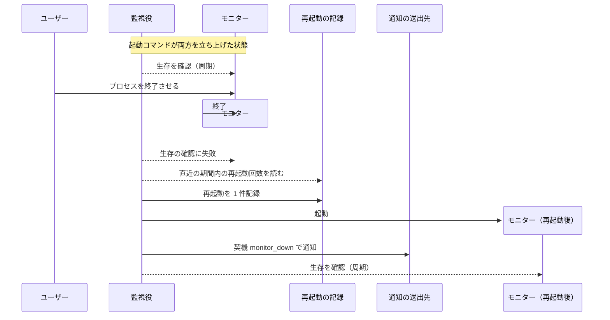
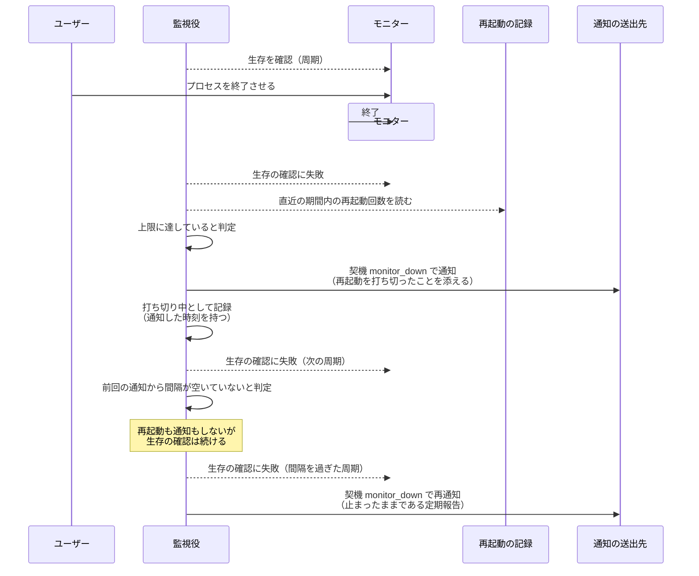
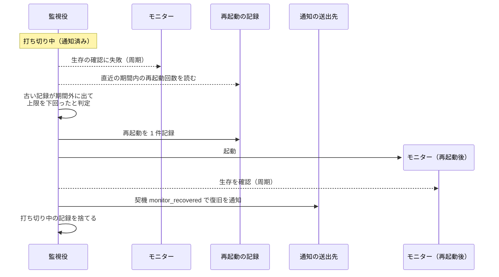
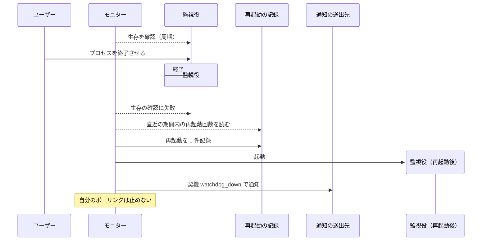
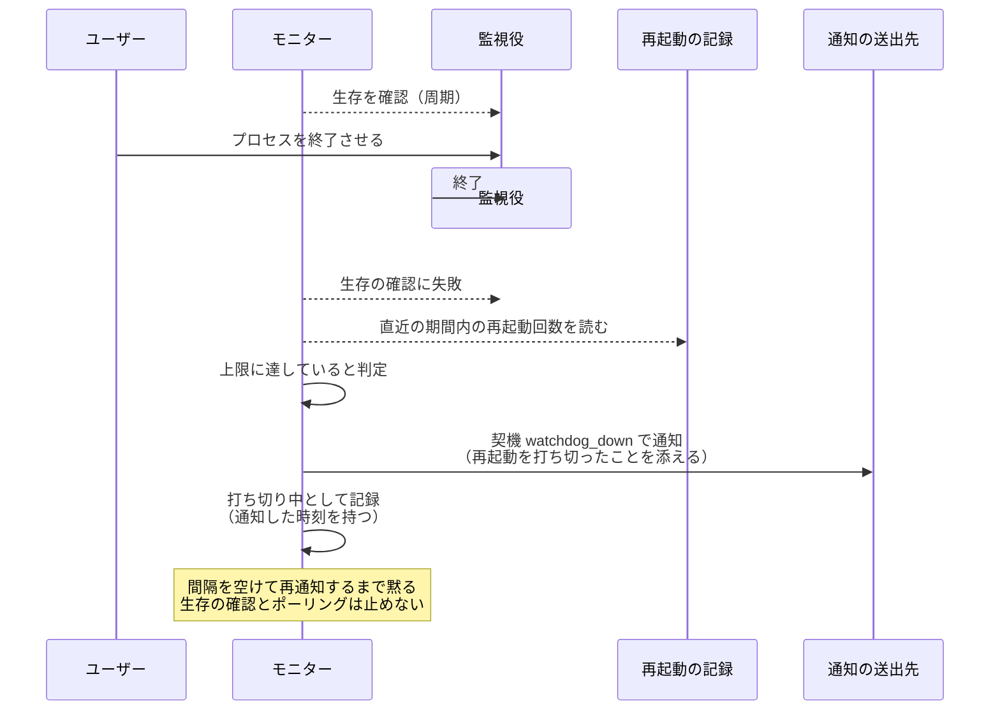
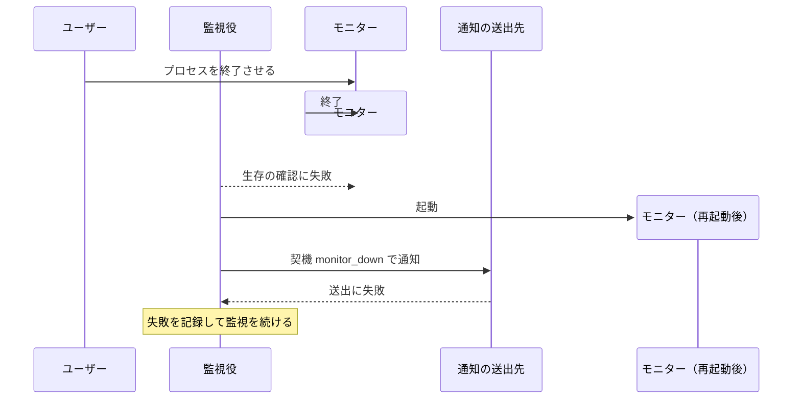

# プロセス死活監視

モニターと監視役がお互いの生存を見張り、相手が落ちたら再起動して通知する単一ユースケース。

- 対応テストファイル: `tests/integration/monitor/test_プロセス死活監視.py`

## 正常シナリオ（モニターの異常終了）

### セットアップ

| セットアップ | 説明 | 補足 |
| --- | --- | --- |
| Mock | なし（実環境で実行） | - |
| モニターと監視役 | 起動コマンドで両方が立ち上がっている | 監視役はモニターの子プロセスにしない |
| 通知先 | 契機の送出先を 1 件設定 | 通知の到達を確認するため |
| 再起動の記録 | 直近の期間内に再起動なし | 上限に達していない状態を作る |
| 誘発 | モニターのプロセスを外から終了させる | 異常終了を決定的に誘発 |

### フロー

### 期待値

- モニターのプロセスが再び動いており、待受ポートが応答する
- 再起動の記録に 1 件が追加されている
- 契機 `monitor_down` の通知が送られ、本文に落ちたプロセスと再起動したことが載っている
- 監視役のプロセスは終始同じものが動き続けている

## 正常シナリオ（再起動の上限超過）

### セットアップ

| セットアップ | 説明 | 補足 |
| --- | --- | --- |
| Mock | なし（実環境で実行） | - |
| モニターと監視役 | 起動コマンドで両方が立ち上がっている | - |
| 通知先 | 契機の送出先を 1 件設定 | - |
| 再起動の記録 | 直近の期間内に上限回数ぶんの再起動が記録済み | 上限超過を決定的に誘発 |
| 誘発 | モニターのプロセスを外から終了させる | - |

### フロー

### 期待値

- モニターのプロセスが起動されていない
- 再起動の記録が増えていない
- 契機 `monitor_down` の通知が送られ、本文に再起動を打ち切ったことと上限の値が載っている
- 設定した間隔を過ぎるまでは、周期を何度またいでも通知が増えない（同じ文面が鳴り続けない）
- 間隔を過ぎた周期で再通知が 1 件送られる（止まったままであることが定期的に分かる）
- 打ち切り中も生存の確認は続いている

## 正常シナリオ（打ち切りからの復帰）

### セットアップ

| セットアップ | 説明 | 補足 |
| --- | --- | --- |
| Mock | なし（実環境で実行） | - |
| 監視役 | 打ち切り中の状態で起動し続けている | 打ち切りの状態はプロセス内に持つ |
| モニター | 停止したまま | - |
| 再起動の記録 | 上限回数ぶんが記録済み | 打ち切り状態を決定的に誘発 |
| 誘発 | 記録の最も古い 1 件が期間の外に出るまで待つ | 直近の期間内の回数が上限を下回る |

### フロー

### 期待値

- モニターのプロセスが再び動いており、待受ポートが応答する
- 人が再起動の記録を消さなくても復帰している
- 復旧の通知が 1 件送られ、本文に相手が戻ったことが載っている
- 打ち切り中の記録が落ちており、次に打ち切りへ入ったときは再び最初の 1 回から通知される
- 監視役が途中で再起動していた場合は復旧の通知が送られない（打ち切りに入っていた事実をプロセス内にしか持たないため）

## 正常シナリオ（監視役の異常終了）

### セットアップ

| セットアップ | 説明 | 補足 |
| --- | --- | --- |
| Mock | なし（実環境で実行） | - |
| モニターと監視役 | 起動コマンドで両方が立ち上がっている | - |
| 通知先 | 契機の送出先を 1 件設定 | - |
| 再起動の記録 | 直近の期間内に再起動なし | - |
| 誘発 | 監視役のプロセスを外から終了させる | 異常終了を決定的に誘発 |

### フロー

### 期待値

- 監視役のプロセスが再び動いている
- モニターのプロセスは終始同じものが動き続け、ポーリングが止まっていない
- 契機 `watchdog_down` の通知が送られている

## 正常シナリオ（監視役の再起動の上限超過）

### セットアップ

| セットアップ | 説明 | 補足 |
| --- | --- | --- |
| Mock | なし（実環境で実行） | - |
| モニターと監視役 | 起動コマンドで両方が立ち上がっている | - |
| 通知先 | 契機の送出先を 1 件設定 | - |
| 再起動の記録 | 監視役の再起動が直近の期間内に上限回数ぶん記録済み | 上限超過を決定的に誘発 |
| 誘発 | 監視役のプロセスを外から終了させる | - |

### フロー

### 期待値

- 監視役のプロセスが起動されていない
- 再起動の記録が増えていない
- 契機 `watchdog_down` の通知が送られ、本文に再起動を打ち切ったことと上限の値が載っている
- 設定した間隔を過ぎるまでは、周期を何度またいでも通知が増えない（同じ文面が鳴り続けない）
- モニターのプロセスは動き続け、ポーリングが止まっていない

## 異常シナリオ（通知の送出に失敗）

### セットアップ

| セットアップ | 説明 | 補足 |
| --- | --- | --- |
| Mock | なし（実環境で実行） | - |
| モニターと監視役 | 起動コマンドで両方が立ち上がっている | - |
| 通知先 | 到達しない送出先を設定 | 送出の失敗を決定的に誘発 |
| 誘発 | モニターのプロセスを外から終了させる | - |

### フロー

### 期待値

- 通知の送出に失敗してもモニターの再起動は完了している
- 監視役のプロセスが落ちずに監視を続けている
