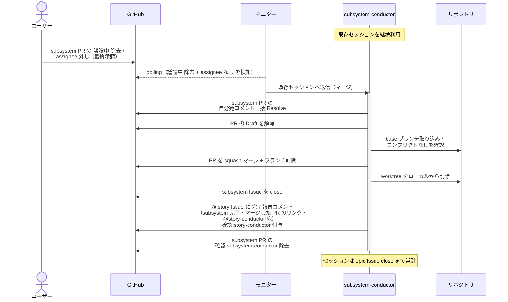
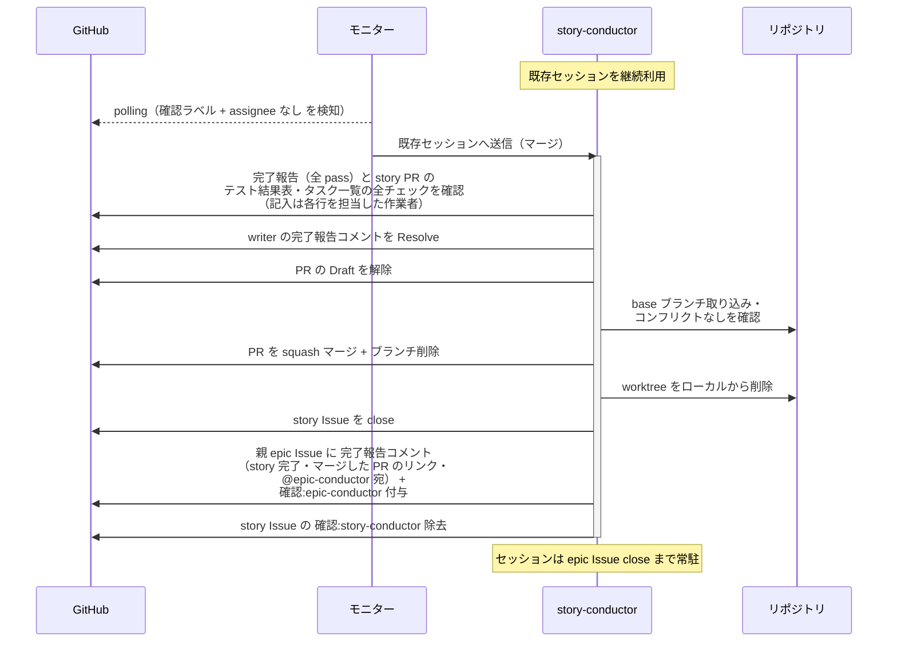
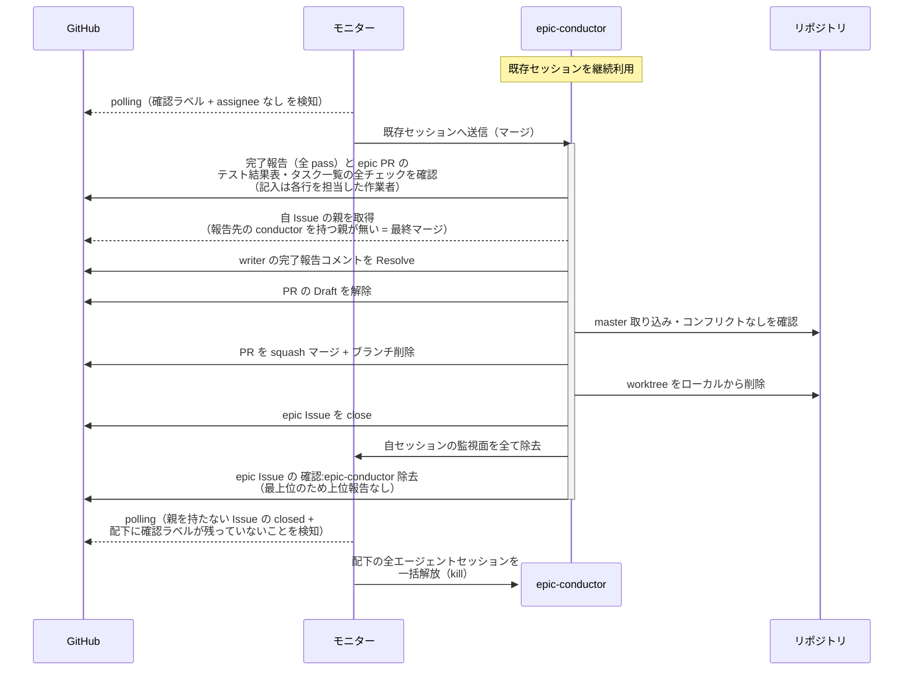
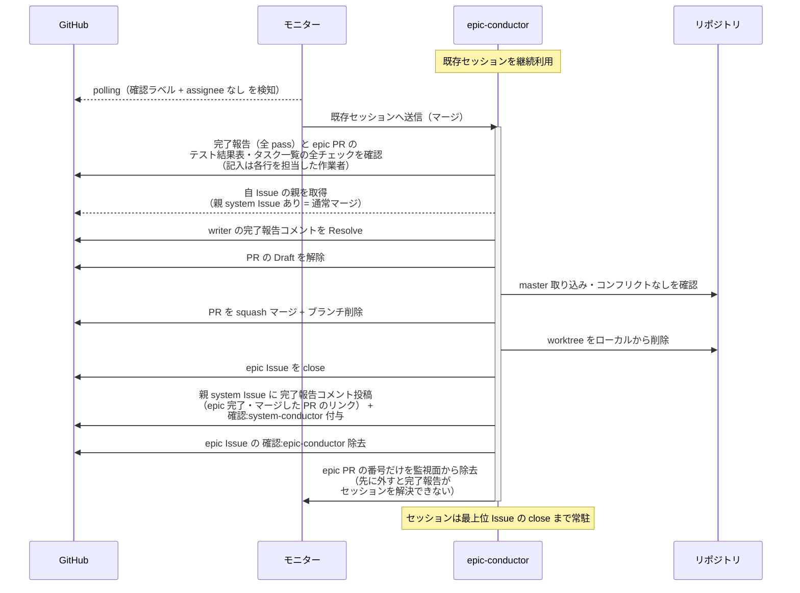
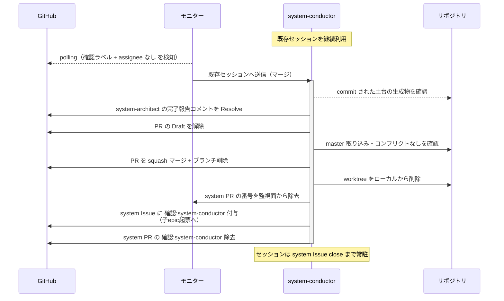
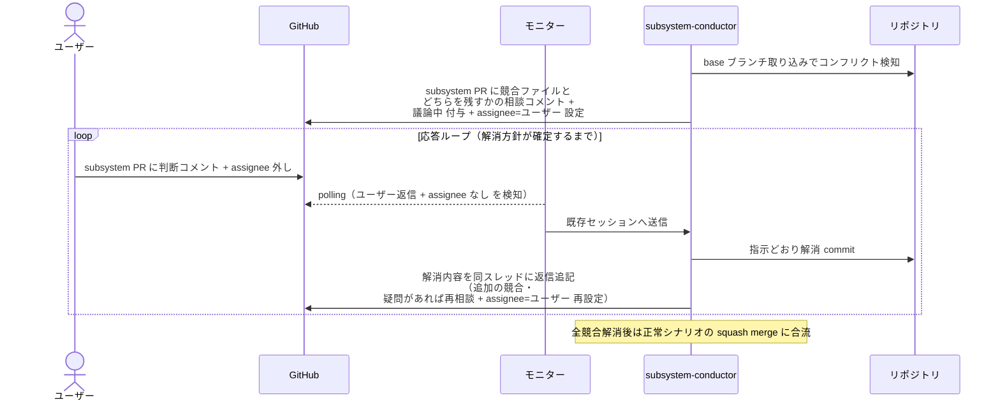

# マージ

各レイヤーの conductor が自分の配下 PR を base ブランチへ squash マージし、ブランチ / worktree を削除して上位レイヤーの conductor に完了報告する単一ユースケース（手順は `規約/マージ手順.md`）。

対応エージェント: `subsystem-conductor` / `story-conductor` / `epic-conductor` / `system-conductor`

- 対応テストファイル: `tests/e2e/単一ユースケース/test_マージ.py`

## 正常シナリオ（subsystem レベル・ユーザー承認後）

### セットアップ

| セットアップ | 説明 | 補足 |
| --- | --- | --- |
| Mock | なし（実環境で実行） | - |
| subsystem PR | Ready + タスク一覧 全チェック済み + `確認:subsystem-conductor` + `議論中` + `assignee=ユーザー`（マージ起動のゲート中） | - |
| ユーザー操作 | `議論中` 除去 + assignee 外し（最終承認） | 分岐を決定的に誘発 |
| base ブランチ | コンフリクトなし | - |

### フロー

### 期待値

- subsystem PR が merged 状態、リモートブランチ・ローカル worktree とも削除済み
- 紐づく subsystem Issue が close されている
- 親 story Issue に `確認:story-conductor` + 完了報告コメント（subsystem 完了・@story-conductor 宛・未解決）が付与・投稿されている
- 完了報告の本文にマージした subsystem PR へのリンクが載っている（受け取った側が経緯を追える）
- subsystem PR の自分宛コメントが全て Resolve 済みで、`確認:subsystem-conductor` が除去されている

## 正常シナリオ（story レベル・自動）

### セットアップ

| セットアップ | 説明 | 補足 |
| --- | --- | --- |
| Mock | なし（実環境で実行） | - |
| story Issue | `確認:story-conductor` 付与済み + single-scenario-writer の完了報告コメント（全 pass・自分宛・未解決）あり | - |
| story PR | `## タスク一覧` が全行チェック済み | 記入は各行を担当した作業者。conductor は確認だけ |
| base ブランチ | コンフリクトなし | - |
| assignee | 未設定 | エージェント起動条件 |

### フロー

### 期待値

- story PR が merged 状態、リモートブランチ・ローカル worktree とも削除済み
- 紐づく story Issue が close されている
- writer の完了報告コメントが Resolve 済み
- 親 epic Issue に `確認:epic-conductor` + 完了報告コメント（story 完了・@epic-conductor 宛・未解決）が付与・投稿されている
- 完了報告の本文にマージした story PR へのリンクが載っている（受け取った側が経緯を追える）
- `確認:story-conductor` が除去されている

## 正常シナリオ（epic レベル・終端処理）

自 Issue が最上位（親 Issue を持たない、または親が報告先の conductor を持たない `layer:intake`）のときの経路。
上位レイヤーがある場合は 正常シナリオ（epic レベル・上位レイヤーあり）を通る。

### セットアップ

| セットアップ | 説明 | 補足 |
| --- | --- | --- |
| Mock | なし（実環境で実行） | - |
| epic Issue | `確認:epic-conductor` 付与済み + complex-scenario-writer の完了報告コメント（全 pass・自分宛・未解決）あり | - |
| epic PR | `## タスク一覧` が全行チェック済み | 記入は各行を担当した作業者。conductor は確認だけ |
| 親 Issue | なし、または `layer:intake` の intake Issue | 最終マージ判定を決定的に誘発 |
| base ブランチ | master・コンフリクトなし | - |
| assignee | 未設定 | エージェント起動条件 |

### フロー

### 期待値

- epic PR が master へ merged 状態、リモートブランチ・ローカル worktree とも削除済み
- 紐づく epic Issue が close され、epic 配下の Issue / PR に `確認:*` が 1 つも残っていない
- 最終マージを行ったセッションの監視面が空になっている
- epic 配下の全エージェントの tmux セッションが解放済み（ゾンビセッションなし）

## 正常シナリオ（epic レベル・上位レイヤーあり）

自 Issue が親 system Issue を持つときの経路。
マージと上位への完了報告だけを行い、後片付け（監視面の全除去とセッション一括解放）は最上位レイヤーが closed になるまで走らせない。

### セットアップ

| セットアップ | 説明 | 補足 |
| --- | --- | --- |
| Mock | なし（実環境で実行） | - |
| epic Issue | `確認:epic-conductor` 付与済み + complex-scenario-writer の完了報告コメント（全 pass・自分宛・未解決）あり | - |
| epic PR | `## タスク一覧` が全行チェック済み | 記入は各行を担当した作業者。conductor は確認だけ |
| 親 Issue | `layer:system` の system Issue が open | 上位レイヤーありを決定的に誘発 |
| 兄弟 epic | 未着手の epic Issue が open で残っている | 一括解放が走らないことの確認用 |
| base ブランチ | master・コンフリクトなし | - |
| assignee | 未設定 | エージェント起動条件 |

### フロー

### 期待値

- epic PR が master へ merged 状態、リモートブランチ・ローカル worktree とも削除済み
- 紐づく epic Issue が close されている
- 親 system Issue に `確認:system-conductor` と完了報告コメント（未解決）が付与・投稿されている
- 完了報告の本文にマージした epic PR へのリンクが載っている（受け取った側が経緯を追える）
- epic PR の番号だけが監視面から除去され、epic Issue の番号は監視面に残っている
- epic 配下のセッションが 1 つも解放されていない（一括解放が走っていない）
- 兄弟 epic Issue が open のまま残っている

## 正常シナリオ（system レベル・自動）

### セットアップ

| セットアップ | 説明 | 補足 |
| --- | --- | --- |
| Mock | なし（実環境で実行） | - |
| system PR | `確認:system-conductor` 付与済み + system-architect の完了報告コメント（自分宛・未解決）あり | 土台生成はユーザー承認済み |
| base ブランチ | master・コンフリクトなし | - |
| assignee | PR に未設定 | エージェント起動条件 |

### フロー

### 期待値

- system PR が master へ merged 状態、リモートブランチ・ローカル worktree とも削除済み
- master に `README.md`・`docs/rules.yaml`・`docs/wiki/` の骨格とアーキテクチャ図が入っている
- system PR の番号が監視面から除去されている
- system Issue に `確認:system-conductor` が付与されている（子epic起票へ続く）
- system PR の `確認:system-conductor` が除去され、system-architect の完了報告コメントが Resolve 済み

## 異常シナリオ（コンフリクト発生）

### セットアップ

| セットアップ | 説明 | 補足 |
| --- | --- | --- |
| Mock | なし（実環境で実行） | - |
| subsystem PR | マージ実行の直前まで完了（ユーザー最終承認済み） | 図は subsystem レベルで代表 |
| base ブランチ | 同一ファイルが base 側で先に変更済み | 意図的にコンフリクトを仕込む |

### フロー

### 期待値

- PR が merged 状態（解消 commit を含む）
- 解消内容が相談コメントのスレッドに記録されている
