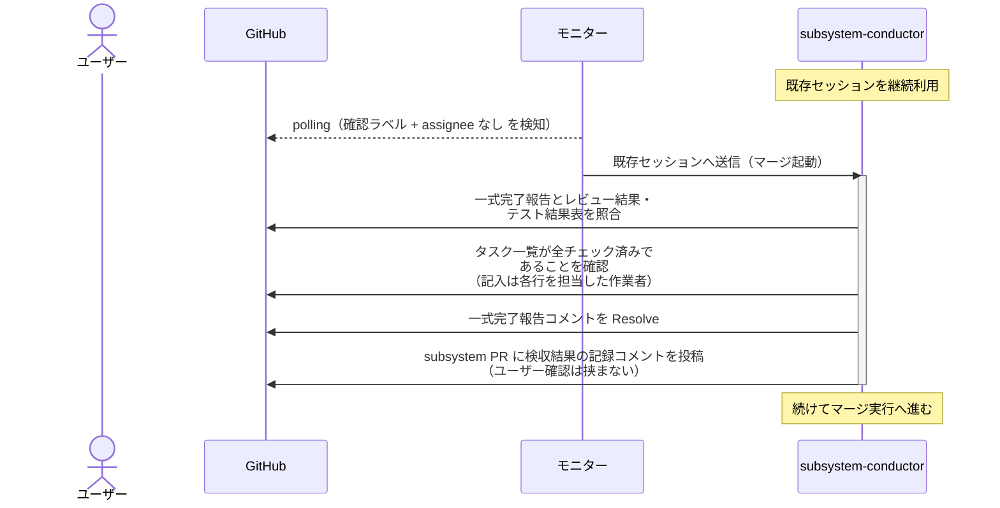

# マージ起動

subsystem-conductor（復帰呼び出し）が architect の一式完了報告を検収し、検収結果を記録してマージ実行へ続ける単一ユースケース。

対応エージェント: `subsystem-conductor`（architect の一式完了報告コメントで復帰）

- 対応テストファイル: `tests/e2e/単一ユースケース/test_マージ起動.py`

## 正常シナリオ

### セットアップ

| セットアップ | 説明 | 補足 |
| --- | --- | --- |
| Mock | なし（実環境で実行） | - |
| subsystem PR | `確認:subsystem-conductor` 付与済み + architect の一式完了報告コメント（自分宛・未解決）あり | Ready 状態・テスト結果表 全 ✅・タスク一覧 全チェック済み |
| assignee | 未設定 | エージェント起動条件 |

### フロー

### 期待値

- `## タスク一覧` の全行がチェック済み
- 一式完了報告コメントが Resolve 済み
- subsystem PR に検収結果の記録コメントが投稿されている
- `議論中` が付与されず assignee も設定されていない（検収は自動で通る）
- `確認:subsystem-conductor` は保持されたまま（同じ担当がマージ実行へ進むため）

## 異常シナリオ

なし
