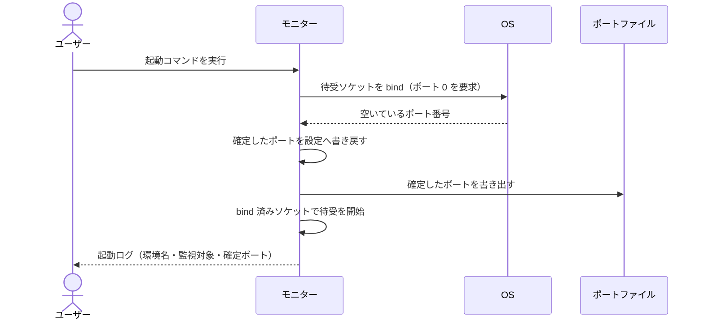
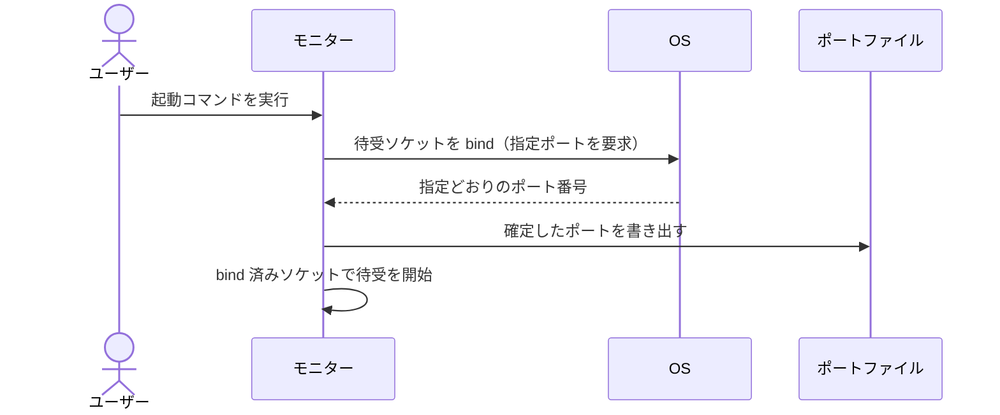
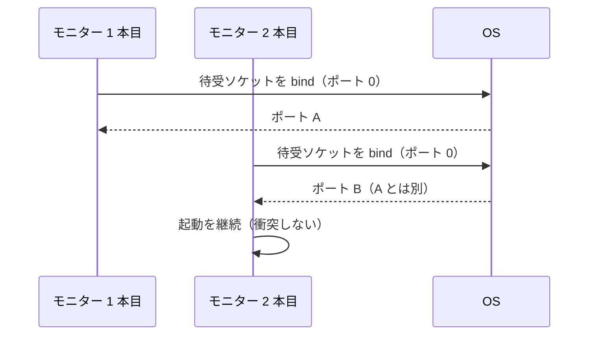
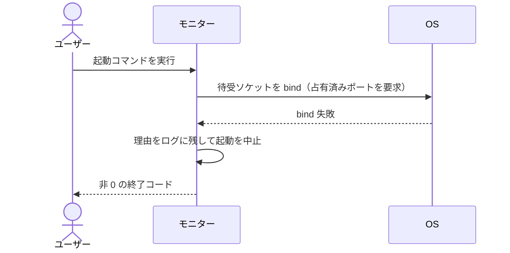

# モニターの起動

ユーザーがモニターを起動し、待受ポートが確定して監視が始まるまでの単一ユースケース。

- 対応テストファイル: `tests/integration/monitor/test_モニターの起動.py`

## 正常シナリオ（ポート自動確定）

### セットアップ

| セットアップ | 説明 | 補足 |
| --- | --- | --- |
| Mock | GitHub API を差し替え（対象一覧に空を返す） | 実リポジトリを持たずにポーリングを回すため |
| 設定ファイル | 待受ポートに `0` を指定 | 自動確定を決定的に誘発 |
| 監視役 | 無効化 | 起動の検証にプロセスを増やさない |

### フロー

### 期待値

- ポートファイルに 1 以上のポート番号が書かれている
- そのポートで HTTP の応答が返る
- 起動ログの先頭に環境名・監視対象リポジトリ・確定ポートが出ている
- エージェント起動時に組み立てる MCP の接続先が、確定したポートを指している

## 正常シナリオ（ポート指定）

### セットアップ

| セットアップ | 説明 | 補足 |
| --- | --- | --- |
| Mock | GitHub API を差し替え（対象一覧に空を返す） | - |
| 設定ファイル | 待受ポートに空いている固定値を指定 | 指定値の尊重を確認 |
| 監視役 | 無効化 | - |

### フロー

### 期待値

- 指定した番号がそのまま待受ポートになっている
- ポートファイルの内容が指定値と一致している

## 正常シナリオ（2 本目の同時起動）

### セットアップ

| セットアップ | 説明 | 補足 |
| --- | --- | --- |
| Mock | GitHub API を差し替え（対象一覧に空を返す） | - |
| 1 本目 | 待受ポートに `0` を指定して起動済み | - |
| 2 本目 | 別の作業ディレクトリ・別のポートファイルで、待受ポートに `0` を指定 | 並行起動を決定的に誘発 |
| 監視役 | 双方とも無効化 | - |

### フロー

### 期待値

- 2 本のモニターが同時に待受している
- 互いのポート番号が異なる
- それぞれのポートファイルに自分のポートだけが書かれている

## 異常シナリオ（指定ポートが使用中）

### セットアップ

| セットアップ | 説明 | 補足 |
| --- | --- | --- |
| Mock | GitHub API を差し替え（対象一覧に空を返す） | - |
| 占有 | 対象ポートを別のソケットが占有済み | bind 失敗を決定的に誘発 |
| 設定ファイル | その占有済みポートを固定値で指定 | - |

### フロー

### 期待値

- 非 0 の終了コードで終了している
- ログに「指定ポートが使用中」であることと該当ポート番号が出ている
- ポートファイルが作成 / 更新されていない（古い値を残さない）
