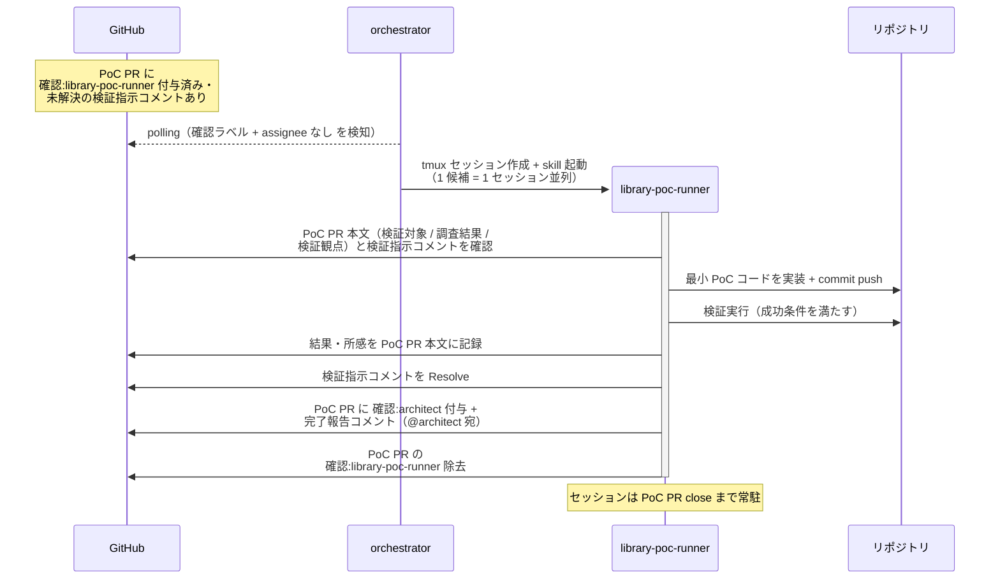

# ライブラリPoC検証

library-poc-runner が担当候補 1 つの PoC を検証する単一ユースケース。発注元 worker（architect / ui-designer）が作成した PoC PR 上で、最小 PoC コードの実装 → 検証実行 → 結果記録を行い、発注元へ完了報告する。
監視・会話面は担当の PoC PR のみ（図は発注元 = architect で代表）。

対応モニター: `library-poc-runner`

## 正常シナリオ

### 前提条件

| No | セットアップ | 説明 | 補足 |
| --- | --- | --- | --- |
| 1 | PoC Draft PR | 発注元が作成済み（base=master・検証観点を本文に記載）+ `確認:library-poc-runner` + 検証指示コメント（@library-poc-runner 宛・未解決）あり | - |
| 2 | 候補比較コメント | subsystem PR に調査結果（使い方・コード例）あり | 引き継ぎ元 |
| 3 | assignee | PoC PR に未設定 | モニター起動条件 |

### 図



**期待動作:**
- PoC PR 本文に検証結果（実測値・所感）が記録されている
- 検証指示コメントが Resolve 済み
- PoC PR に `確認:{発注元 worker}` + 完了報告コメント（@発注元宛・未解決）が付与・投稿されている
- `確認:library-poc-runner` が除去されている

## 正常シナリオ（ユーザーからの個別質問・追加検証）

### 前提条件

| No | セットアップ | 説明 | 補足 |
| --- | --- | --- | --- |
| 1 | PoC PR | 完了報告済み・セッション常駐中 | - |
| 2 | ユーザー操作 | PoC PR に `確認:library-poc-runner` を付与して質問 / 追加検証の指示コメントを投稿 | 個別候補の深掘り |

### 図

```mermaid
sequenceDiagram
  actor U as ユーザー
  participant GH as GitHub
  participant ORC as orchestrator
  participant MON as architect
  participant REPO as リポジトリ

  Note over MON: 設計の応答ループ中に<br>ライブラリ選定論点が発生
  activate MON
  MON->>MON: 候補列挙 + 候補ごとの調査<br>（library-finder / library-researcher 並列）
  MON->>GH: subsystem PR に候補比較 +<br>検証観点の提案コメント（スレッド起点）+<br>assignee=ユーザー 設定
  deactivate MON

