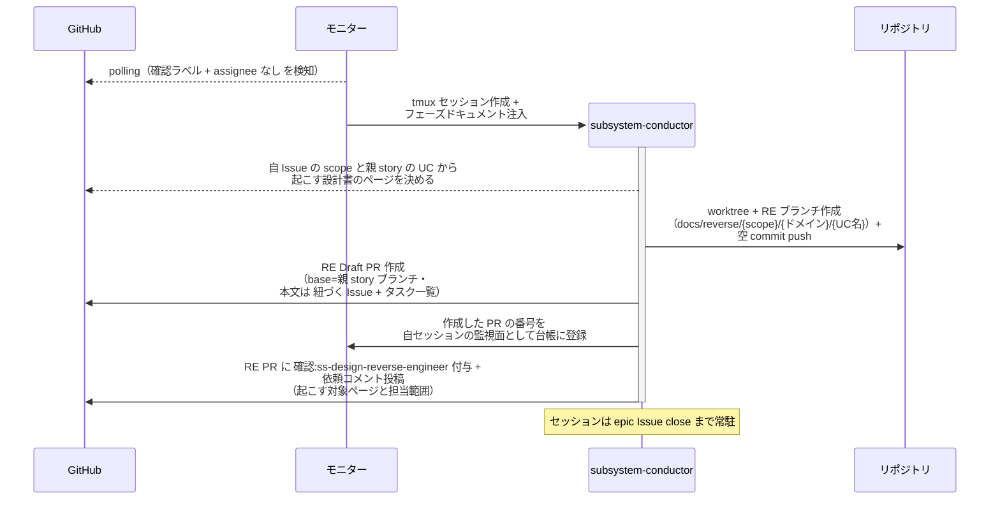
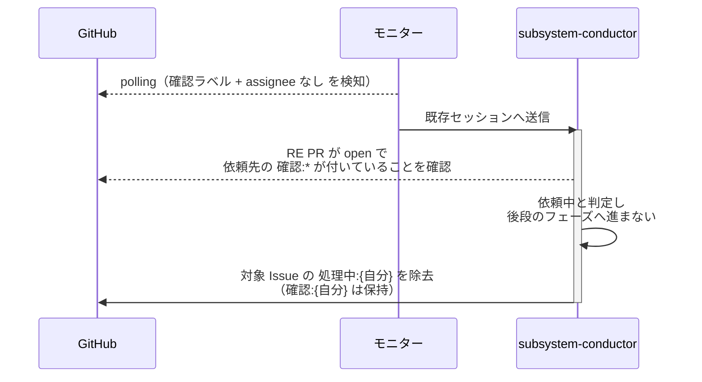
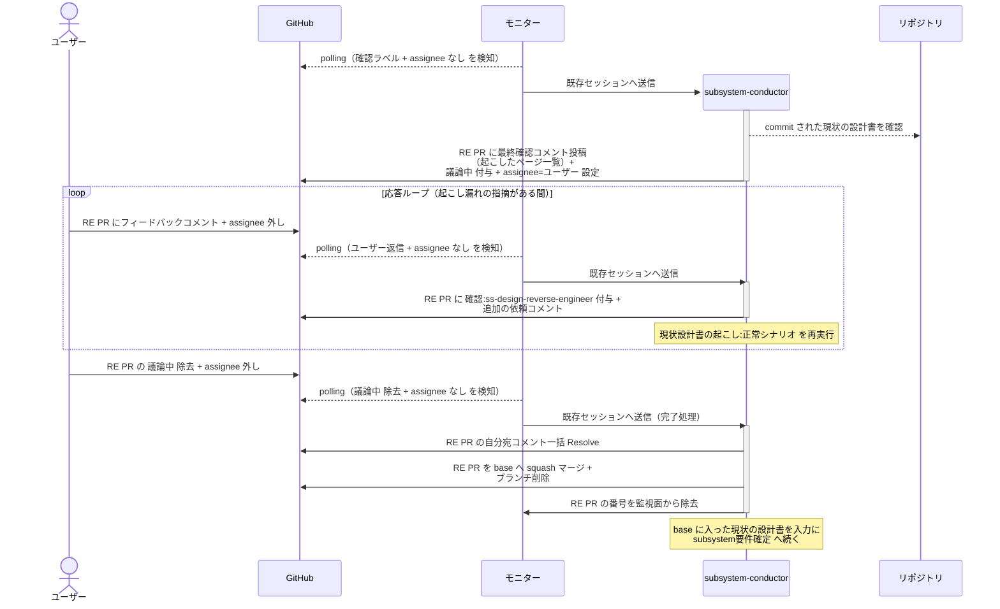
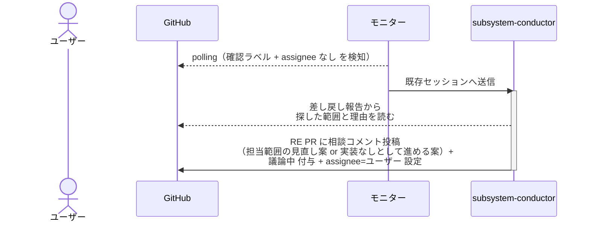

# リバースエンジニアリング起動

conductor が RE PR を作って `*-reverse-engineer` に現状の設計書を起こさせ、完了報告を受けてユーザー確認後にマージするまでの単一ユースケース。
自レイヤーの最初の工程として、要件確定より前に通す。
レイヤーごとに担当と成果物が違うだけで手順は共通のため 1 ファイルにまとめる。

対応エージェント: `epic-conductor` / `story-conductor` / `subsystem-conductor` / `system-conductor`

- 対応テストファイル: `tests/e2e/単一ユースケース/test_リバースエンジニアリング起動.py`

**レイヤー別の担当:**

| レイヤー | 起動する側 | 依頼先 | RE ブランチ | マージ先 | 起こす範囲 | マージ後に conductor が読むもの |
| --- | --- | --- | --- | --- | --- | --- |
| system | system-conductor | `architecture-reverse-engineer` | `docs/reverse/system/{ドメイン}` | `master` | リポジトリ全体 | アーキテクチャ図 + 機能の洗い出し（完了報告コメント） |
| epic | epic-conductor | `mock-reverse-engineer` / `complex-scenario-reverse-engineer` | `docs/reverse/mock/{ドメイン}` / `docs/reverse/epic/{ドメイン}` | `master` | 親 system Issue の `## エピック一覧` の所属ユースケース | 現状モック + 現状の複合 UC シナリオ（画面ありの epic のみ mock 側の RE PR も作る） |
| story | story-conductor | `single-scenario-reverse-engineer` | `docs/reverse/story/{ドメイン}/{UC名}` | epic ブランチ | 親 epic Issue の `## ユースケース一覧` の当該 UC | 現状の単一 UC シナリオ |
| subsystem | subsystem-conductor | `ss-design-reverse-engineer` | `docs/reverse/{scope}/{ドメイン}/{UC名}` | story ブランチ | 親 story の UC のうち自 Issue の `scope:*` が指す範囲 | 現状の結合 / モジュール構成 |

## 正常シナリオ（RE PR の作成と依頼）

### セットアップ

| セットアップ | 説明 | 補足 |
| --- | --- | --- |
| Mock | なし（実環境で実行） | - |
| `リバースエンジニアリング` ラベル | 対象 Issue に付与済み | 本 UC を通す判定材料 |
| subsystem Issue | `layer:subsystem` + `scope:*` + `確認:subsystem-conductor` 付与済み・本文は空 | [子subsystem起票](./子subsystem起票.md) の完了状態 |
| assignee | 未設定 | エージェント起動条件 |
| モニター | 対象リポを polling 中 | - |

### フロー

### 期待値

- RE Draft PR（base=通常 PR と同じ base）が作成され、本文に `## 紐づく Issue` と `## タスク一覧` が記入されている
- 作成した PR の番号が自セッションの監視面（モニターの台帳）に登録されている
- RE PR に依頼先の `確認:*` と依頼コメント（未解決）が付与・投稿されている
- 通常 PR はまだ作成されていない
- 対象 Issue の `確認:{自分}` が残っている（マージまで担当を持つ）

## 正常シナリオ（依頼中の再起動）

### セットアップ

| セットアップ | 説明 | 補足 |
| --- | --- | --- |
| Mock | なし（実環境で実行） | - |
| `リバースエンジニアリング` ラベル | 対象 Issue に付与済み | 本 UC を通す判定材料 |
| RE PR | 作成済みで open・依頼先の `確認:*` が付与済み | 依頼先が作業中の状態 |
| 依頼先からのコメント | なし | 完了報告も差し戻し報告も返っていない |
| 対象 Issue | `確認:{自分}` が残っており、本文の `## システム要件（SA）` は未記入 | 索引を上から見ると要件確定にフォールスルーする条件 |
| assignee | 未設定 | エージェント起動条件 |
| モニター | 対象リポを polling 中 | - |

### フロー

### 期待値

- 設計書への commit が 1 件も発生していない
- 対象 Issue の本文に `## システム要件（SA）` が書かれていない（要件確定へフォールスルーしていない）
- RE PR の本文・ラベル・コメントが変わっていない
- 対象 Issue に `確認:{自分}` が残り、`処理中:{自分}` が除去されている（状況が変わったターンで正しいフェーズから再開できる）
- ユーザー宛のコメントが投稿されていない（待機であってユーザーの判断を求めない）

## 正常シナリオ（完了報告の受領とマージ）

### セットアップ

| セットアップ | 説明 | 補足 |
| --- | --- | --- |
| Mock | なし（実環境で実行） | - |
| RE PR | `確認:subsystem-conductor` 付与済み + `*-reverse-engineer` の完了報告コメント（自分宛・未解決）あり | [現状設計書の起こし](./現状設計書の起こし.md) の完了状態 |
| assignee | PR に未設定 | エージェント起動条件 |
| 現状の設計書 | RE ブランチに commit 済み | マージ対象 |

### フロー

### 期待値

- RE PR が merged・RE ブランチが削除済み
- base ブランチに現状の設計書が入っている
- RE PR の番号が監視面から除去されている
- 対象 Issue の `確認:{自分}` が残っている（要件確定へ続くため）
- 対象 Issue の本文がまだ空（要件確定は次工程）
- 自分宛コメントが全て Resolve 済み

## 異常シナリオ（RE エージェントからの差し戻し）

### セットアップ

| セットアップ | 説明 | 補足 |
| --- | --- | --- |
| Mock | なし（実環境で実行） | - |
| RE PR | `確認:subsystem-conductor` 付与済み + `*-reverse-engineer` の差し戻し報告コメントあり | 担当範囲の実装が見つからなかった状態 |
| assignee | PR に未設定 | エージェント起動条件 |

### フロー

### 期待値

- RE PR に相談コメント（未解決）が投稿され、`議論中` + `assignee=ユーザー` が設定されている
- 設計書が 1 ページも commit されていない
- RE PR はマージされていない
