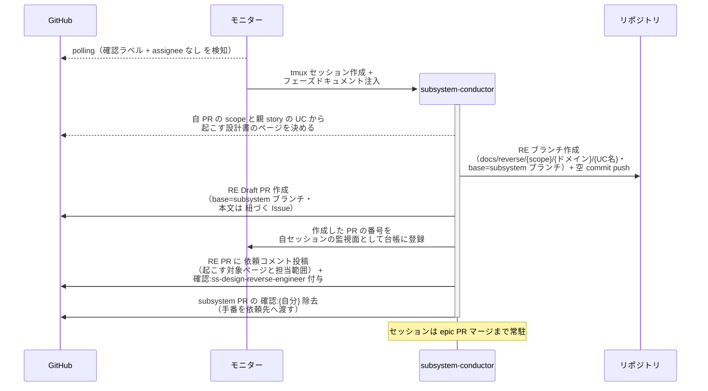
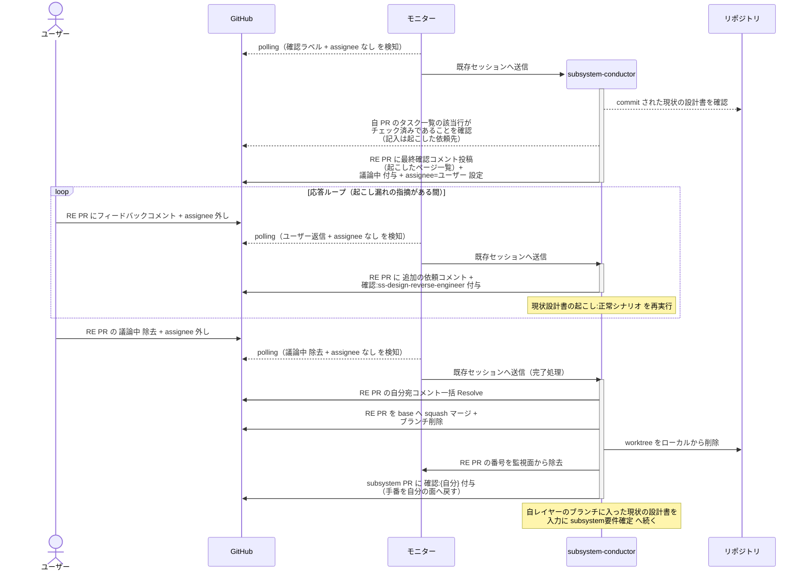
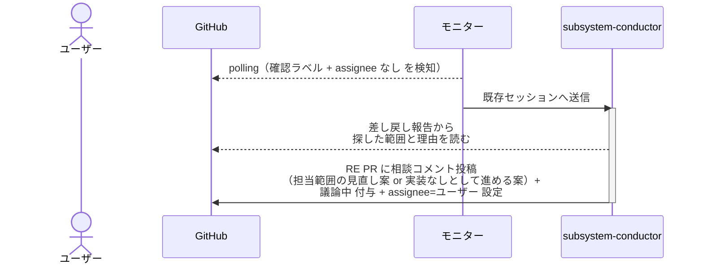

# リバースエンジニアリング起動

conductor が RE PR を作って `*-reverse-engineer` に現状の設計書を起こさせ、完了報告を受けてユーザー確認後にマージするまでの単一ユースケース。

対応エージェント: `epic-conductor` / `story-conductor` / `subsystem-conductor` / `system-conductor`

- 対応テストファイル: `tests/e2e/単一ユースケース/test_リバースエンジニアリング起動.py`

**レイヤー別の担当:**

| レイヤー | 起動する側 | 依頼先 | RE ブランチ | base とマージ先 | 起こす範囲 | マージ後に conductor が読むもの |
| --- | --- | --- | --- | --- | --- | --- |
| system | system-conductor | `architecture-reverse-engineer` | `docs/reverse/system/{ドメイン}` | system ブランチ | リポジトリ全体 | アーキテクチャ図 + 機能の洗い出し（完了報告コメント） |
| epic | epic-conductor | `mock-reverse-engineer` / `complex-scenario-reverse-engineer` | `docs/reverse/mock/{ドメイン}` / `docs/reverse/epic/{ドメイン}` | epic ブランチ | 親 system PR の `## エピック一覧` の所属ユースケース | 現状モック + 現状の複合 UC シナリオ（画面ありの epic のみ mock 側の RE PR も作る） |
| story | story-conductor | `single-scenario-reverse-engineer` | `docs/reverse/story/{ドメイン}/{UC名}` | story ブランチ | 親 epic PR の `## ユースケース一覧` の当該 UC | 現状の単一 UC シナリオ |
| subsystem | subsystem-conductor | `ss-design-reverse-engineer` | `docs/reverse/{scope}/{ドメイン}/{UC名}` | subsystem ブランチ | 親 story の UC のうち自 PR の `scope:*` が指す範囲 | 現状の結合 / モジュール構成 |

## 正常シナリオ（RE PR の作成と依頼）

### セットアップ

| セットアップ | 説明 | 補足 |
| --- | --- | --- |
| Mock | なし（実環境で実行） | - |
| `リバースエンジニアリング` ラベル | 対象 PR に付与済み | 本 UC を通す判定材料 |
| subsystem PR | `layer:subsystem` + `scope:*` + `確認:subsystem-conductor` 付与済み・本文は `## 紐づく Issue` のみ | [子subsystemPR作成](./子subsystemPR作成.md) の完了状態 |
| assignee | 未設定 | エージェント起動条件 |
| モニター | 対象リポを polling 中 | - |

### フロー

### 期待値

- RE Draft PR（base=自レイヤーのブランチ）が作成され、本文の `## 紐づく Issue` に起点の Issue の番号が入っている
- 作成した PR の番号が自セッションの監視面（モニターの台帳）に登録されている
- RE PR に依頼先の `確認:*` と依頼コメント（未解決）が付与・投稿されている
- 同じレイヤーの他の成果物ブランチはまだ作成されていない（RE を先にマージしてから作る）
- 対象 PR の `確認:{自分}` が除去されている（手番は RE PR の依頼先にあり、依頼中に自分が起動されない）

## 正常シナリオ（完了報告の受領とマージ）

### セットアップ

| セットアップ | 説明 | 補足 |
| --- | --- | --- |
| Mock | なし（実環境で実行） | - |
| RE PR | `確認:subsystem-conductor` 付与済み + `*-reverse-engineer` の完了報告コメント（自分宛・未解決）あり | [現状設計書の起こし](./現状設計書の起こし.md) の完了状態 |
| assignee | 未設定 | エージェント起動条件 |
| 現状の設計書 | RE ブランチに commit 済み | マージ対象 |

### フロー

### 期待値

- RE PR が merged・RE ブランチが削除済み
- 自レイヤーのブランチに現状の設計書が 1 コミットとして入っている
- 自レイヤーの PR が open のまま（巻き込まれていない）
- RE PR の番号が監視面から除去されている
- 対象 PR に `確認:{自分}` が付与されている（要件確定へ続く）
- 対象 PR の本文がまだ `## 紐づく Issue` だけ（要件確定は次工程）
- 自分宛コメントが全て Resolve 済み

## 異常シナリオ（RE エージェントからの差し戻し）

### セットアップ

| セットアップ | 説明 | 補足 |
| --- | --- | --- |
| Mock | なし（実環境で実行） | - |
| RE PR | `確認:subsystem-conductor` 付与済み + `*-reverse-engineer` の差し戻し報告コメントあり | 担当範囲の実装が見つからなかった状態 |
| assignee | 未設定 | エージェント起動条件 |

### フロー

### 期待値

- RE PR に相談コメント（未解決）が投稿され、`議論中` + `assignee=ユーザー` が設定されている
- 設計書が 1 ページも commit されていない
- RE PR はマージされていない
