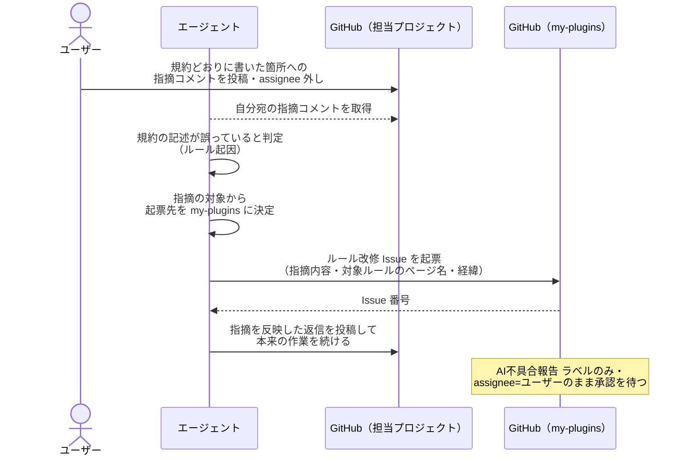
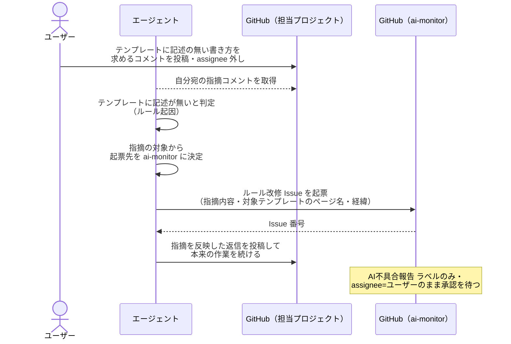
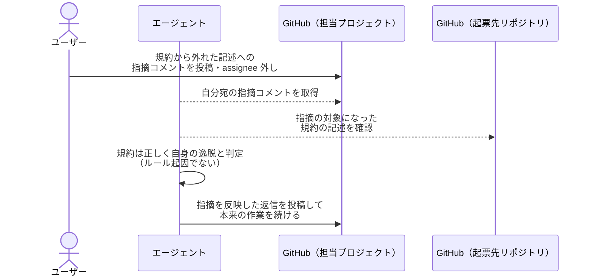

# ルール改修Issueの起票

ルールに従って作業したエージェントがユーザーから指摘を受けたとき、指摘の対象に応じた起票先へルール改修 Issue を起票する単一ユースケース。

対応エージェント: 全エージェント

- 対応テストファイル: `tests/e2e/単一ユースケース/test_ルール改修Issueの起票.py`

## 正常シナリオ（ルールの記述が誤っている）

### セットアップ

| セットアップ | 説明 | 補足 |
| --- | --- | --- |
| Mock | なし（実環境で実行） | - |
| intake Issue | 分解判定の応答ループで待機中（`議論中` + assignee=ユーザー） | エージェント起動条件。サブ Issue 案 + 確認事項 投稿済み |
| ルール（my-plugins 側） | 指摘の対象になる言語・フレームワークの規約ページが存在する | 起票本文から辿る先 |
| ユーザーフィードバック | 規約の記述どおりに書いた箇所を、その記述と反対の内容へ直すよう求めるコメント + assignee 外し | ルールの記述が誤っている分岐を決定的に誘発 |

### フロー

### 期待値

- my-plugins にルール改修 Issue が 1 件起票されている
- 起票された Issue の本文に、指摘内容・対象ルールのページ名・指摘に至った経緯が入っている
- 起票された Issue に `AI不具合報告` ラベルが付いている
- 起票された Issue に確認ラベルが付いていない
- 起票された Issue の assignee がユーザーになっている
- 担当プロジェクトの intake Issue に指摘を反映した返信が投稿され、応答ループが続いている

## 正常シナリオ（ルールに記述が無い）

### セットアップ

| セットアップ | 説明 | 補足 |
| --- | --- | --- |
| Mock | なし（実環境で実行） | - |
| intake Issue | 分解判定の応答ループで待機中（`議論中` + assignee=ユーザー） | エージェント起動条件。サブ Issue 案 + 確認事項 投稿済み |
| ルール（ai-monitor 側） | 指摘の対象になる PR 本文テンプレートに、ユーザーが求める書き方の記述が無い | 記述の欠落を決定的に誘発 |
| ユーザーフィードバック | テンプレートに記述の無い書き方へ直すよう求めるコメント + assignee 外し | ルールに記述が無い分岐を誘発 |

### フロー

### 期待値

- ai-monitor にルール改修 Issue が 1 件起票されている
- 起票された Issue の本文に、指摘内容・対象テンプレートのページ名・指摘に至った経緯が入っている
- 起票された Issue に `AI不具合報告` ラベルが付いている
- 起票された Issue に確認ラベルが付いていない
- 起票された Issue の assignee がユーザーになっている
- 担当プロジェクトの intake Issue に指摘を反映した返信が投稿され、応答ループが続いている

## 正常シナリオ（ルール起因でない指摘）

### セットアップ

| セットアップ | 説明 | 補足 |
| --- | --- | --- |
| Mock | なし（実環境で実行） | - |
| intake Issue | 分解判定の応答ループで待機中（`議論中` + assignee=ユーザー） | エージェント起動条件。サブ Issue 案 + 確認事項 投稿済み |
| ルール | ユーザーが求める書き方が、そのとおり規約ページに記述されている | ルール起因でない分岐を決定的に誘発 |
| ユーザーフィードバック | 規約に書かれているとおりへ直すよう求めるコメント + assignee 外し | エージェント自身の逸脱に対する指摘 |

### フロー

### 期待値

- 起票先リポジトリにルール改修 Issue が起票されていない
- 担当プロジェクトの intake Issue に指摘を反映した返信が投稿され、応答ループが続いている

## 異常シナリオ

なし
