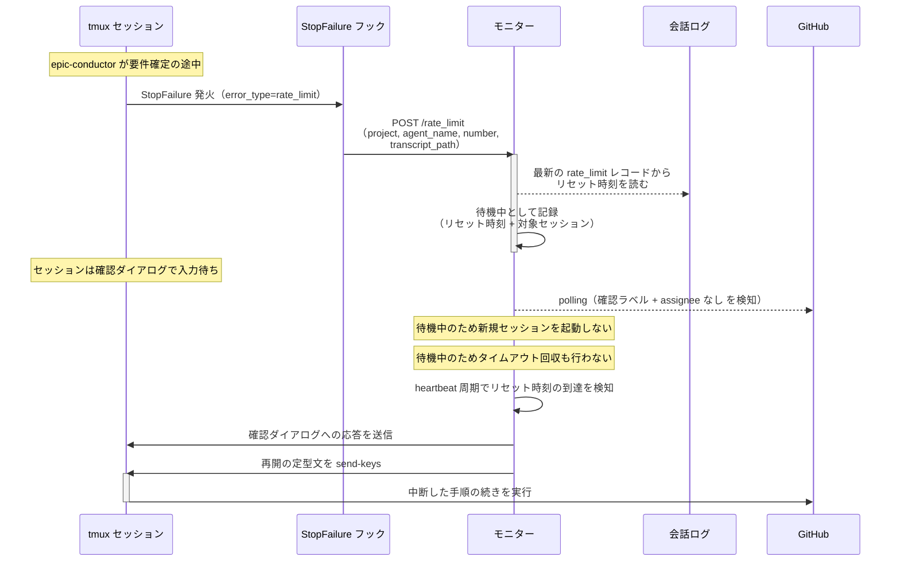
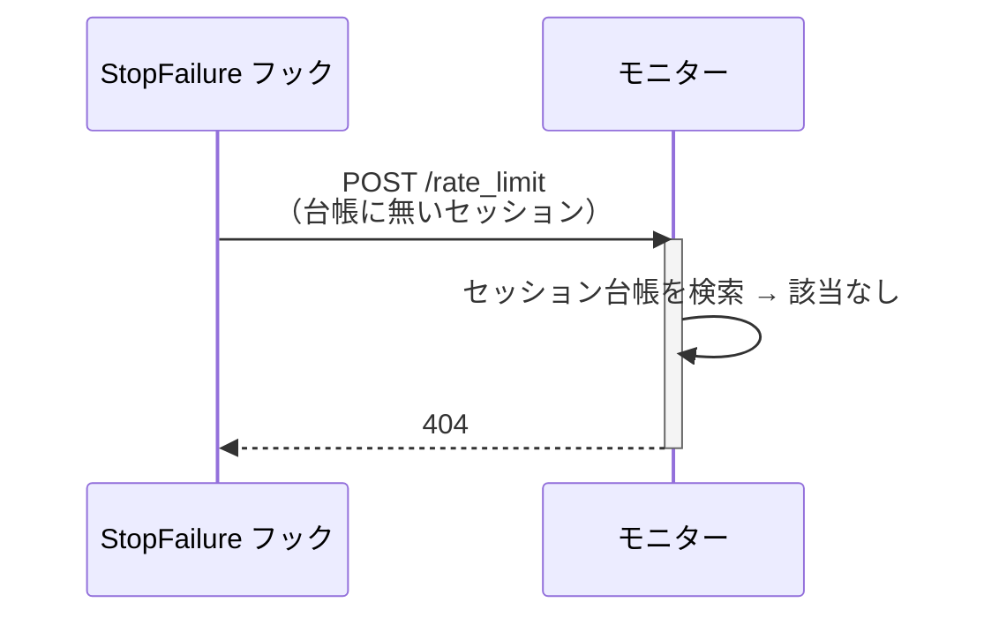

# レートリミット時の待機と再開

稼働中のエージェントが Claude の利用上限に達したとき、リセットまで待って自動で作業を再開する単一ユースケース。

上限に達したセッションは「上限のリセットを待つか」を問う確認ダイアログで入力待ちになる。
モニターはダイアログに応答しないので、誰も押さなければそのセッションは永久に止まる。
`処理中:*` が付いたままなので次のポーリングでも拾われず、タイムアウト回収の閾値（既定 30 分）まで放置される。
そこで kill しても、リセット前ならすぐ同じところで止まり直し、会話コンテキストだけが失われる。

上限はアカウント単位で、1 セッションで検知できれば全セッションが影響を受けている。
待っている間は新しいセッションを起動しない（起動しても枠を消費して止まるだけ）。
タイムアウト回収も止める（止まっているのはハングではないため）。

検知は Claude Code の `StopFailure` フックが担う。
`error_type` が `rate_limit` のときだけ発火させ、リセット時刻は会話ログ（`transcript_path`）の最新レコードから読む。

対応エージェント: 全エージェント共通（代表: `epic-conductor`）

- 対応テストファイル: `tests/e2e/単一ユースケース/test_レートリミット時の待機と再開.py`

## 正常シナリオ

### セットアップ

| セットアップ | 説明 | 補足 |
| --- | --- | --- |
| Mock | `StopFailure` フックを Claude Code と同じ入力でテストから起動して上限到達を再現 | 本 UC だけ Mock を使う（実際に枠を使い切って再現するのは現実的でないため）。フック入力の `transcript_path` には上限到達のレコードを書いた会話ログを渡す |
| epic Issue | 本文空 + `layer:epic` + `確認:epic-conductor` 付きで存在 | 親 intake と Sub-issue リンク済み |
| エージェント | 要件確定（初回）を終えて待機中 | 稼働中セッションが台帳にある状態を作る |
| リセット時刻 | 会話ログのリセット時刻が数分後を指す | 待機と再開の両方を 1 回の実行で通す |
| 起動条件 | 待機中にフィードバック + assignee 外しを行う | 起動条件を満たしても起動しないことを決定的に確かめる |

### フロー

### 期待値

- モニターが到達通知を受理している（`POST /rate_limit` が `200` を返している）
- 待機中は起動条件を満たしても送信が発生しない（`処理中:*` が付かず、新しい tmux セッションも作成されない）
- リセット時刻の到達後、止まっていたセッションが同じ名前のまま作業を再開している（kill されていない）
- 再開後のターンで、中断した手順の続きが実行されている（フィードバックが本文へ反映される）

## 異常シナリオ（解放済みセッションからの通知）

### セットアップ

| セットアップ | 説明 | 補足 |
| --- | --- | --- |
| Mock | `StopFailure` フックを Claude Code と同じ入力でテストから起動 | 正常シナリオと同じ |
| セッション | 台帳に無いエージェント名 + 番号（epic 完了などで解放された後） | 拒否を決定的に誘発 |

### フロー

### 期待値

- `404` が返る
- 待機が開始されず、モニターが落ちない（待受ポートが開いたまま）
