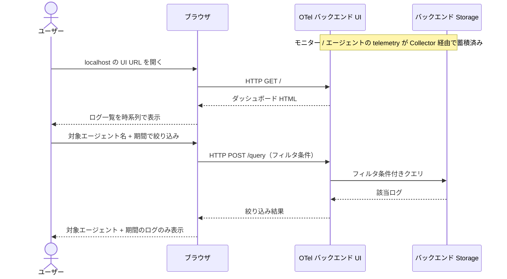
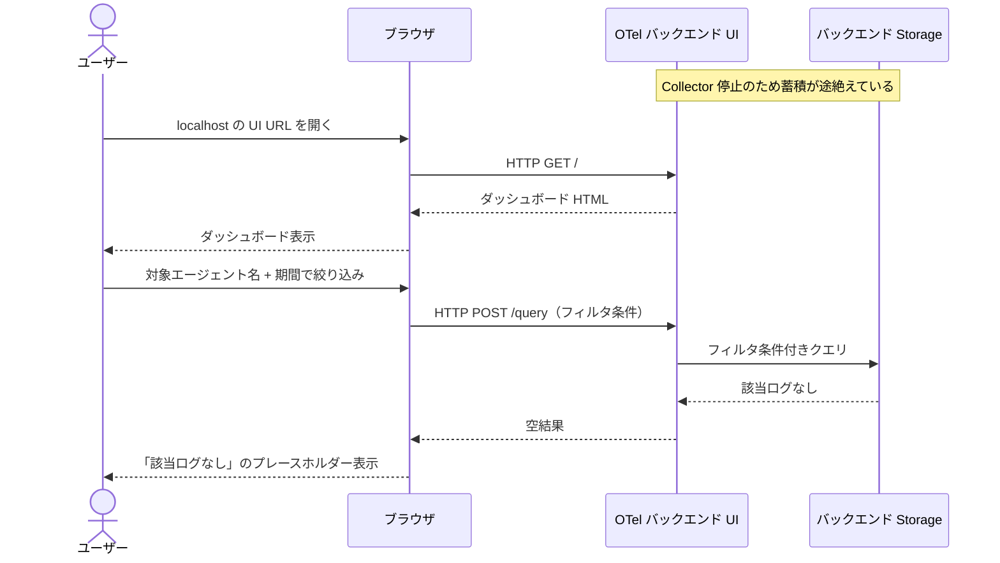
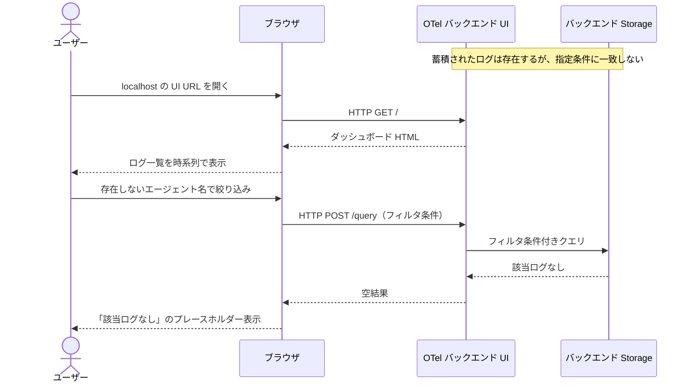

# ログ確認

ユーザーがブラウザで OpenTelemetry バックエンド UI を開き、モニター / エージェントの動作ログを検索・絞り込みして表示する単一ユースケース。

- 対応テストファイル: `tests/e2e/単一ユースケース/test_ログ確認.py`

## 正常シナリオ

### セットアップ

| セットアップ | 説明 | 補足 |
| --- | --- | --- |
| Mock | なし（実環境で実行） | - |
| OTel Collector | ローカル起動済み（OTLP 受信ポート開放） | telemetry 中継ハブ |
| OTel バックエンド | ローカル起動済み（UI ポート開放） | Storage + Web UI 一体 |
| モニタープロセス | OTel SDK 経由で telemetry を Collector に送信中 | 対象ログの発生源 |
| エージェントプロセス | tmux 内で稼働中・OTel SDK 経由で telemetry を Collector に送信中 | 対象ログの発生源 |
| ブラウザ | 手元マシンで起動可能 | UI 表示側 |

### フロー

### 期待値

- UI に対象エージェント + 期間のログが時系列順で表示されている
- 各ログ行に「発生時刻 / 発生元プロセス（モニター or エージェント名）/ レベル / メッセージ」が含まれる

## 異常シナリオ（Collector 停止でデータが届いていない）

### セットアップ

| セットアップ | 説明 | 補足 |
| --- | --- | --- |
| Mock | なし（実環境で実行） | - |
| OTel Collector | 未起動 | 異常を決定的に誘発 |
| OTel バックエンド | ローカル起動済み（UI ポート開放） | - |
| モニタープロセス | OTel SDK 経由で telemetry を送信試行するが Collector に届かない | - |
| エージェントプロセス | 同上 | - |
| ブラウザ | 手元マシンで起動可能 | - |

### フロー

### 期待値

- UI 上に「該当ログなし」のプレースホルダーが表示されている
- ダッシュボード自体は開けており、UI が落ちてはいない

## 異常シナリオ（絞り込み条件に一致するログがない）

### セットアップ

| セットアップ | 説明 | 補足 |
| --- | --- | --- |
| Mock | なし（実環境で実行） | - |
| OTel Collector | ローカル起動済み | - |
| OTel バックエンド | ローカル起動済み | - |
| モニタープロセス | 稼働中・telemetry 蓄積済み | - |
| エージェントプロセス | 稼働中・telemetry 蓄積済み | - |
| ブラウザ | 手元マシンで起動可能 | - |

### フロー

### 期待値

- UI 上に「該当ログなし」のプレースホルダーが表示されている
- 絞り込み条件をクリアすれば全ログが再表示される（UI 状態は保持されている）
