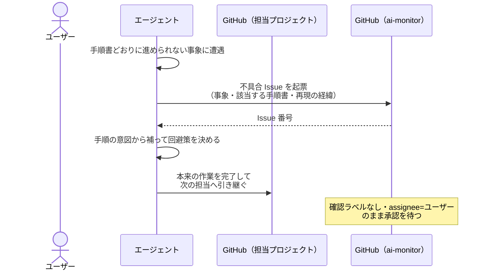
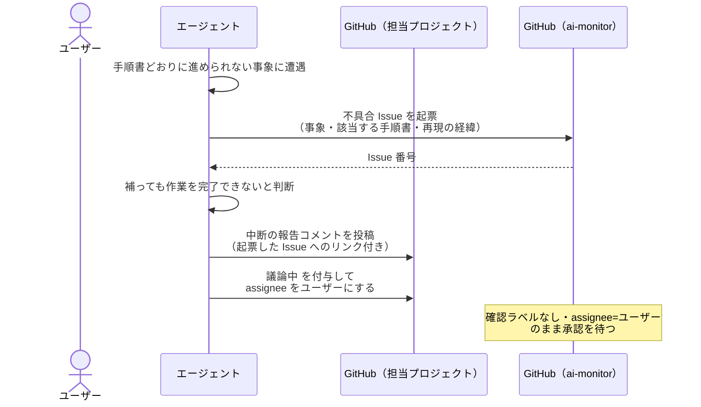

# 不具合報告

エージェントが手順書どおりに進められない事象（手順の矛盾・欠落、MCP ツールの想定外エラー）に行き当たったとき、ai-monitor 自身のリポジトリへ不具合 Issue を起票する単一ユースケース。
起票した Issue は assignee をユーザーにして確認ラベルを付けずに置き、ユーザーが内容を確認して `確認:intake-issue-triager` を付けた時点で ai-monitor の改修フローに乗る。

配下から上がった業務上の論点を上位 conductor へ渡す [エスカレーション対応](./エスカレーション対応.md) とは扱う対象が違う。
あちらは担当プロジェクトの要件・設計の論点、こちらは ai-monitor の仕組みそのものの欠陥で、報告先も担当プロジェクトではなく ai-monitor のリポジトリになる。

対応エージェント: 全エージェント

- 対応テストファイル: `tests/e2e/単一ユースケース/test_不具合報告.py`

## 正常シナリオ（回避して作業を続けられる）

### セットアップ

| セットアップ | 説明 | 補足 |
| --- | --- | --- |
| Mock | なし（実環境で実行） | - |
| 担当 PR | `確認:single-scenario-writer` 付与済みで `統合テスト割り当て` の起動条件を満たす | エージェント起動条件。テスト結果表が未記入 + 自身の投稿コメントあり |
| 手順書 | `統合テスト割り当て` の一手順だけが存在しない MCP ツールを指している | 事象を決定的に誘発。手順書は実クローンではなく複製を書き換える |
| 回避策 | 残りの手順は正しく、他の MCP ツールで同じ結果を出せる状態 | 続行できる分岐を誘発 |

### フロー

### 期待値

- ai-monitor のリポジトリに不具合 Issue が起票され、本文に事象・該当する手順書のページ名・再現の経緯が入っている
- 起票された Issue の assignee がユーザーになっている
- 起票された Issue に確認ラベルが付いていない（ユーザーが承認するまで改修フローが動き出さない）
- 担当プロジェクト側では本来の作業が完了し、次の担当の確認ラベルが付いている

## 正常シナリオ（作業を続けられない）

### セットアップ

| セットアップ | 説明 | 補足 |
| --- | --- | --- |
| Mock | なし（実環境で実行） | - |
| 担当 PR | `確認:single-scenario-writer` 付与済みで `統合テスト割り当て` の起動条件を満たす | エージェント起動条件。テスト結果表が未記入 + 自身の投稿コメントあり |
| 手順書 | `統合テスト割り当て` の手順が丸ごと欠けている | 事象を決定的に誘発。手順書は実クローンではなく複製を書き換える |
| 回避策 | 補って完了できる余地がない状態 | 中断する分岐を誘発 |

### フロー

### 期待値

- ai-monitor のリポジトリに不具合 Issue が起票され、本文に事象・該当する手順書のページ名・再現の経緯が入っている
- 起票された Issue の assignee がユーザーになっている
- 起票された Issue に確認ラベルが付いていない
- 担当している Issue / PR に中断の報告コメントが投稿され、本文から起票した Issue を辿れる
- 担当している Issue / PR が `議論中` + assignee=ユーザー で待機している
- 担当している Issue / PR の次の担当の確認ラベルが付いていない（作業は引き継がれていない）

## 異常シナリオ

なし
