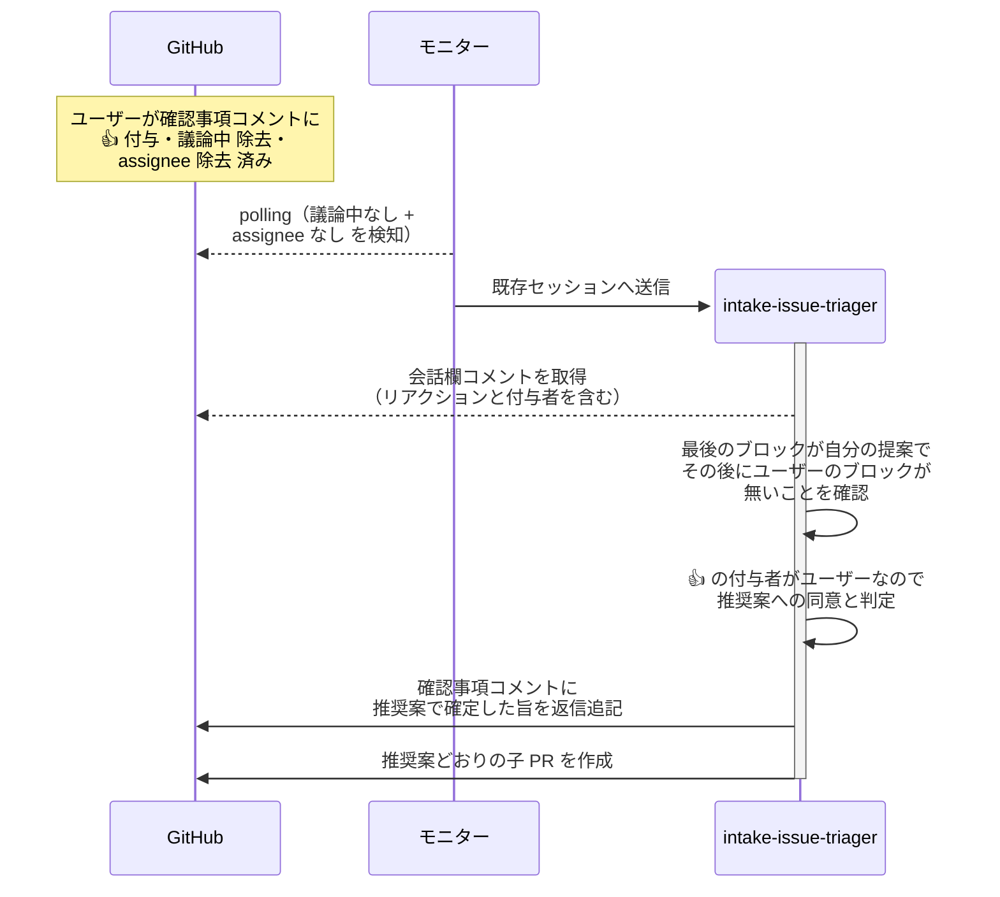
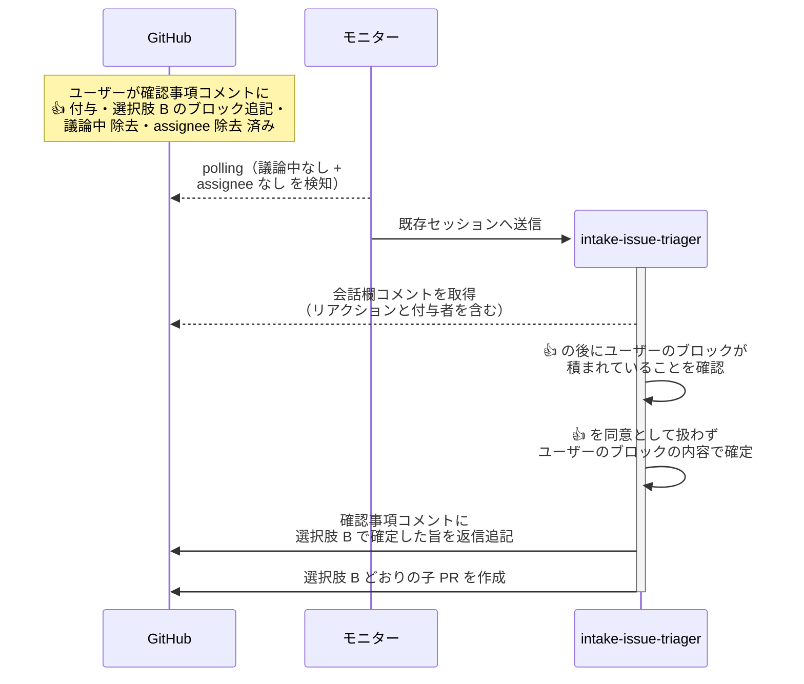

# 会話欄リアクションの読み取り

エージェントが会話欄に投稿した確認事項に付いた 👍 を読み取り、推奨案への同意として扱う単一ユースケース。

対応エージェント: `intake-issue-triager`（分解判定（応答ループ）・子PR作成（完了処理））

- 対応テストファイル: `tests/e2e/単一ユースケース/test_会話欄リアクションの読み取り.py`

## 正常シナリオ（👍 の後にユーザーのブロックなし）

### セットアップ

| セットアップ | 説明 | 補足 |
| --- | --- | --- |
| Mock | なし（実環境で実行） | - |
| intake Issue | 分解判定の応答ループで待機中（`議論中` + `assignee=ユーザー`） | 分解案 + 確認事項 投稿済み |
| 確認事項コメント | 会話欄に 1 件。選択肢と推奨案を含み、最後のブロックがエージェントの提案 | 推奨案を選択肢 A に固定する |
| ユーザーのリアクション | 確認事項コメントに 👍 を付与 | 返信ブロックは追記しない |
| 議論中ラベル | ユーザーが除去 | 完了処理の起動条件 |
| assignee | ユーザーが除去 | エージェント起動条件 |

### フロー

### 期待値

- 推奨案（選択肢 A）どおりの子 PR が作成されている
- 確認事項コメントの末尾に、推奨案で確定した旨のエージェントのブロックが積まれている
- intake Issue に `議論中` が付いていない
- 未回答の論点を問い直す確認コメントが新たに投稿されていない

## 正常シナリオ（👍 の後にユーザーのブロックあり）

### セットアップ

| セットアップ | 説明 | 補足 |
| --- | --- | --- |
| Mock | なし（実環境で実行） | - |
| intake Issue | 分解判定の応答ループで待機中（`議論中` + `assignee=ユーザー`） | 分解案 + 確認事項 投稿済み |
| 確認事項コメント | 会話欄に 1 件。選択肢と推奨案を含み、エージェントの提案の後にユーザーのブロックが積まれている | 推奨案を選択肢 A に固定する |
| ユーザーのリアクション | 確認事項コメントに 👍 を付与 | ブロック追記より前に付与する |
| ユーザーのブロック | 推奨案ではなく選択肢 B を選ぶ内容を追記 | 👍 と食い違う回答を決定的に作る |
| 議論中ラベル | ユーザーが除去 | 完了処理の起動条件 |
| assignee | ユーザーが除去 | エージェント起動条件 |

### フロー

### 期待値

- 選択肢 B どおりの子 PR が作成されている（推奨案の選択肢 A では作られていない）
- 確認事項コメントの末尾に、選択肢 B で確定した旨のエージェントのブロックが積まれている
- intake Issue に `議論中` が付いていない

## 異常シナリオ

なし
