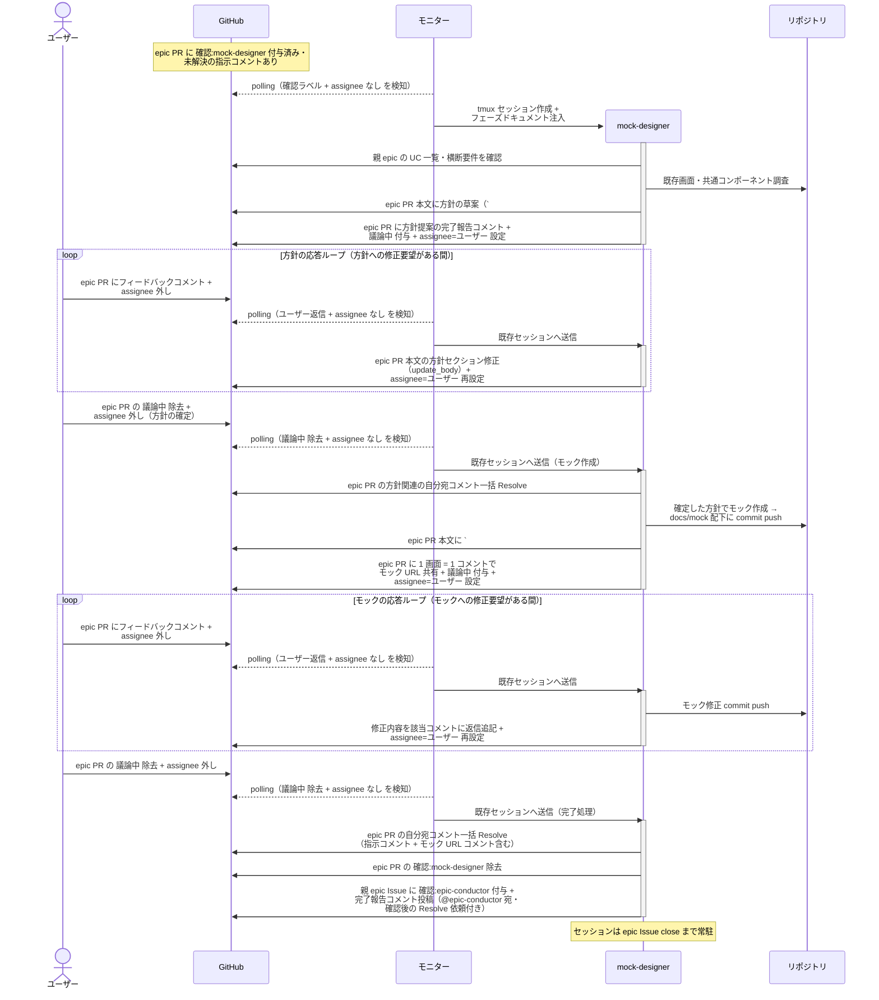
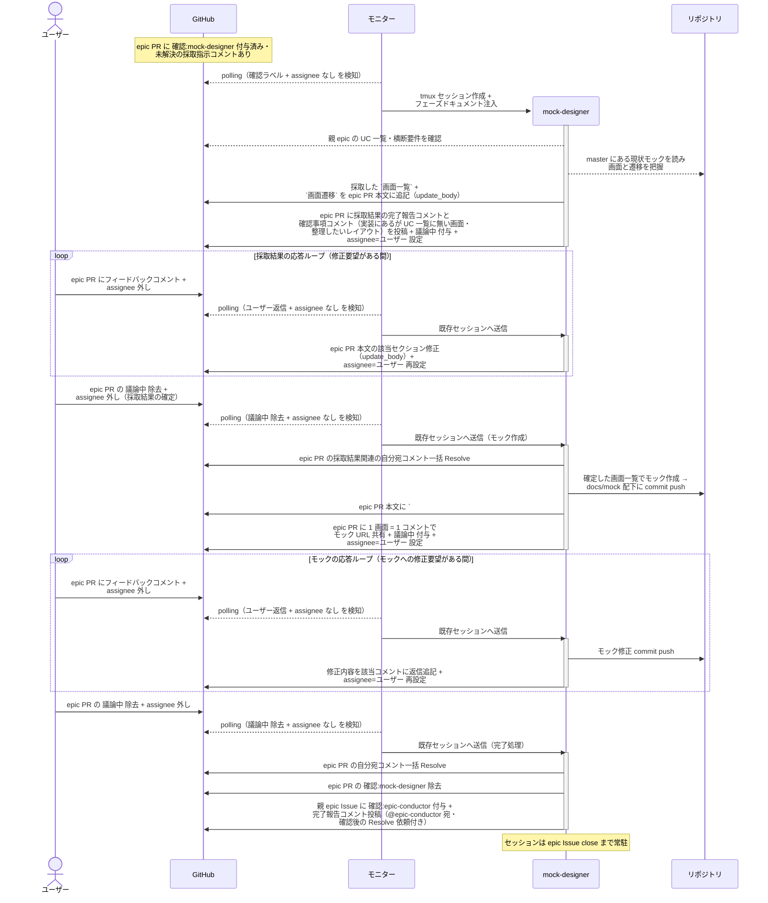

# 全体UI設計

mock-designer が epic 全体の画面の方向性 — 画面一覧（新規 / 変更の洗い出し）・画面遷移の全体像・新規 / 変更画面のモック — を確定する単一ユースケース。
画面は複数 UC で共有されるため、UC / subsystem に分解する前・複合シナリオを書く前に epic レベルで方向性をユーザーと合意する（設計トップダウンの V 字原則）。
いきなりモックは作らず、**方針の合意 → モック作成 → モックの合意** の 2 ゲートで進める。

対応エージェント: `mock-designer`（画面の新規作成 / レイアウト変更を含む epic のみ）

- 対応テストファイル: `tests/e2e/単一ユースケース/test_全体UI設計.py`

## 正常シナリオ

### セットアップ

| セットアップ | 説明 | 補足 |
| --- | --- | --- |
| Mock | なし（実環境で実行） | - |
| epic PR | `確認:mock-designer` 付与済み + epic-conductor の指示コメント（自分宛・未解決）あり | - |
| epic Issue | ユースケース一覧・横断要件 確定済み | 画面一覧の元ネタ |
| assignee | PR に未設定 | エージェント起動条件 |

### フロー

### 期待値

- epic PR 本文に `## UI 設計`（`### 画面一覧` / `### 画面遷移` / `### モック`）が段階的に記入され、完了時点で 3 セクション全て記入済み
- モックが `docs/mock/pages/{画面名}/issues/{epic番号}/{案名}/` に commit され、コメントに URL が共有されている
- `確認:mock-designer` が除去され、親 epic Issue に `確認:epic-conductor` + 完了報告コメント（@epic-conductor 宛・未解決）が付与・投稿されている
- epic PR の自分宛コメント（指示コメント + モック URL コメント含む）が全て Resolve 済み

## 正常シナリオ（リバースエンジニアリング）

### セットアップ

| セットアップ | 説明 | 補足 |
| --- | --- | --- |
| Mock | なし（実環境で実行） | - |
| `リバースエンジニアリング` ラベル | 対象の Issue / PR に付与済み | 本経路を選ぶ判定材料。ユーザーが system Issue に付け、子 Issue へ引き継がれる |
| epic PR | `確認:mock-designer` 付与済み + epic-conductor の既存画面の採取指示コメント（自分宛・未解決）あり | - |
| epic Issue | `type:docs` でユースケース一覧・横断要件 確定済み | 画面と UC の対応の元ネタ |
| assignee | PR に未設定 | エージェント起動条件 |
| 現状モック | `docs/mock/pages/{画面名}/{RE PR 番号}/current/` が master に存在 | RE PR がマージ済みであることが前提 |

### フロー

### 期待値

- epic PR 本文に `## UI 設計`（`### 画面一覧` / `### 画面遷移` / `### モック`）が 3 セクション全て記入済み
- 画面一覧の各行が現状モックの画面と対応している
- mock-designer が実装コードを読み出した記録がない（入力は UC 一覧・横断要件・現状モックに閉じる）
- 実装にあるが UC 一覧に無い画面が確認事項コメントに挙がり、ユーザー判断が本文に反映されている
- モックが `docs/mock/pages/{画面名}/issues/{epic番号}/{案名}/` に commit され、コメントに URL が共有されている
- `確認:mock-designer` が除去され、親 epic Issue に `確認:epic-conductor` + 完了報告コメントが付与・投稿されている
- epic PR の自分宛コメントが全て Resolve 済み

## 異常シナリオ

なし
