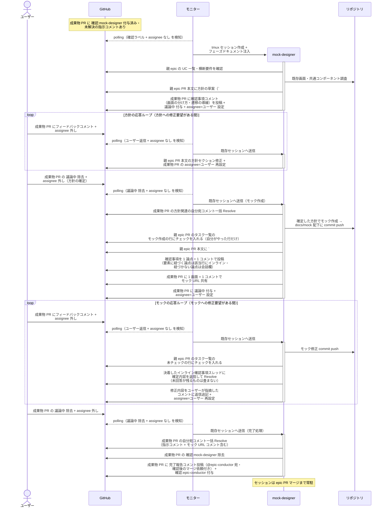
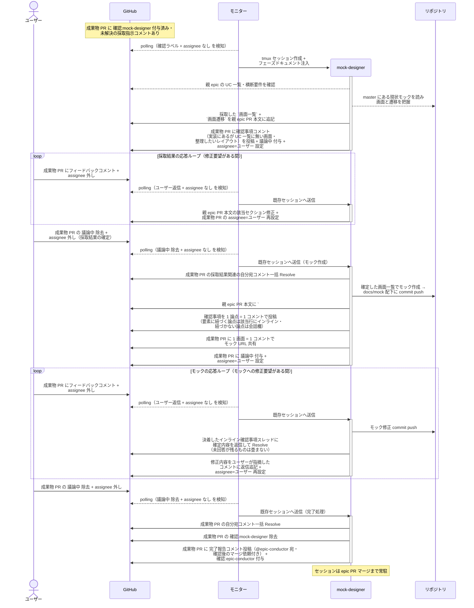

# 全体UI設計

mock-designer が epic 全体の画面の方向性 — 画面一覧（変更種別の洗い出し）・画面遷移の全体像・新規 / 変更画面のモック — を確定する単一ユースケース。

対応エージェント: `mock-designer`（画面の新規作成 / レイアウト変更を含む epic のみ）

- 対応テストファイル: `tests/e2e/単一ユースケース/test_全体UI設計.py`

## 正常シナリオ

### セットアップ

| セットアップ | 説明 | 補足 |
| --- | --- | --- |
| Mock | なし（実環境で実行） | - |
| 成果物 Draft PR | `docs/epic/{ドメイン}/mock`（base=epic ブランチ）に `確認:mock-designer` 付与済み + epic-conductor の指示コメント（自分宛・未解決）あり | - |
| 親 epic PR | ユースケース一覧・横断要件 確定済み | 画面一覧の元ネタ。`## UI 設計` の書き込み先 |
| assignee | 未設定 | エージェント起動条件 |

### フロー

### 期待値

- 親 epic PR 本文に `## UI 設計`（`### 画面一覧` / `### 画面遷移` / `### モック`）が段階的に記入され、完了時点で 3 セクション全て記入済み
- モック HTML は成果物ブランチに commit されており、epic ブランチには入っていない（マージ時に 1 コミットへ畳まれる）
- `### 画面一覧` の `変更種別` 列が全行 `新規` / `変更` / `削除` のいずれかで埋まっている（未記入の行がない）
- モックが `docs/mock/pages/{画面名}/{epic PR 番号}/{案名}/` に commit され、コメントに URL が共有されている
- 親 epic PR の `## タスク一覧` のモック作成の行がチェック済み（シナリオ・E2E テストの行は未チェック）
- 確認事項が 1 論点 = 1 コメントで投稿され、特定の要素に紐づく論点は該当行のインライン、画面全体の方向性は会話欄に振り分けられている
- 成果物 PR から `確認:mock-designer` が除去され、`確認:epic-conductor` + 完了報告コメント（@epic-conductor 宛・未解決）が付与・投稿されている
- 成果物 PR の自分宛コメント（指示コメント + モック URL コメント含む）が全て Resolve 済み

## 正常シナリオ（リバースエンジニアリング）

### セットアップ

| セットアップ | 説明 | 補足 |
| --- | --- | --- |
| Mock | なし（実環境で実行） | - |
| `リバースエンジニアリング` ラベル | 対象の PR に付与済み | 本経路を選ぶ判定材料。ユーザーが立ち上げ Issue に付け、子 PR へ引き継がれる |
| 成果物 Draft PR | `docs/epic/{ドメイン}/mock`（base=epic ブランチ）に `確認:mock-designer` 付与済み + epic-conductor の既存画面の採取指示コメント（自分宛・未解決）あり | - |
| 親 epic PR | `type:docs` でユースケース一覧・横断要件 確定済み | 画面と UC の対応の元ネタ |
| assignee | 未設定 | エージェント起動条件 |
| 現状モック | `docs/mock/pages/{画面名}/{RE PR 番号}/current/` が master に存在 | RE PR がマージ済みであることが前提 |

### フロー

### 期待値

- 親 epic PR 本文に `## UI 設計`（`### 画面一覧` / `### 画面遷移` / `### モック`）が 3 セクション全て記入済み
- 画面一覧の各行が現状モックの画面と対応している
- `### 画面一覧` の `変更種別` 列が全行埋まっており、現状モックから採取した画面は `新規` ではない（既存画面の起こしなので `変更` / `削除`）
- mock-designer が実装コードを読み出した記録がない（入力は UC 一覧・横断要件・現状モックに閉じる）
- 実装にあるが UC 一覧に無い画面が確認事項コメントに挙がり、ユーザー判断が本文に反映されている
- モックが `docs/mock/pages/{画面名}/{epic PR 番号}/{案名}/` に commit され、コメントに URL が共有されている
- 親 epic PR の `## タスク一覧` のモック作成の行がチェック済み（シナリオ・E2E テストの行は未チェック）
- 成果物 PR から `確認:mock-designer` が除去され、`確認:epic-conductor` + 完了報告コメントが付与・投稿されている
- 成果物 PR の自分宛コメントが全て Resolve 済み
- 応答ループの各ターンで、決着したインライン確認事項スレッドが確定内容の返信付きで Resolve されている
- 応答ループの返信が、ユーザーが指摘したコメントのスレッドに積まれている（自分の過去の報告コメントに追記していない）
- 完了処理に入った時点で未解決のインライン確認事項が残っていない（残る場合は `議論中` を戻して聞き直す）

## 異常シナリオ

なし
