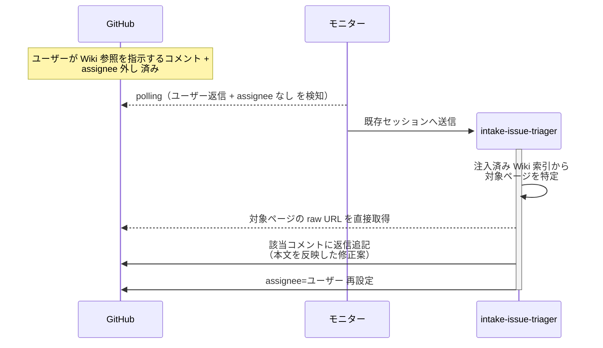

# 動的Wiki参照

エージェントが起動時に注入された Wiki 索引を参照して、事前注入されていない Wiki ページを応答ループ中に直接読み込み、自ターンの応答に反映する単一ユースケース。
対象エージェントは応答ループを持つ任意のエージェントでよいが、実行頻度が最も高い `intake-issue-triager` の分解判定応答ループを代表ケースにする。

対応エージェント: `intake-issue-triager`（分解判定 応答ループ）

- 対応テストファイル: `tests/e2e/単一ユースケース/test_動的Wiki参照.py`

## 正常シナリオ

### セットアップ

| セットアップ | 説明 | 補足 |
| --- | --- | --- |
| Mock | なし（実環境で実行） | - |
| intake Issue | 分解判定応答ループの待機中（`議論中` + `assignee=ユーザー`） | サブ Issue 案 + 確認事項 投稿済み |
| Wiki（sandbox 側） | 検証用フレーズを含む対象ページを Wiki 配下に配置し、対応 README の目次にも登録済み | 動的探索の目印 |
| Wiki 索引 | エージェント起動時に注入済み（対象ページの raw URL を含む） | |
| ユーザーフィードバック | 具体的な Wiki パスを伝えず「関連 Wiki を参照して分解案を修正してほしい」とだけコメント + assignee 外し | 事前注入外のページを索引経由で見つけに行かせる |

### フロー

### 期待値

- 応答ループの返信コメントに、対象ページの検証用フレーズが含まれている
- `assignee=ユーザー` が再設定されて再待機に入っている（応答ループの規約通り）

## 異常シナリオ

なし
