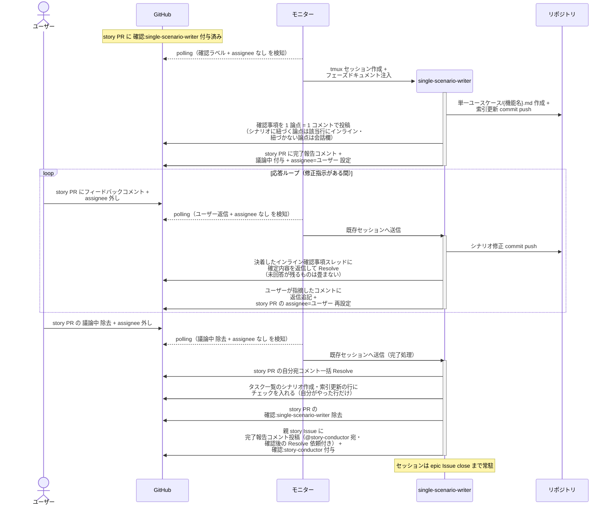
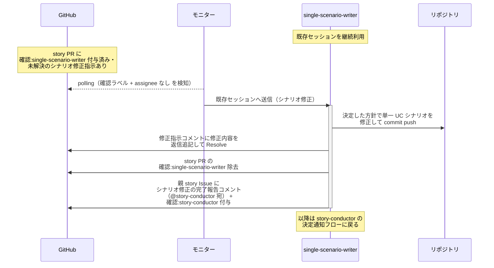
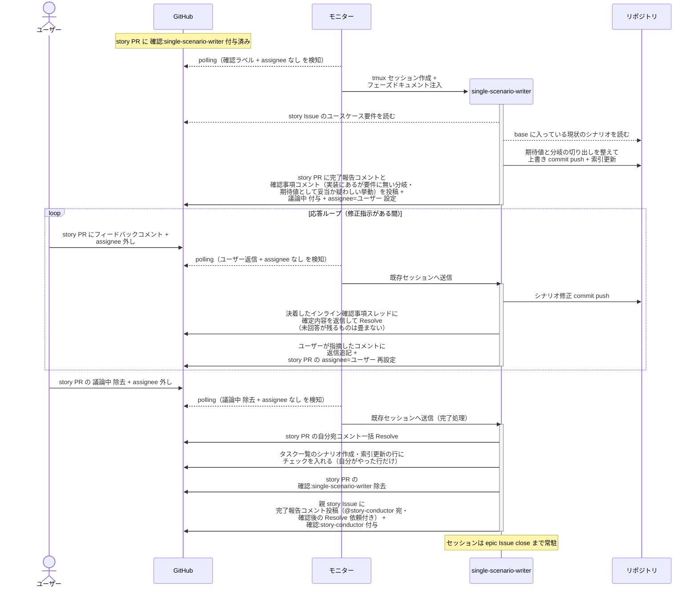

# 単一シナリオ設計

single-scenario-writer が story のユースケース要件をもとに単一ユースケースシナリオ（1 UC の正常系 + 異常系）を設計し、story ブランチに commit する単一ユースケース。

対応エージェント: `single-scenario-writer`

- 対応テストファイル: `tests/e2e/単一ユースケース/test_単一シナリオ設計.py`

## 正常シナリオ

### セットアップ

| セットアップ | 説明 | 補足 |
| --- | --- | --- |
| Mock | なし（実環境で実行） | - |
| story Draft PR | `確認:single-scenario-writer` 付与済み | 本文は `## 紐づく Issue` のみ |
| story Issue | ユースケース要件 確定済み | シナリオの元ネタ |
| assignee | PR に未設定 | エージェント起動条件 |

### フロー

### 期待値

- story ブランチに `docs/wiki/設計図/シナリオ/単一ユースケース/{機能名}.md` が commit されている（ファイル名 = 親 epic ユースケース一覧の UC 名 = 複合シナリオのノード名）
- `## タスク一覧` のシナリオ作成・索引更新の行がチェック済み（E2E テスト実行の行は未チェック）
- 確認事項が 1 論点 = 1 コメントで投稿され、シナリオの特定箇所に紐づく論点は該当行のインライン、紐づかない論点は会話欄に振り分けられている
- `設計図/シナリオ/README.md` の索引に行が追加されている
- 親 story Issue に `確認:story-conductor` が付与され、完了報告コメント（@story-conductor 宛・未解決）が投稿されている
- story PR の自分宛コメントが全て Resolve 済み
- 応答ループの各ターンで、決着したインライン確認事項スレッドが確定内容の返信付きで Resolve されている
- 応答ループの返信が、ユーザーが指摘したコメントのスレッドに積まれている（自分の過去の報告コメントに追記していない）
- 完了処理に入った時点で未解決のインライン確認事項が残っていない（残る場合は `議論中` を戻して聞き直す）

## 正常シナリオ（エスカレーション由来のシナリオ修正）

### セットアップ

| セットアップ | 説明 | 補足 |
| --- | --- | --- |
| Mock | なし（実環境で実行） | - |
| story PR | `確認:single-scenario-writer` 付与済み + story-conductor のシナリオ修正指示コメント（自分宛・未解決）あり | エスカレーション対応で決まった方針 |
| 単一 UC シナリオ | 確定済みのものが story ブランチにある | 修正対象 |
| assignee | PR に未設定 | エージェント起動条件 |

### フロー

### 期待値

- 修正後の単一 UC シナリオの commit が story ブランチに積まれている
- シナリオ修正指示コメントに修正内容が返信追記され、Resolve 済み
- 親 story Issue に `確認:story-conductor` + シナリオ修正の完了報告コメント（@story-conductor 宛・未解決）が付与・投稿されている
- story PR の `確認:single-scenario-writer` が除去されている

## 正常シナリオ（リバースエンジニアリング）

### セットアップ

| セットアップ | 説明 | 補足 |
| --- | --- | --- |
| Mock | なし（実環境で実行） | - |
| `リバースエンジニアリング` ラベル | 対象の Issue / PR に付与済み | 本経路を選ぶ判定材料。ユーザーが system Issue に付け、子 Issue へ引き継がれる |
| story Draft PR | `確認:single-scenario-writer` 付与済み | 本文は `## 紐づく Issue` のみ |
| story Issue | `type:docs` でユースケース要件 確定済み | シナリオの元ネタ |
| assignee | PR に未設定 | エージェント起動条件 |
| 現状のシナリオ | 当該 UC のシナリオが現状の内容で base に存在 | RE PR がマージ済みであることが前提 |

### フロー

### 期待値

- story ブランチに `docs/wiki/設計図/シナリオ/単一ユースケース/{機能名}.md` が commit されている（ファイル名 = 親 epic ユースケース一覧の UC 名 = 複合シナリオのノード名）
- single-scenario-writer が実装コードを読み出した記録がない（入力はユースケース要件と base のシナリオに閉じる）
- 本 PR の Files changed が現状からあるべき姿への変更範囲になっている
- 実装にある分岐が正常系 / 異常系のいずれかのシナリオでカバーされている
- 各シナリオの期待値が実装の現在の振る舞いと一致している（またはユーザーが承認したあるべき姿になっている）
- 期待値として妥当か疑わしい挙動が確認事項コメントに挙がり、ユーザー判断がシナリオに反映されている
- `設計図/シナリオ/README.md` の索引に行が追加されている
- 親 story Issue に `確認:story-conductor` が付与され、完了報告コメント（@story-conductor 宛・未解決）が投稿されている
- story PR の自分宛コメントが全て Resolve 済み
- 応答ループの各ターンで、決着したインライン確認事項スレッドが確定内容の返信付きで Resolve されている
- 応答ループの返信が、ユーザーが指摘したコメントのスレッドに積まれている（自分の過去の報告コメントに追記していない）
- 完了処理に入った時点で未解決のインライン確認事項が残っていない（残る場合は `議論中` を戻して聞き直す）

## 異常シナリオ

なし
