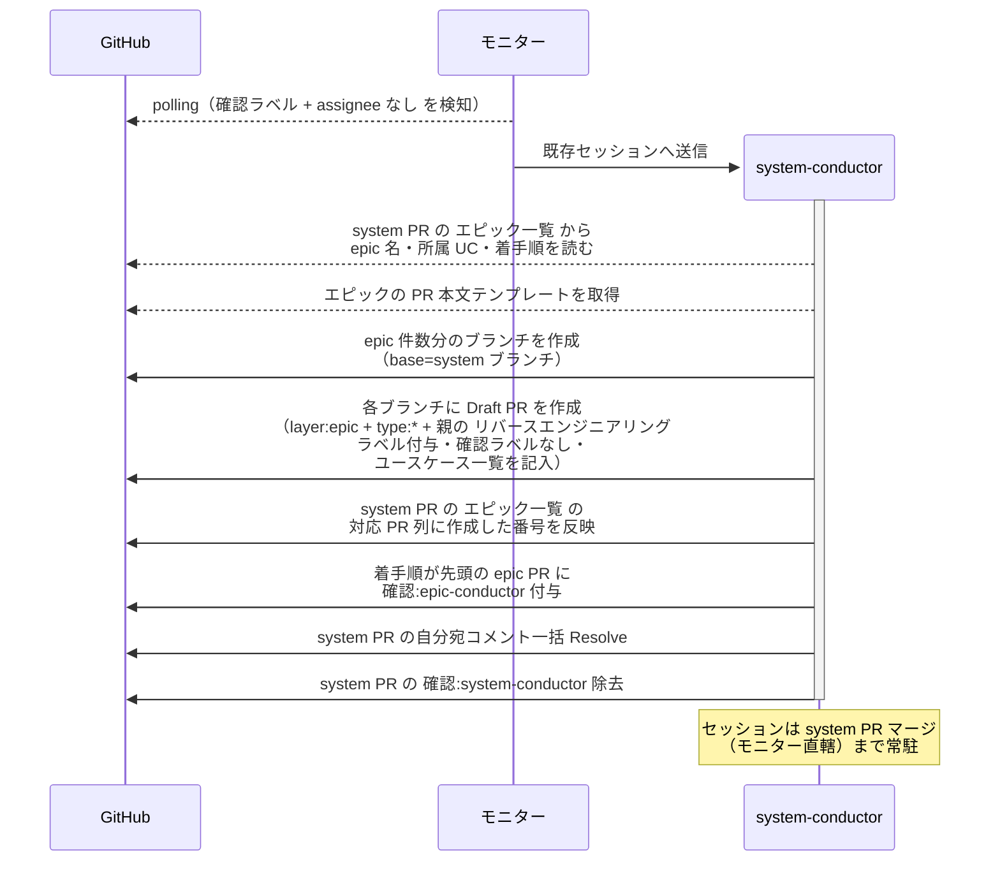

# 子epicPR作成

system-conductor が system PR の `## エピック一覧` から epic ブランチと Draft PR を一括作成する単一ユースケース。

対応エージェント: `system-conductor`（復帰）

- 対応テストファイル: `tests/e2e/単一ユースケース/test_子epicPR作成.py`

## 正常シナリオ

### セットアップ

| セットアップ | 説明 | 補足 |
| --- | --- | --- |
| Mock | なし（実環境で実行） | - |
| system PR | `確認:system-conductor` 付与済み・`## エピック一覧` が確定済み | [システム構成確定](./システム構成確定.md) で承認済み |
| assignee | 未設定 | エージェント起動条件 |
| `議論中` | 未付与 | - |
| 土台生成 | system ブランチへマージ済み | エピック一覧の `対応 PR` 列が全行 `未作成` |
| `docs/wiki/` | 骨格・テンプレートが system ブランチに存在 | 作成する epic が従う書式の参照元 |
| モニター | 対象リポを polling 中 | - |

### フロー

### 期待値

- エピック一覧と同数の epic ブランチと Draft PR が存在する
- 各 epic PR の base が system ブランチになっている
- 各 epic PR 本文の `## ユースケース一覧` がエピック一覧の所属ユースケースで埋まり、対応 story 列が全行 `未作成`
- 各 epic PR 本文の `## ユースケース一覧` の `変更種別` 列が全行 `新規` / `変更` / `削除` のいずれかで埋まっている（未記入の行がない）
- 着手順が 2 番目以降の epic PR には確認ラベルが付いていない（先行のマージ時に付け替えられる）
- 確認ラベルが付いていない epic PR に着手の痕跡が無い（`議論中` 未付与・assignee 未設定・epic-conductor の投稿コメントなし）
- 全 epic PR に `layer:epic` と、経路に応じた `type:*`（新規は `type:feat` / 移行は `type:docs`）が付与されている
- 親 system PR に `リバースエンジニアリング` ラベルが付いていた場合、全 epic PR に引き継がれている（付いていなければ子にも付かない）
- `確認:epic-conductor` が着手順の先頭 epic PR にだけ付いている
- system PR のエピック一覧の `対応 PR` 列が全行 `#N` に更新されている
- system PR の `確認:*` が 1 つも残っていない
- 自分宛コメントが全て Resolve 済み

## 異常シナリオ

なし
