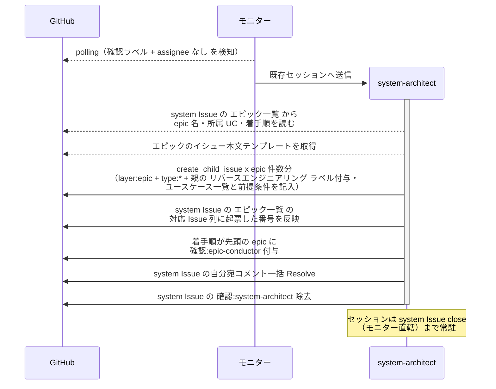

# 子epic起票

system-architect が system Issue の `## エピック一覧` から epic Issue を一括起票する単一ユースケース。
新規プロジェクトの立ち上げでも既存プロジェクトの移行でも通る。
着手は直列にするため、確認ラベルは着手順が先頭の epic にだけ付ける。

対応エージェント: `system-architect`（復帰）

- 対応テストファイル: `tests/e2e/単一ユースケース/test_子epic起票.py`

## 正常シナリオ

### セットアップ

| セットアップ | 説明 | 補足 |
| --- | --- | --- |
| Mock | なし（実環境で実行） | - |
| system Issue | `確認:system-architect` 付与済み・`## エピック一覧` が確定済み | [システム構成確定](./システム構成確定.md) で承認済み |
| assignee | 未設定 | エージェント起動条件 |
| `議論中` | 未付与 | - |
| system PR | master へマージ済み | エピック一覧の `対応 Issue` 列が全行 `未起票` |
| `docs/wiki/` | 骨格・テンプレートが master に存在 | 起票する epic が従う書式の参照元 |
| モニター | 対象リポを polling 中 | - |

### フロー

### 期待値

- エピック一覧と同数の epic Issue が system Issue に紐づいて存在する
- 各 epic 本文の `## ユースケース一覧` がエピック一覧の所属ユースケースで埋まり、対応 story 列が全行 `未起票`
- 着手順が 2 番目以降の epic 本文の `## 前提条件` に先行 epic が `未完了` として記載されている
- 全 epic に `layer:epic` と、経路に応じた `type:*`（新規は `type:feat` / 移行は `type:docs`）が付与されている
- 親 system Issue に `リバースエンジニアリング` ラベルが付いていた場合、全 epic に引き継がれている（付いていなければ子にも付かない）
- `確認:epic-conductor` が着手順の先頭 epic にだけ付いている
- system Issue のエピック一覧の `対応 Issue` 列が全行 `#N` に更新されている
- system Issue の `確認:*` が 1 つも残っていない
- 自分宛コメントが全て Resolve 済み

## 異常シナリオ

なし
