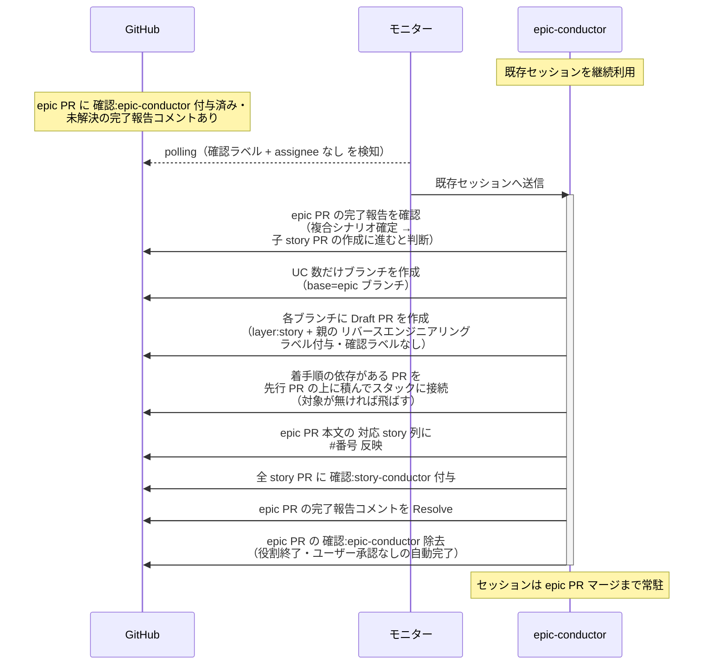

# 子storyPR作成

epic-conductor（復帰呼び出し）が complex-scenario-writer の完了報告を確認し、複合シナリオ確定を受けて次フェーズ（子 story PR の作成）に進むと判断する単一ユースケース。

対応エージェント: `epic-conductor`（complex-scenario-writer の完了報告コメントで復帰）

- 対応テストファイル: `tests/e2e/単一ユースケース/test_子storyPR作成.py`

## 正常シナリオ

### セットアップ

| セットアップ | 説明 | 補足 |
| --- | --- | --- |
| Mock | なし（実環境で実行） | - |
| epic PR | `確認:epic-conductor` 付与済み + complex-scenario-writer の完了報告コメント（自分宛・未解決）あり | - |
| 複合 UC シナリオ | 成果物 PR が epic ブランチへマージ済み | story 分割の元ネタ |
| ユースケース一覧 | 全行 `対応 story` 列が `未作成` | - |
| assignee | 未設定 | エージェント起動条件 |

### フロー

### 期待値

- ユースケース一覧の行数と同数の story ブランチと Draft PR が存在する
- 各 story PR の base が epic ブランチになっている
- 各 story PR に `layer:story` + `確認:story-conductor` が付与されている
- ユースケース一覧に着手順の依存が無い場合、story PR 同士は積まれず、それぞれが epic PR の上に並列で接続されている
- 親 epic PR に `リバースエンジニアリング` ラベルが付いていた場合、全 story PR に引き継がれている（付いていなければ子にも付かない）
- `対応 story` 列の `未作成` が全て `#番号` に置き換わっている
- epic PR のラベルが `layer:epic` 系のみになっている（`確認:*` は除去、`議論中` 付与なし・assignee 設定なし）

## 異常シナリオ

なし
