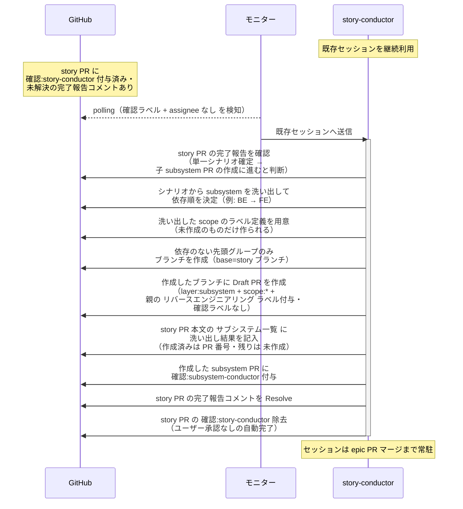
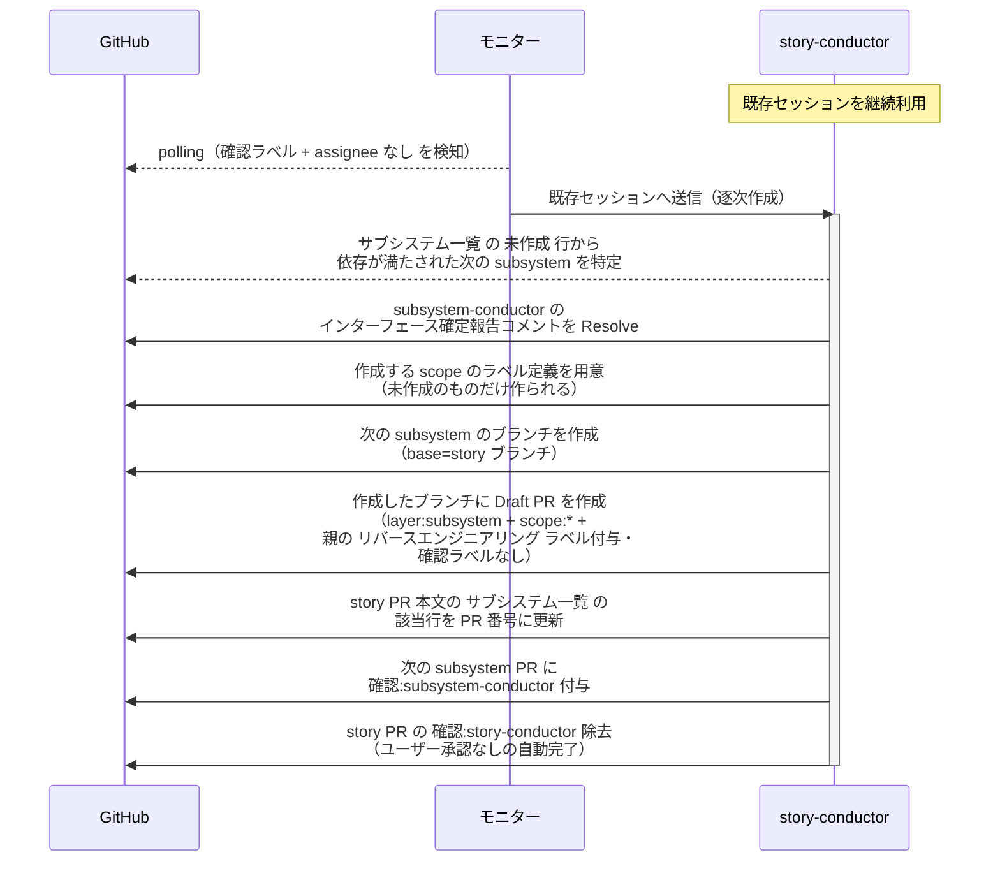

# 子subsystemPR作成

story-conductor（復帰呼び出し）が single-scenario-writer の完了報告を確認し、単一シナリオ確定を受けて次フェーズ（子 subsystem PR の作成）に進むと判断する単一ユースケース。

対応エージェント: `story-conductor`（single-scenario-writer / subsystem-conductor の完了報告コメントで復帰）

- 対応テストファイル: `tests/e2e/単一ユースケース/test_子subsystemPR作成.py`

## 正常シナリオ（初回・依存順の決定と先頭の作成）

### セットアップ

| セットアップ | 説明 | 補足 |
| --- | --- | --- |
| Mock | なし（実環境で実行） | - |
| story PR | `確認:story-conductor` 付与済み + single-scenario-writer の完了報告コメント（自分宛・未解決）あり | - |
| 単一 UC シナリオ | 成果物 PR が story ブランチへマージ済み | subsystem 洗い出しの元ネタ |
| assignee | 未設定 | エージェント起動条件 |

### フロー

### 期待値

- 依存のない先頭グループの subsystem ブランチと Draft PR だけが存在する（`layer:subsystem` + `scope:*` + `確認:subsystem-conductor` 付き）
- 作成した subsystem PR の base が story ブランチになっている
- 作成した subsystem PR が先行 PR の上に積まれていない（先頭グループのため）
- 付与された `scope:*` が `constants.env` の scope 体裁（色・説明）で定義されている（ランダム色の自動作成になっていない）
- 親 story PR に `リバースエンジニアリング` ラベルが付いていた場合、作成した subsystem PR に引き継がれている（付いていなければ子にも付かない）
- story PR 本文に `## サブシステム一覧` が追加され、洗い出した全 subsystem の行が並んでいる（作成済みの行は `対応 subsystem` が `#番号`、未作成の行は `未作成`）
- story PR のラベルが `layer:story` 系のみになっている（`確認:*` は除去、`議論中` 付与なし・assignee 設定なし）

## 正常シナリオ（依存順の逐次作成）

### セットアップ

| セットアップ | 説明 | 補足 |
| --- | --- | --- |
| Mock | なし（実環境で実行） | - |
| story PR | `確認:story-conductor` 付与済み + subsystem-conductor のインターフェース確定報告コメント（先行 subsystem のインターフェース確定・自分宛・未解決）あり | 子 PR は先頭グループのみ |
| サブシステム一覧 | 本文に記入済み（先頭グループの行は PR 番号、後続の行は `未作成`） | 逐次作成の対象を特定する元ネタ |
| 先行 subsystem | `インターフェース定義/バックエンド/{論理名}.md` の `## インターフェース` が確定済み・設計は続行中 | 逐次作成を誘発 |
| assignee | 未設定 | エージェント起動条件 |

### フロー

### 期待値

- 次の subsystem ブランチと Draft PR が存在する（`layer:subsystem` + `scope:*` + `確認:subsystem-conductor` 付き）
- 作成した subsystem PR の base が story ブランチになっている
- 作成した subsystem PR が先行 subsystem の上に積まれていない（インターフェースが確定しているため待たせない）
- 付与された `scope:*` が `constants.env` の scope 体裁（色・説明）で定義されている
- 親 story PR に `リバースエンジニアリング` ラベルが付いていた場合、作成した subsystem PR に引き継がれている（付いていなければ子にも付かない）
- `## サブシステム一覧` の該当行の `対応 subsystem` が `未作成` から `#番号` に更新されている
- subsystem-conductor のインターフェース確定報告コメントが Resolve 済み
- `確認:story-conductor` が除去されている

## 異常シナリオ

なし
