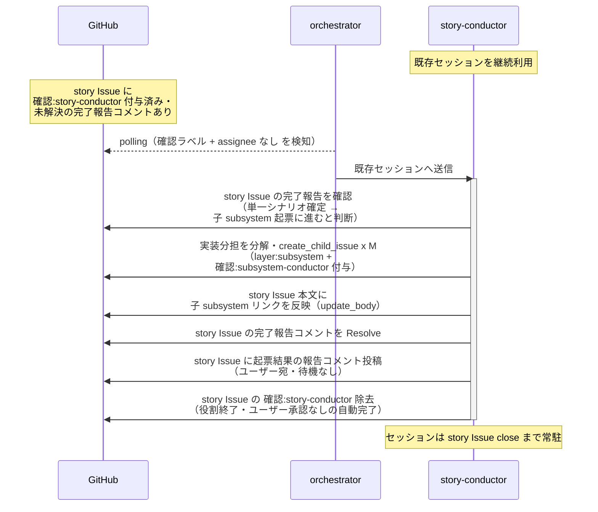

# 子subsystem起票

story-conductor（復帰呼び出し）が single-scenario-writer の完了報告を確認し、単一シナリオ確定を受けて次フェーズ（子 subsystem 起票）に進むと判断する単一ユースケース。UC の実装に必要な subsystem（FE / BE / 外部連携 等）を洗い出し、それぞれ子 Issue として起票する。

対応モニター: `story-conductor`（single-scenario-writer の完了報告コメントで復帰）

## 正常シナリオ

### 前提条件

| No | セットアップ | 説明 | 補足 |
| --- | --- | --- | --- |
| 1 | story Issue | `確認:story-conductor` 付与済み + single-scenario-writer の完了報告コメント（自分宛・未解決）あり | - |
| 2 | 単一 UC シナリオ | story ブランチに commit 済み | subsystem 洗い出しの元ネタ |
| 3 | assignee | 未設定 | モニター起動条件 |

### 図

**期待動作:**
- 実装分担単位（1 subsystem = 1 対象システム）ごとの Issue が story の Sub-issue として存在する
- 各 subsystem Issue に `layer:subsystem` + `確認:subsystem-conductor` が付与されている
- story Issue のラベルが `layer:story` 系のみになっている（`確認:*` は除去、`議論中` 付与なし・assignee 設定なし）

## 異常シナリオ（該当なし）

なし。
