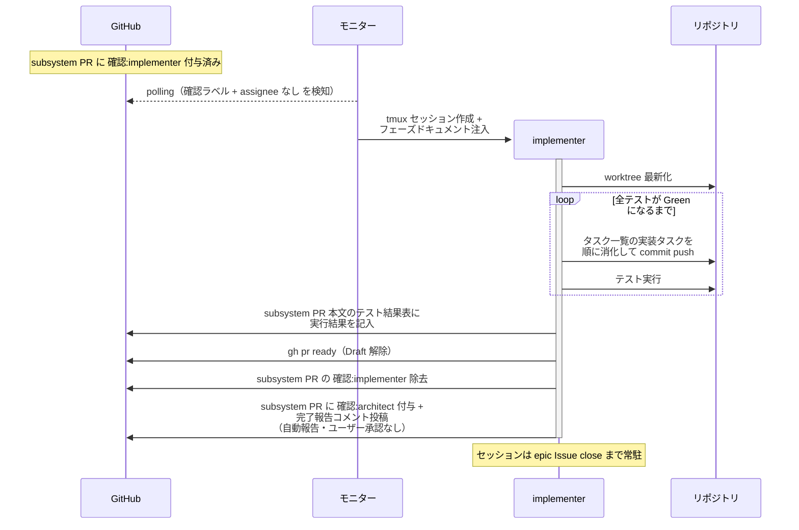
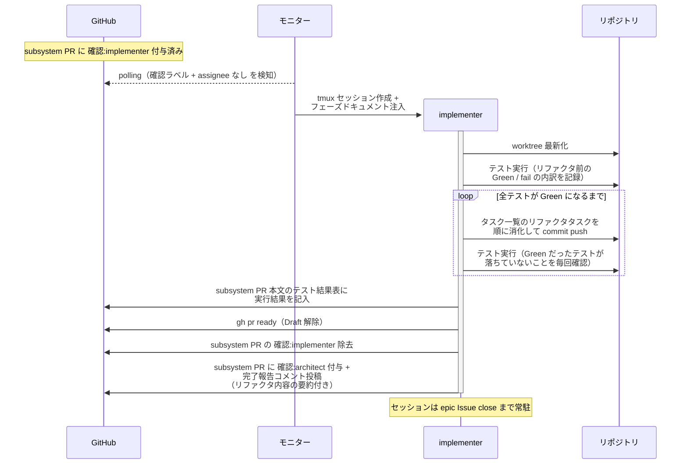
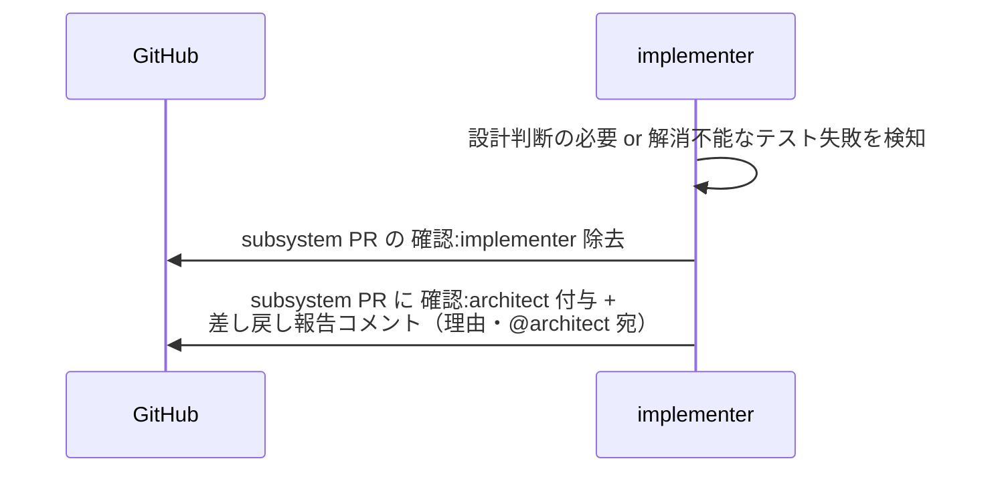

# 実装

implementer がタスク一覧の実装タスクを消化してテストを Green 化し、テスト結果表に実行結果を記入して Draft を解除する単一ユースケース。
**ユーザーとのやり取りなし**（完了で自動遷移。指揮役は architect で、`## タスク一覧` のチェックは architect の検収で入る）。

対応エージェント: `implementer`

- 対応テストファイル: `tests/e2e/単一ユースケース/test_実装.py`

## 正常シナリオ

### セットアップ

| セットアップ | 説明 | 補足 |
| --- | --- | --- |
| Mock | なし（実環境で実行） | - |
| subsystem Draft PR | `確認:implementer` 付与済み・テスト Red + テストレビュー済み | - |
| assignee | PR に未設定 | エージェント起動条件 |

### フロー

### 期待値

- テスト結果表の結果列が全て記入されている（全 ✅・`## タスク一覧` のチェックは未変更）
- PR が Ready 状態（Draft 解除済み）
- subsystem PR に `確認:architect` + 完了報告コメント（未解決）が付与・投稿されている（`議論中` 付与なし）
- `確認:implementer` が除去されている

## 正常シナリオ（リバースエンジニアリング）

### セットアップ

| セットアップ | 説明 | 補足 |
| --- | --- | --- |
| Mock | なし（実環境で実行） | - |
| `リバースエンジニアリング` ラベル | 対象の Issue / PR に付与済み | 本経路を選ぶ判定材料。ユーザーが system Issue に付け、子 Issue へ引き継がれる |
| subsystem Draft PR | `確認:implementer` 付与済み・現状固定テスト + テストレビュー済み | `## タスク一覧` にリファクタの実装タスクがある |
| assignee | PR に未設定 | エージェント起動条件 |
| テストの状態 | 既存の振る舞いを固定するテストが Green・あるべき構造の差分を突くテストが fail | リファクタの到達点 |

### フロー

### 期待値

- テスト結果表の結果列が全て記入されている（全 ✅・`## タスク一覧` のチェックは未変更）
- リファクタ前に Green だったテストが 1 つも fail していない
- リファクタ前に fail していたテストが Green になっている
- 実装コードの構造が確定した設計 Wiki の構成要素（コンテナ・物理名・依存方向）と一致している
- PR が Ready 状態（Draft 解除済み）
- subsystem PR に `確認:architect` + 完了報告コメント（未解決）が付与・投稿されている（`議論中` 付与なし）
- `確認:implementer` が除去されている

## 異常シナリオ（設計レベルの判断が必要）

### セットアップ

| セットアップ | 説明 | 補足 |
| --- | --- | --- |
| Mock | なし（実環境で実行） | - |
| 実装タスクの消化途中 | メソッドシグネチャ変更・複数関数に重複する処理の共通化（ヘルパー切り出し）などの設計判断が必要 or テスト失敗が解消できない | - |

### フロー

### 期待値

- subsystem PR に `確認:architect` + 差し戻し報告コメント（理由・未解決）が付与・投稿されている
- subsystem PR の `確認:implementer` が除去されている
