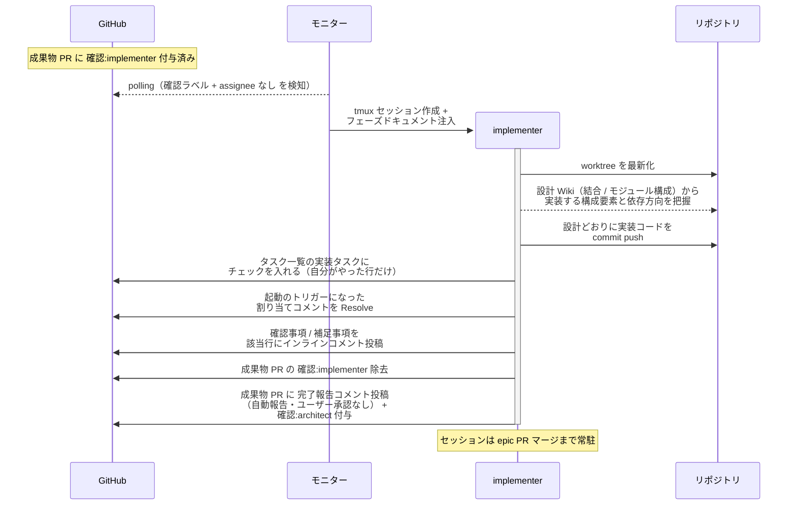
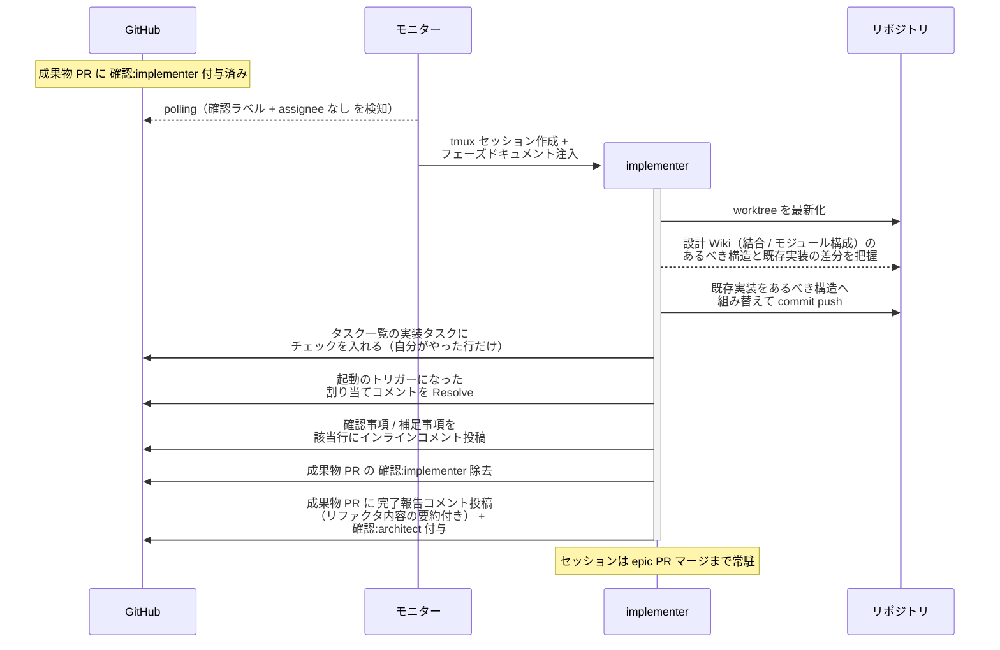
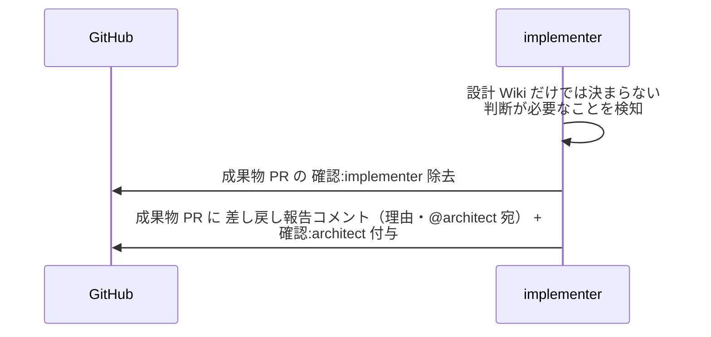

# 実装

implementer が確定済みの設計 Wiki（結合 / モジュール構成）のとおりに実装コードを成果物ブランチへ書く単一ユースケース。

対応エージェント: `implementer`

- 対応テストファイル: `tests/e2e/単一ユースケース/test_実装.py`

## 正常シナリオ

### セットアップ

| セットアップ | 説明 | 補足 |
| --- | --- | --- |
| Mock | なし（実環境で実行） | - |
| 成果物 Draft PR | `確認:implementer` 付与済み・テストレビュー済み（Red 確認済み） | - |
| assignee | 未設定 | エージェント起動条件 |

### フロー

### 期待値

- 実装コードの構造が設計 Wiki の構成要素（コンテナ・物理名・依存方向）と一致している
- implementer がテストを実行した記録がない（実行は architect の担当）
- テスト結果表の結果列が未記入のまま（記入は architect の担当）
- PR が Draft のまま（Draft 解除は architect の担当）
- `## タスク一覧` の実装タスクがチェック済み（自分がやった行だけで、テスト実行タスクは未チェック）
- 起動のトリガーになった architect の割り当てコメントが Resolve 済み（受け取った依頼は自分で畳む）
- 成果物 PR に `確認:architect` + 完了報告コメント（未解決）が付与・投稿されている（`議論中` 付与なし）
- `確認:implementer` が除去されている
- commit した内容に対する補足事項がインラインコメントで残っている（判断を仰ぐ論点がある場合は `@ユーザー` 宛の確認事項として投稿されている）

## 正常シナリオ（リバースエンジニアリング）

### セットアップ

| セットアップ | 説明 | 補足 |
| --- | --- | --- |
| Mock | なし（実環境で実行） | - |
| `リバースエンジニアリング` ラベル | 対象の PR に付与済み | 本経路を選ぶ判定材料。ユーザーが立ち上げ Issue に付け、子 PR へ引き継がれる |
| 成果物 Draft PR | `確認:implementer` 付与済み・テストレビュー済み（Red 確認済み） | `## タスク一覧` にリファクタの実装タスクがある |
| assignee | 未設定 | エージェント起動条件 |
| 既存実装 | 当該範囲が現状の構造で実装済み | リファクタの起点 |

### フロー

### 期待値

- 実装コードの構造が確定した設計 Wiki の構成要素（コンテナ・物理名・依存方向）と一致している
- implementer がテストを実行した記録がない（実行は architect の担当）
- テスト結果表の結果列が未記入のまま（記入は architect の担当）
- PR が Draft のまま（Draft 解除は architect の担当）
- `## タスク一覧` の実装タスクがチェック済み（自分がやった行だけで、テスト実行タスクは未チェック）
- 起動のトリガーになった architect の割り当てコメントが Resolve 済み（受け取った依頼は自分で畳む）
- 成果物 PR に `確認:architect` + 完了報告コメント（未解決）が付与・投稿されている（`議論中` 付与なし）
- `確認:implementer` が除去されている
- commit した内容に対する補足事項がインラインコメントで残っている（判断を仰ぐ論点がある場合は `@ユーザー` 宛の確認事項として投稿されている）

## 異常シナリオ（設計レベルの判断が必要）

### セットアップ

| セットアップ | 説明 | 補足 |
| --- | --- | --- |
| Mock | なし（実環境で実行） | - |
| 実装の途中 | メソッドシグネチャ変更・複数関数に重複する処理の共通化（ヘルパー切り出し）など、設計 Wiki に書かれていない判断が必要 | - |

### フロー

### 期待値

- 成果物 PR に `確認:architect` + 差し戻し報告コメント（理由・未解決）が付与・投稿されている
- 成果物 PR の `確認:implementer` が除去されている
