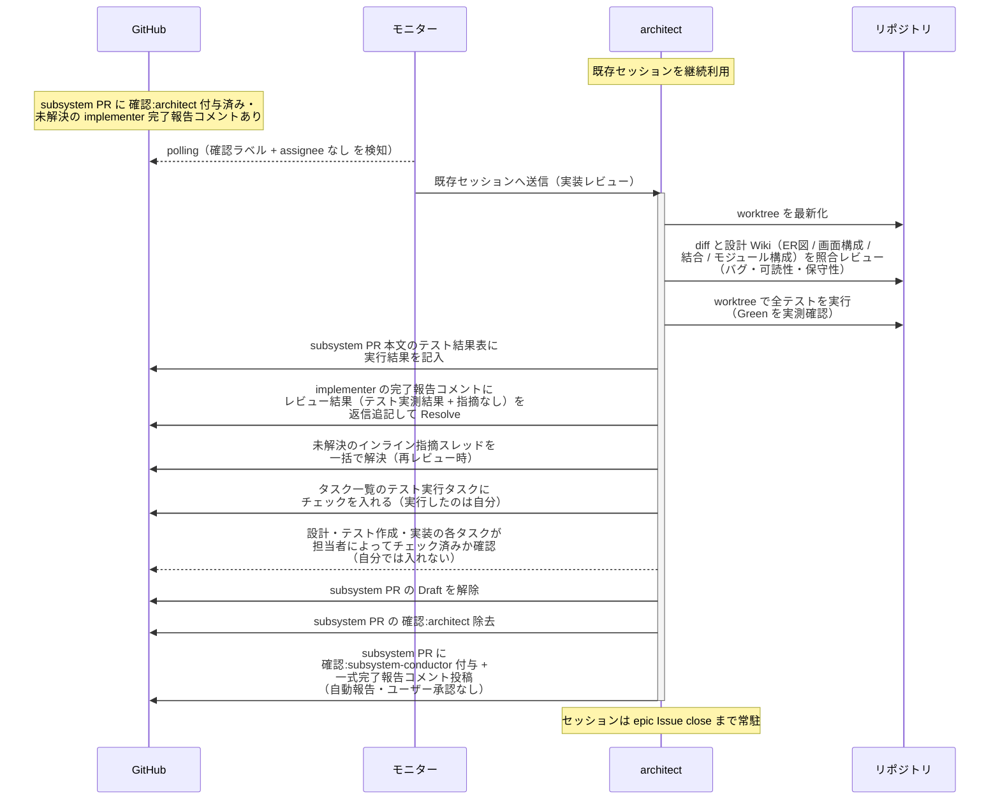
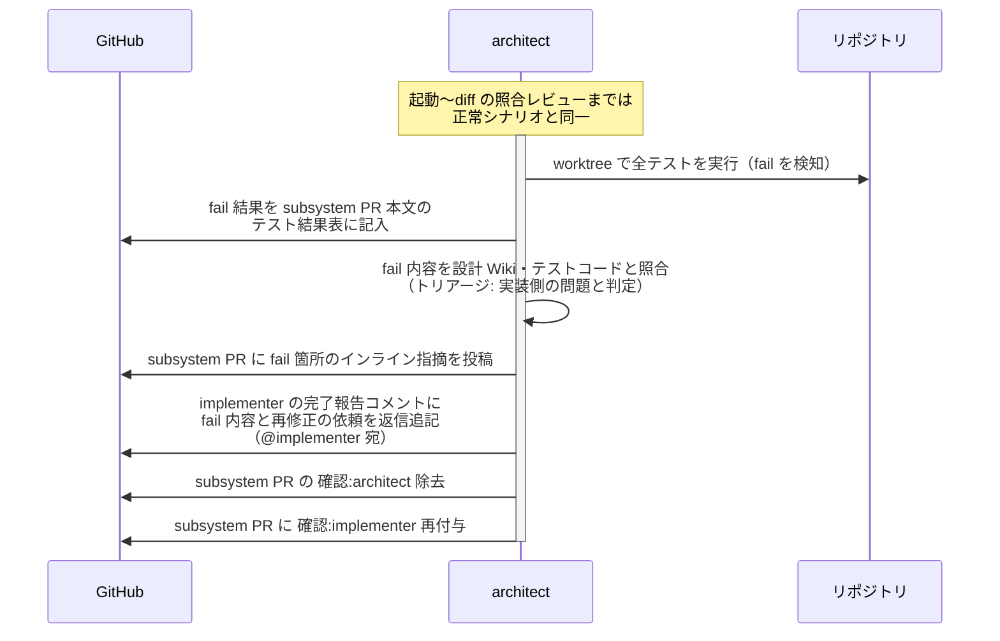
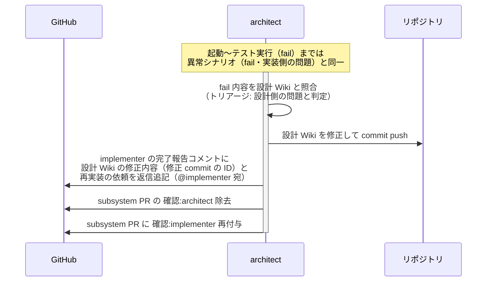
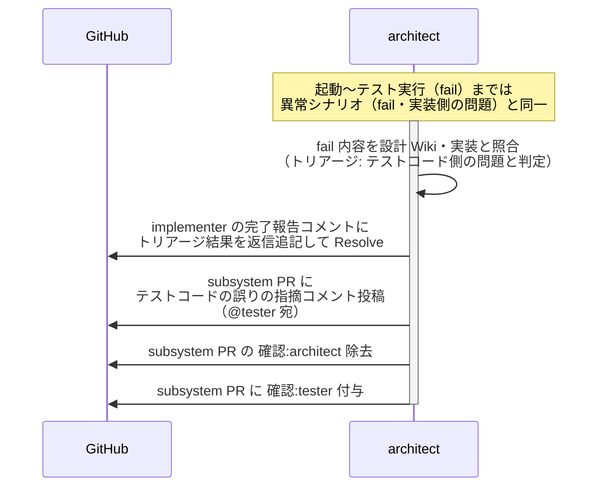
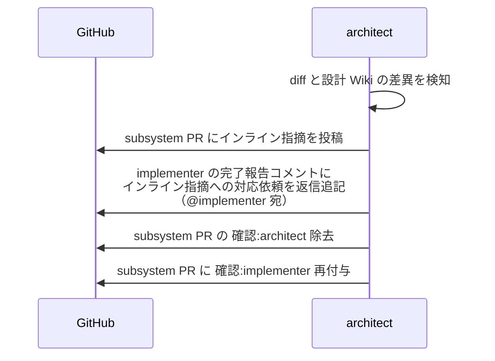

# 実装レビュー

architect（設計 Wiki の作成者・内部パイプラインの指揮役）が implementer の実装 diff を設計 Wiki と照合し、テストを実行して Green を確認したうえで Ready 化する単一ユースケース。
architect が触るのは設計 Wiki だけで、実装コード・テストコードの修正は担当の worker に差し戻す。
**ユーザーとのやり取りなし**（指摘は implementer に直接差し戻し、指摘 → 修正の往復も本エージェントと implementer で直接回す。ユーザーの最終確認は subsystem-conductor のマージ起動ゲートで行う）。

対応エージェント: `architect`

- 対応テストファイル: `tests/e2e/単一ユースケース/test_実装レビュー.py`

## 正常シナリオ

### セットアップ

| セットアップ | 説明 | 補足 |
| --- | --- | --- |
| Mock | なし（実環境で実行） | - |
| subsystem Draft PR | `確認:architect` 付与済み + implementer の完了報告コメント（自分宛・未解決）あり | - |
| テスト結果表 | テストファイル名のみ記入済み（結果列は未記入） | 記入は本 UC で行う |
| assignee | PR に未設定 | エージェント起動条件 |

### フロー

### 期待値

- worktree でのテスト実行が全 pass（Green の実測確認）
- テスト結果表の結果列が全て記入されている（全 ✅）
- implementer の完了報告コメントのスレッドにレビュー結果（テスト実測結果 + 指摘なし）が返信追記され、Resolve 済み
- インライン指摘スレッドが残っていない（再レビュー時は解決済みになっている）
- `## タスク一覧` の全行がチェック済み（テスト実行タスクは architect、設計は architect、テスト作成は tester、実装は implementer がそれぞれ入れたもの）
- PR が Ready 状態（Draft 解除済み）
- subsystem PR に `確認:subsystem-conductor` + 一式完了報告コメント（未解決）が付与・投稿されている
- `確認:architect` が除去されている

## 異常シナリオ（fail・実装側の問題）

### セットアップ

| セットアップ | 説明 | 補足 |
| --- | --- | --- |
| Mock | なし（実環境で実行） | - |
| subsystem Draft PR | `確認:architect` 付与済み + implementer の完了報告コメント（自分宛・未解決）あり | - |
| fail の原因 | 実装が設計 Wiki の期待する振る舞いを満たしていない（設計 Wiki・テストコードは正しい） | 実装側の問題と判定させる |
| assignee | PR に未設定 | エージェント起動条件 |

### フロー

### 期待値

- fail 結果がテスト結果表に記録されている
- architect が実装コードを変更した記録がない（修正は implementer の担当）
- implementer の完了報告コメントのスレッドに fail 内容と再修正の依頼（@implementer 宛）が返信追記されている（スレッドは未解決のまま）
- fail 箇所のインライン指摘スレッドが未解決のまま残っている（対応の往復は指摘したスレッド内で行う）
- subsystem PR に `確認:implementer` が付与され、`確認:architect` が除去されている
- PR が Draft のまま（Ready 化は Green 確認後）

## 異常シナリオ（fail・設計側の問題）

### セットアップ

| セットアップ | 説明 | 補足 |
| --- | --- | --- |
| Mock | なし（実環境で実行） | - |
| subsystem Draft PR | `確認:architect` 付与済み + implementer の完了報告コメント（自分宛・未解決）あり | - |
| fail の原因 | 設計 Wiki の記述が実装すべき要件と矛盾している（実装は設計 Wiki どおり） | 設計側の問題と判定させる |
| assignee | PR に未設定 | エージェント起動条件 |

### フロー

### 期待値

- 設計 Wiki の修正 commit が subsystem ブランチに積まれている
- architect が実装コード・テストコードを変更した記録がない（修正対象は設計 Wiki のみ）
- implementer の完了報告コメントのスレッドに修正 commit の ID と再実装の依頼（@implementer 宛）が返信追記されている
- subsystem PR に `確認:implementer` が付与され、`確認:architect` が除去されている

## 異常シナリオ（fail・テストコード側の問題）

### セットアップ

| セットアップ | 説明 | 補足 |
| --- | --- | --- |
| Mock | なし（実環境で実行） | - |
| subsystem Draft PR | `確認:architect` 付与済み + implementer の完了報告コメント（自分宛・未解決）あり | - |
| fail の原因 | テストコードが設計 Wiki の期待値を誤って表現している（設計 Wiki・実装は正しい） | テストコード側の問題と判定させる |
| assignee | PR に未設定 | エージェント起動条件 |

### フロー

### 期待値

- architect がテストコード・実装コードを変更した記録がない（修正は tester の担当）
- implementer の完了報告コメントにトリアージ結果が返信追記され、Resolve 済み
- subsystem PR に `確認:tester` + テストコードの誤りの指摘コメント（@tester 宛・未解決）が付与・投稿されている（対応の往復は指摘したスレッド内で行う）
- `確認:architect` が除去されている

## 異常シナリオ（実装への指摘あり）

### セットアップ

| セットアップ | 説明 | 補足 |
| --- | --- | --- |
| Mock | なし（実環境で実行） | - |
| レビューの途中 | diff に設計 Wiki との差異 or バグ・可読性・保守性の問題を発見 | 例: 結合ドキュメントにないレスポンス形式 |

### フロー

### 期待値

- インライン指摘が subsystem PR に投稿されている
- implementer の完了報告コメントのスレッドにインライン指摘への対応依頼（@implementer 宛）が返信追記されている（スレッドは未解決のまま = 修正確定まで同スレッドで往復する）
- subsystem PR に `確認:implementer` が付与されている
- `確認:architect` が除去され、`## タスク一覧` の実装タスクは implementer のチェックのまま（差し戻しでも外さない）・テスト実行タスクは未チェック（Green を確認できていないため）
