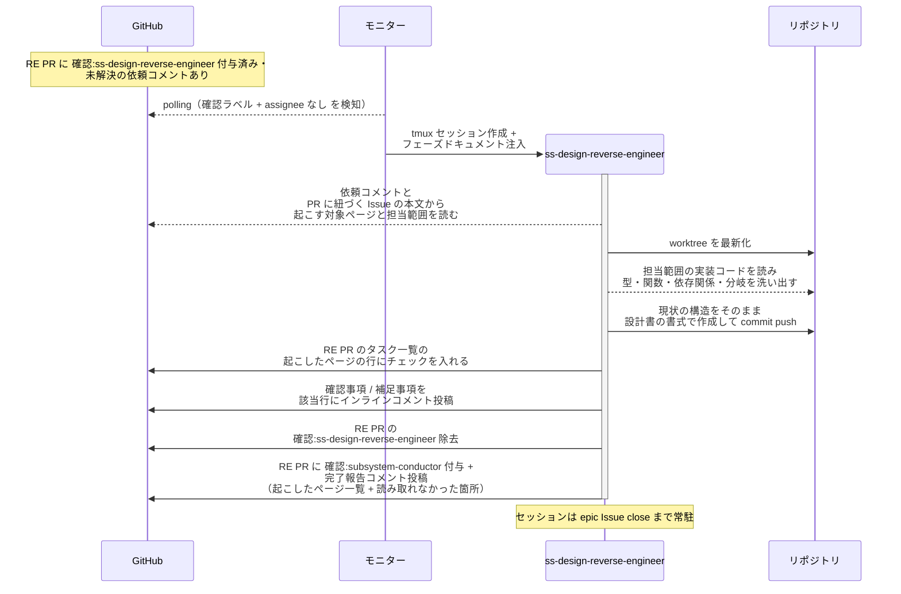
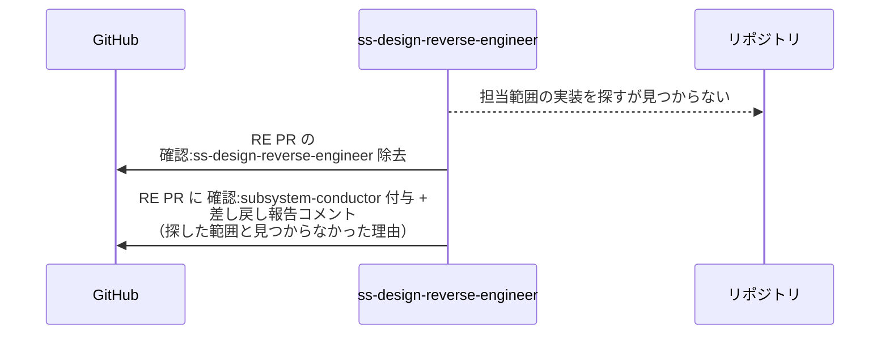

# 現状設計書の起こし

`*-reverse-engineer` が実装コードを読み、現状の構造をそのまま設計書の書式で起こして RE PR に commit し、発注元の conductor へ完了報告する単一ユースケース。
レイヤーごとに担当エージェントと成果物が違うだけで、手順は共通のため 1 ファイルにまとめる。

対応エージェント: `architecture-reverse-engineer` / `mock-reverse-engineer` / `complex-scenario-reverse-engineer` / `single-scenario-reverse-engineer` / `ss-design-reverse-engineer`

- 対応テストファイル: `tests/e2e/単一ユースケース/test_現状設計書の起こし.py`

**レイヤー別の担当と成果物:**

| レイヤー | エージェント | 発注元 | RE ブランチの base | 成果物（現状版） | 後続の担当 |
| --- | --- | --- | --- | --- | --- |
| system | `architecture-reverse-engineer` | system-conductor | `master` | `設計図/アーキテクチャ図.md` + 機能の洗い出し（完了報告コメント） | system-architect |
| epic | `mock-reverse-engineer` | epic-conductor | `master` | `docs/mock/pages/{画面名}/{RE PR 番号}/current/index.html` | mock-designer |
| epic | `complex-scenario-reverse-engineer` | epic-conductor | `master` | `設計図/シナリオ/複合ユースケース/{機能名}.md` | complex-scenario-writer |
| story | `single-scenario-reverse-engineer` | story-conductor | epic ブランチ | `設計図/シナリオ/単一ユースケース/{機能名}.md` | single-scenario-writer |
| subsystem | `ss-design-reverse-engineer` | subsystem-conductor | story ブランチ | `設計図/インターフェース定義/バックエンド/` / `設計図/インターフェース定義/フロントエンド/` / `設計図/モジュール構成/` / `設計図/ER図/` / `設計図/画面構成/` | architect |

## 正常シナリオ

### セットアップ

| セットアップ | 説明 | 補足 |
| --- | --- | --- |
| Mock | なし（実環境で実行） | - |
| `リバースエンジニアリング` ラベル | 対象の Issue / PR に付与済み | 本エージェントが動く前提条件 |
| RE PR | `確認:ss-design-reverse-engineer` 付与済み + 発注元の依頼コメント（自分宛・未解決）あり | subsystem-conductor が作成した `docs/reverse/{scope}/{ドメイン}/{UC名}` ブランチの PR |
| 紐づく Issue | RE PR 本文の `## 紐づく Issue` から辿れる | 担当範囲の詳細が書かれている |
| assignee | PR に未設定 | エージェント起動条件 |
| 対象コード | 担当範囲が実装済み | 読み取り元 |
| 設計書の書式 | `docs/wiki/テンプレート/` が base に存在 | 書き出す書式の参照元 |

### フロー

### 期待値

- 依頼されたページが RE ブランチに commit されている
- RE PR の `## タスク一覧` の起こしたページの行がチェック済み（起こした本人が入れる）
- 各ページの構成要素が実装の物理名（ファイルパス・関数名・型名）と一致している
- 実装に存在しない要素が書かれていない（推測で補完していない）
- あるべき姿への整理・リファクタ提案が含まれていない
- 実装から読み取れなかった箇所が完了報告コメントに列挙されている
- RE PR に発注元の `確認:*` + 完了報告コメント（未解決）が付与・投稿されている（`議論中` 付与なし・assignee 設定なし）
- 自分の `確認:*` が除去されている
- commit した内容に対する補足事項がインラインコメントで残っている（判断を仰ぐ論点がある場合は `@ユーザー` 宛の確認事項として投稿されている）

## 異常シナリオ（担当範囲の実装が見つからない）

### セットアップ

| セットアップ | 説明 | 補足 |
| --- | --- | --- |
| Mock | なし（実環境で実行） | - |
| `リバースエンジニアリング` ラベル | 対象の Issue / PR に付与済み | - |
| RE PR | `確認:ss-design-reverse-engineer` 付与済み + 依頼コメントあり | - |
| 対象コード | 依頼された担当範囲に対応する実装が存在しない | 失敗を決定的に誘発 |

### フロー

### 期待値

- 設計書が 1 ページも commit されていない
- `## タスク一覧` が全行未チェックのまま（起こせていないのでチェックしない）
- RE PR に発注元の `確認:*` + 差し戻し報告コメント（未解決）が付与・投稿されている
- 自分の `確認:*` が除去されている
