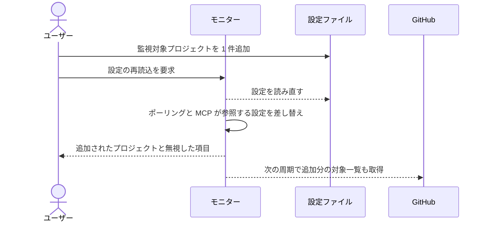
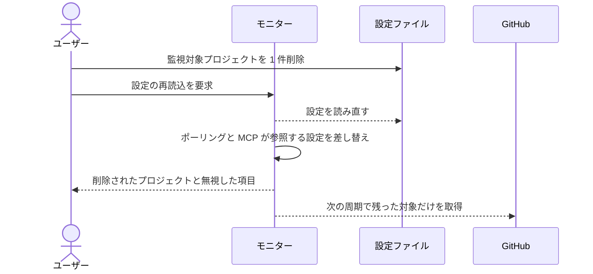

# 監視対象の増減

稼働中のモニターに設定の再読込を指示し、監視対象プロジェクトの増減を再起動なしで反映する単一ユースケース。

再起動している間はエージェントの起動もセッションの生存確認も止まる。
稼働中のワークフローを抱えたまま監視対象を足せるようにするのが目的。

契機は明示的な呼び出しにする。
周期でファイルを読み続ける方式だと、いつ切り替わったのかが追えず、編集途中のファイルを拾う危険もあるため。

再読込の対象はポーリングと MCP の両方が見る設定に限る。
どちらか片方だけだと、追加したプロジェクトのエージェントが起動しても MCP で対象を解決できない。

実行中に変えられない項目の扱いと、設定ファイルを読めなかったときの挙動はエンドポイント側の責務なので本 UC では見ない（`設計図/インターフェース定義/バックエンド/設定リロード.py.md`）。

本 UC にはエージェントが登場せず、tmux も使わない。
そのため E2E ハーネス（モニターを 1 本共有してエージェントを起動する作り）ではなく、実プロセスを起動する結合テストで検証する。

- 対応テストファイル: `tests/integration/monitor/test_監視対象の増減.py`

## 正常シナリオ（監視対象の追加）

### セットアップ

| セットアップ | 説明 | 補足 |
| --- | --- | --- |
| Mock | GitHub API を差し替え（対象一覧に空を返す） | 実リポジトリを持たずにポーリングを回すため |
| モニター | 監視対象 1 件の設定で起動済み | 稼働中に足す状況を作る |
| 設定ファイル | 監視対象を 2 件に書き換え済み | 追加分を決定的に誘発 |

### フロー

### 期待値

- 応答に追加されたプロジェクト名が含まれている
- 再読込後の周期で、追加したプロジェクトの対象一覧の取得が発生している
- MCP が追加したプロジェクト名を対象として解決できる
- 起動時に配った設定の実体がそのまま使われている（作り直していない）

## 正常シナリオ（監視対象の削除）

### セットアップ

| セットアップ | 説明 | 補足 |
| --- | --- | --- |
| Mock | GitHub API を差し替え（対象一覧に空を返す） | - |
| モニター | 監視対象 2 件の設定で起動済み | - |
| 設定ファイル | 監視対象を 1 件に書き換え済み | 削除分を決定的に誘発 |

### フロー

### 期待値

- 応答に削除されたプロジェクト名が含まれている
- 再読込後の周期で、削除したプロジェクトの対象一覧の取得が発生していない
- MCP が削除したプロジェクト名を対象として解決できない

## 異常シナリオ

なし
