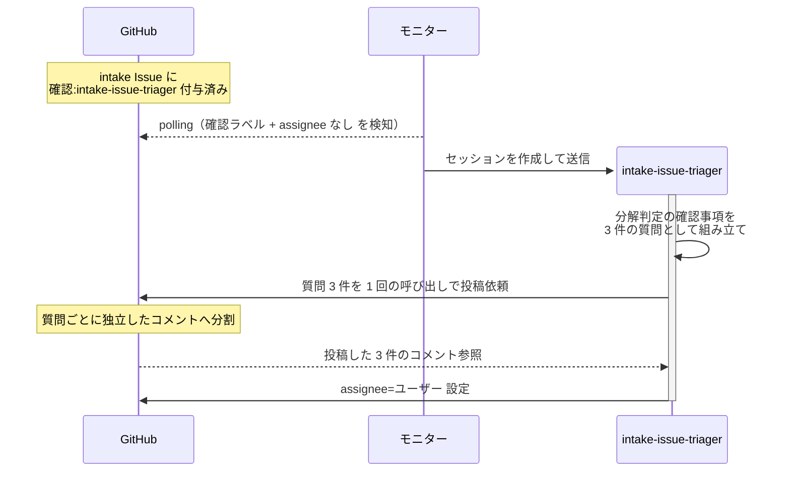

# 確認質問の個別投稿

エージェントが確認質問を複数まとめて投げたとき、質問 1 件ごとに独立したコメントとして投稿され、ユーザーが質問ごとに回答できる状態になる単一ユースケース。
呼び出しは 1 回のままで、分割と採番はツール側が担う。

対象エージェントは確認質問を投げる任意のエージェントでよいが、報告の発端になった `intake-issue-triager` の分解判定を代表ケースにする。

対応エージェント: `intake-issue-triager`（分解判定（初回））

- 対応テストファイル: `tests/e2e/単一ユースケース/test_確認質問の個別投稿.py`

## 正常シナリオ

### セットアップ

| セットアップ | 説明 | 補足 |
| --- | --- | --- |
| Mock | なし（実環境で実行） | - |
| フェーズ手順書 | 確認質問を 3 件投げる内容に差し替えて注入 | 質問件数を決定的に固定する |
| intake Issue | sandbox に open の Issue が 1 件存在し、`確認:intake-issue-triager` 付与済み | コメント 0 件の状態から始める |
| 宛先 | 受信者にユーザーのログイン名を指定 | to 行の付与を観測するため |
| assignee | 未設定 | エージェント起動条件 |

### フロー

### 期待値

- intake Issue のコメントが質問件数と同じ 3 件増えている
- 各コメントが質問 1 件だけを含み、質問文・背景・選択肢・推奨が揃っている
- 各コメントの先頭に引用ヘッダー（送信者の from 行 + 受信者の to 行）が付いている
- 各コメントの選択肢の採番記号が、そのコメント内で先頭から振られている
- 各コメントが区切り線で終わっている（ユーザーがそのまま回答を書き足せる状態）

## 異常シナリオ

なし
