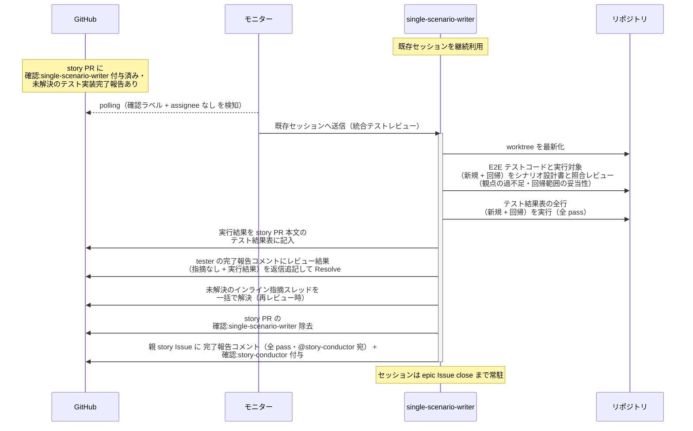
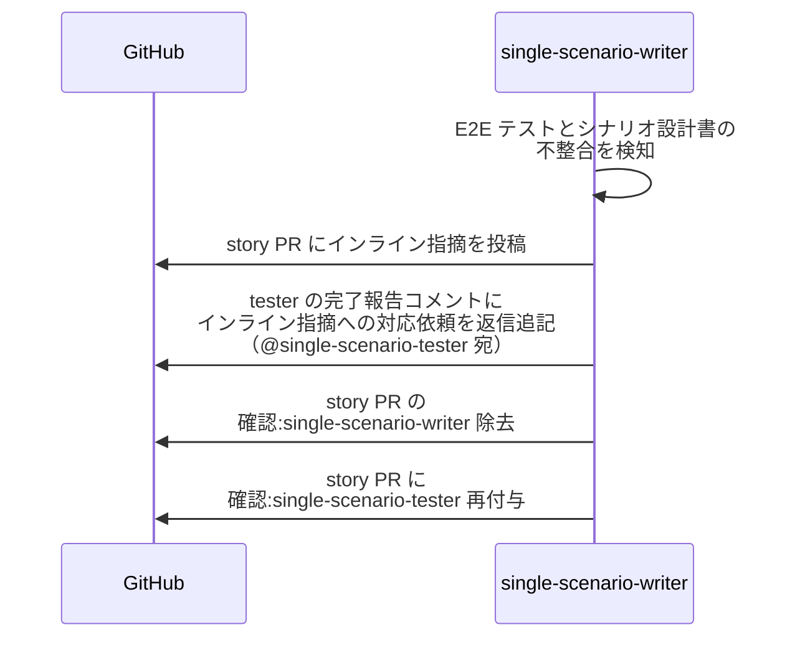
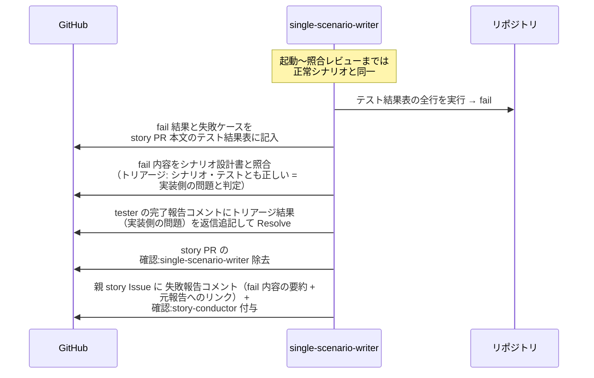
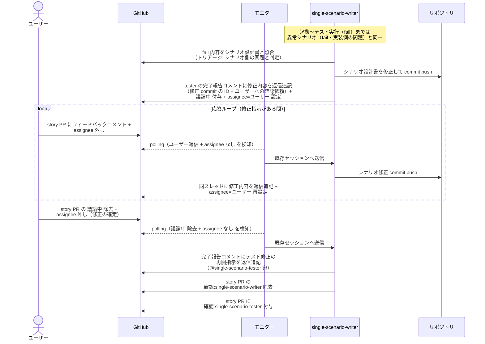
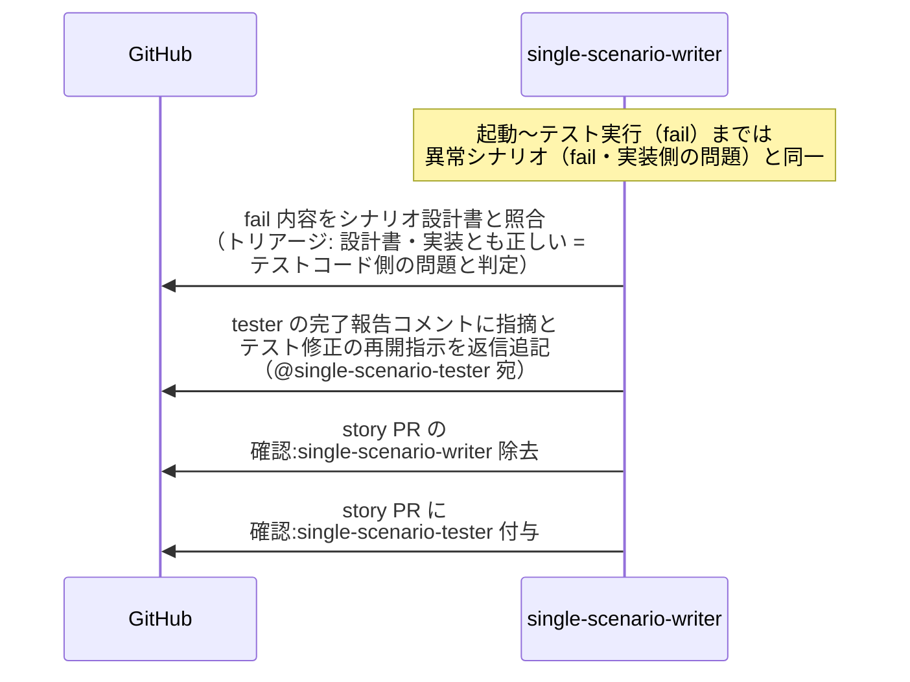

# 統合テストレビュー

single-scenario-writer / complex-scenario-writer（シナリオ設計書の作成者・統合テストの指揮役）が、配下の scenario-tester の実装した E2E テストコードと実行対象（新規 + 回帰）をシナリオ設計書と照合し、テストを実行して結果を判定する単一ユースケース。

対応エージェント: `single-scenario-writer` / `complex-scenario-writer`

図は単一 UC（story レベル）で代表する。
複合 UC（epic レベル）は以下を読み替えて同型。

| 図の表記 | 複合 UC での読み替え |
| --- | --- |
| single-scenario-writer | complex-scenario-writer |
| single-scenario-tester | complex-scenario-tester |
| story PR / story ブランチ | epic PR / epic ブランチ |
| 親 story Issue / story-conductor | 親 epic Issue / epic-conductor |
| fail を誘発するバグ埋込 = subsystem 実装のバグ | UC 間の受け渡しの不整合（単一 UC 単体は pass） |

- 対応テストファイル: `tests/e2e/単一ユースケース/test_統合テストレビュー.py`

## 正常シナリオ（全 pass）

### セットアップ

| セットアップ | 説明 | 補足 |
| --- | --- | --- |
| Mock | なし（実環境で実行） | - |
| story PR | `確認:single-scenario-writer` 付与済み + tester のテスト実装完了報告コメント（自分宛・未解決）あり | - |
| E2E テスト | story ブランチに commit 済み・テスト結果表に新規 + 回帰の行あり（結果列は未記入） | - |
| assignee | PR に未設定 | エージェント起動条件 |

### フロー

### 期待値

- テスト結果表の結果列が全て記入されている（新規 + 回帰とも全 ✅）
- tester のテスト実装完了報告コメントのスレッドにレビュー結果（指摘なし + 実行結果）が返信追記され、Resolve 済み
- インライン指摘スレッドが残っていない（再レビュー時は解決済みになっている）
- 親 story Issue に `確認:story-conductor` + 完了報告コメント（全 pass・未解決）が付与・投稿されている
- `確認:single-scenario-writer` が除去されている

## 異常シナリオ（テストへの指摘あり）

### セットアップ

| セットアップ | 説明 | 補足 |
| --- | --- | --- |
| Mock | なし（実環境で実行） | - |
| レビューの途中 | E2E テストにシナリオ設計書との不整合を発見 | 例: 異常シナリオのケースが未実装 / 回帰対象の漏れ |

### フロー

### 期待値

- インライン指摘が story PR に投稿されている
- tester の完了報告コメントのスレッドにインライン指摘への対応依頼（@single-scenario-tester 宛）が返信追記されている（スレッドは未解決のまま）
- インライン指摘スレッドが未解決のまま残っている（対応の往復は指摘したスレッド内で行う）
- テストを実行した記録がない（照合レビューで差し戻したため）
- story PR に `確認:single-scenario-tester` が付与されている
- `確認:single-scenario-writer` が除去されている

## 異常シナリオ（fail・実装側の問題）

### セットアップ

| セットアップ | 説明 | 補足 |
| --- | --- | --- |
| Mock | なし（実環境で実行） | - |
| story PR | `確認:single-scenario-writer` 付与済み + tester のテスト実装完了報告コメント（自分宛・未解決）あり | - |
| fail の原因 | subsystem 実装に意図的なバグを仕込む（シナリオ設計書・テストコードは正しい） | 実装側の問題と判定させる |

### フロー

### 期待値

- fail 結果と失敗ケースがテスト結果表に記録されている
- tester の完了報告コメントのスレッドにトリアージ結果（実装側の問題）が返信追記され、Resolve 済み
- 親 story Issue に `確認:story-conductor` + 失敗報告コメント（fail 内容の要約 + 元報告へのリンク・未解決）が付与・投稿されている（バグ差し戻しは story-conductor）
- `確認:single-scenario-writer` が除去されている

## 異常シナリオ（fail・シナリオ側の問題）

### セットアップ

| セットアップ | 説明 | 補足 |
| --- | --- | --- |
| Mock | なし（実環境で実行） | - |
| story PR | `確認:single-scenario-writer` 付与済み + tester のテスト実装完了報告コメント（自分宛・未解決）あり | - |
| fail の原因 | シナリオ設計書に実装と矛盾する期待値を仕込む（実装は要件どおり） | シナリオ側の問題と判定させる |
| ユーザー役 | シナリオ修正の承認（`議論中` 除去）を pytest が実施 | - |

### フロー

### 期待値

- シナリオ設計書の修正 commit が story ブランチに積まれている（修正はユーザー承認済み）
- tester の完了報告コメントのスレッドに修正内容（修正 commit の ID）とテスト修正の再開指示（@single-scenario-tester 宛）が返信追記されている（スレッドは未解決のまま = tester が処理時に Resolve する）
- story PR に `確認:single-scenario-tester` が付与されている
- `確認:single-scenario-writer` が除去されている

## 異常シナリオ（fail・テストコード側の問題）

### セットアップ

| セットアップ | 説明 | 補足 |
| --- | --- | --- |
| Mock | なし（実環境で実行） | - |
| story PR | `確認:single-scenario-writer` 付与済み + tester のテスト実装完了報告コメント（自分宛・未解決）あり | - |
| fail の原因 | E2E テストコードに誤りを仕込む（シナリオ設計書・実装は正しい） | テストコード側の問題と判定させる |

### フロー

### 期待値

- tester の完了報告コメントのスレッドに指摘とテスト修正の再開指示（@single-scenario-tester 宛）が返信追記されている（スレッドは未解決のまま = tester が処理時に Resolve する）
- story PR に `確認:single-scenario-tester` が付与され、`確認:single-scenario-writer` が除去されている
- シナリオ設計書・実装コードへの変更が発生していない
