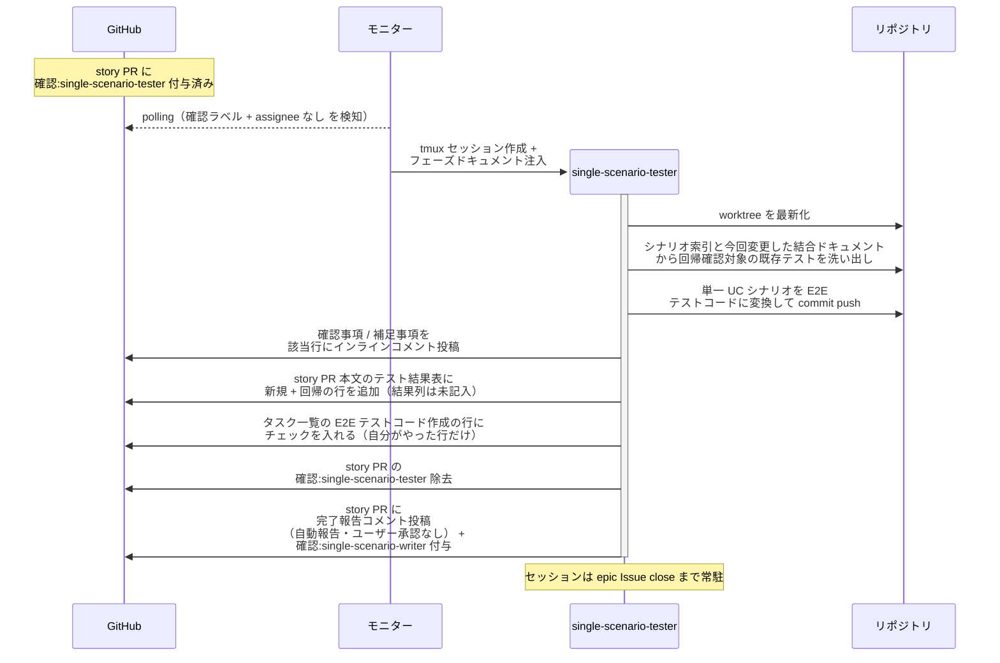
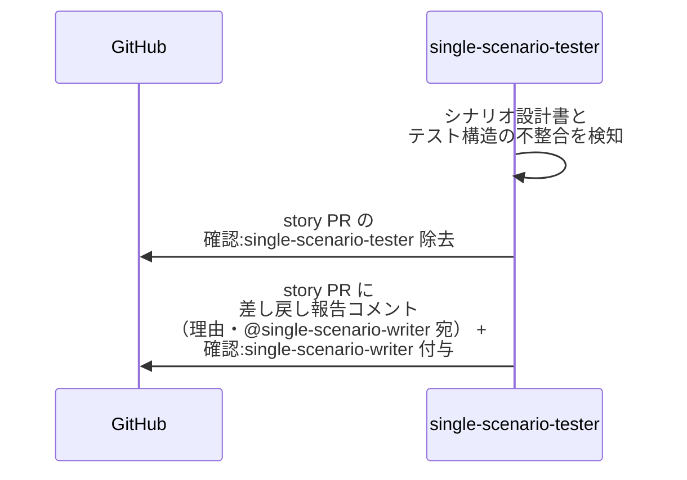

# 統合テスト実装

single-scenario-tester / complex-scenario-tester が担当レベルのシナリオの E2E テストを実装する単一ユースケース（回帰確認対象の洗い出しを含む）。
テストの実行は行わず、指揮役の scenario-writer が統合テストレビューで実行する。

対応エージェント: `single-scenario-tester` / `complex-scenario-tester`

- 対応テストファイル: `tests/e2e/単一ユースケース/test_統合テスト実装.py`（読み替え先の複合 UC も同ファイル内で実行する）

図は単一 UC（story レベル）で代表する。
複合 UC（epic レベル）は以下を読み替えて同型。

| 図の表記 | 複合 UC での読み替え |
| --- | --- |
| single-scenario-tester | complex-scenario-tester |
| single-scenario-writer | complex-scenario-writer |
| story PR / story ブランチ | epic PR / epic ブランチ |
| 全 subsystem マージ済み | 全 story マージ済み |
| 単一 UC シナリオ | 複合 UC シナリオ（各 UC 箱の操作手順は対応する単一 UC テストを再利用） |
| 回帰洗い出しの元 = 今回変更した結合ドキュメント | 今回変更した単一 UC |

## 正常シナリオ

### セットアップ

| セットアップ | 説明 | 補足 |
| --- | --- | --- |
| Mock | なし（実環境で実行） | - |
| story PR | 全 subsystem マージ済み + `確認:single-scenario-tester` 付与済み（writer が割り当て） | - |
| 単一 UC シナリオ | story ブランチに存在 | テスト実装の元ネタ |
| assignee | PR に未設定 | エージェント起動条件 |

### フロー

### 期待値

- 単一 UC シナリオの正常 + 異常の E2E テストコードが story ブランチに commit されている
- story PR 本文のテスト結果表に新規 + 回帰の行が追加されている（結果列は未記入）
- `## タスク一覧` の E2E テストコード作成の行がチェック済み（テスト実行の行は未チェック。実行するのは writer）
- tester がテストを実行した記録がない（実行は writer の担当）
- story PR に `確認:single-scenario-writer` + 完了報告コメント（未解決）が付与・投稿されている
- `確認:single-scenario-tester` が除去されている
- commit した内容に対する補足事項がインラインコメントで残っている（判断を仰ぐ論点がある場合は `@ユーザー` 宛の確認事項として投稿されている）

## 異常シナリオ（シナリオ設計書の見直しが必要）

### セットアップ

| セットアップ | 説明 | 補足 |
| --- | --- | --- |
| Mock | なし（実環境で実行） | - |
| テスト実装の途中 | シナリオ設計書どおりに書けない構造問題を発見 | 例: 期待値が観測不能な中間状態を指している |

### フロー

### 期待値

- E2E テストコードが commit されていない
- story PR に `確認:single-scenario-writer` + 差し戻し報告コメント（理由・未解決）が付与・投稿されている
- `確認:single-scenario-tester` が除去されている
