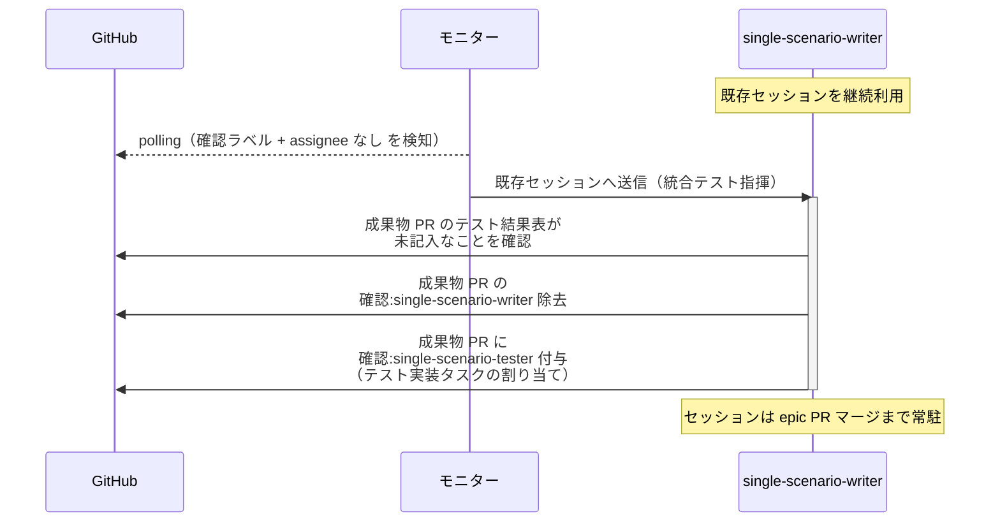
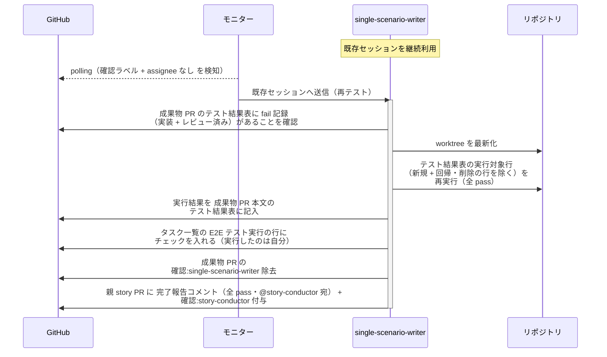

# 統合テスト指揮

single-scenario-writer / complex-scenario-writer（統合テストの指揮役）が、conductor から委任された統合テスト一式について配下の scenario-tester にテスト実装を割り当て、バグ修正後の再テストを実行する単一ユースケース。

対応エージェント: `single-scenario-writer` / `complex-scenario-writer`

図は単一 UC（story レベル）で代表する。
複合 UC（epic レベル）は以下を読み替えて同型。

| 図の表記 | 複合 UC での読み替え |
| --- | --- |
| single-scenario-writer | complex-scenario-writer |
| single-scenario-tester | complex-scenario-tester |
| 親 story PR | 親 epic PR |
| story-conductor | epic-conductor |

- 対応テストファイル: `tests/e2e/単一ユースケース/test_統合テスト指揮.py`

## 正常シナリオ（テスト実装の起動）

### セットアップ

| セットアップ | 説明 | 補足 |
| --- | --- | --- |
| Mock | なし（実環境で実行） | - |
| 成果物 PR | `確認:single-scenario-writer` 付与済み（conductor の委任）・テスト結果表が未記入 | - |
| assignee | 未設定 | エージェント起動条件 |

### フロー

### 期待値

- テスト実装の割り当てコメントに、E2E テスト化するシナリオのページ名と各ページの commit 範囲が記載されている
- 成果物 PR に `確認:single-scenario-tester` が付与されている
- `確認:single-scenario-writer` が除去されている

## 正常シナリオ（再テストの実行）

### セットアップ

| セットアップ | 説明 | 補足 |
| --- | --- | --- |
| Mock | なし（実環境で実行） | - |
| 成果物 PR | `確認:single-scenario-writer` 付与済み（conductor の委任）・テスト結果表に fail 記録あり（実装 + レビュー済み） | 再テストを誘発。`変更種別` に `削除` の行を 1 行含める |
| assignee | 未設定 | エージェント起動条件 |

### フロー

### 期待値

- テスト結果表の結果列が全て記入されている（新規 + 回帰とも全 ✅。`変更種別` が `削除` の行は実行していないので `-`）
- `## タスク一覧` の E2E テスト実行の行がチェック済みになり、これで全行がチェック済みになる
- レビュー済みテストの再実行のため tester への割り当てを経由していない
- 親 story PR に `確認:story-conductor` + 完了報告コメント（全 pass・未解決）が付与・投稿されている
- `確認:single-scenario-writer` が除去されている

## 異常シナリオ

なし
