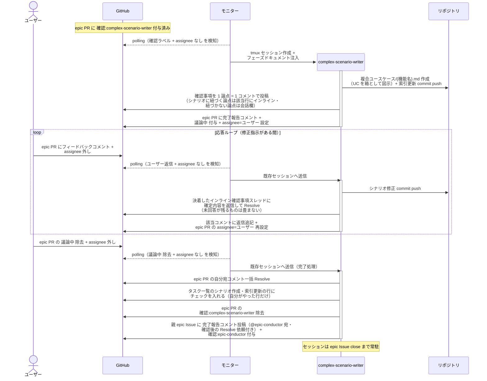
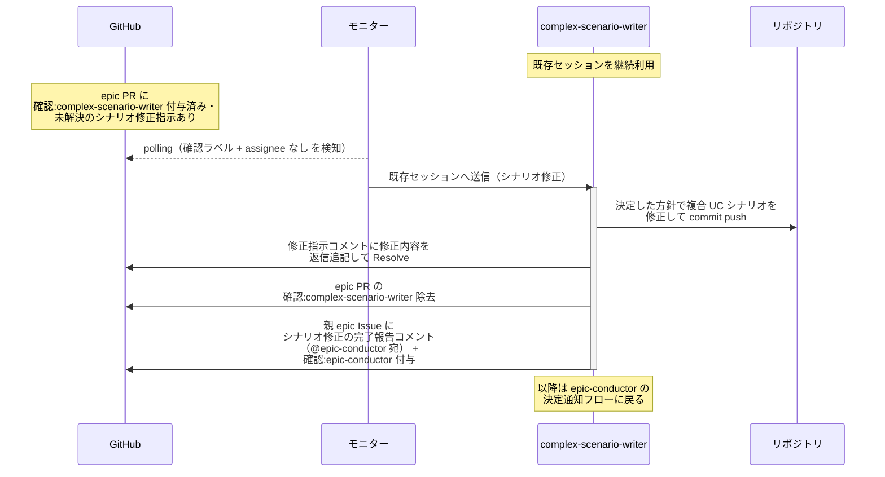
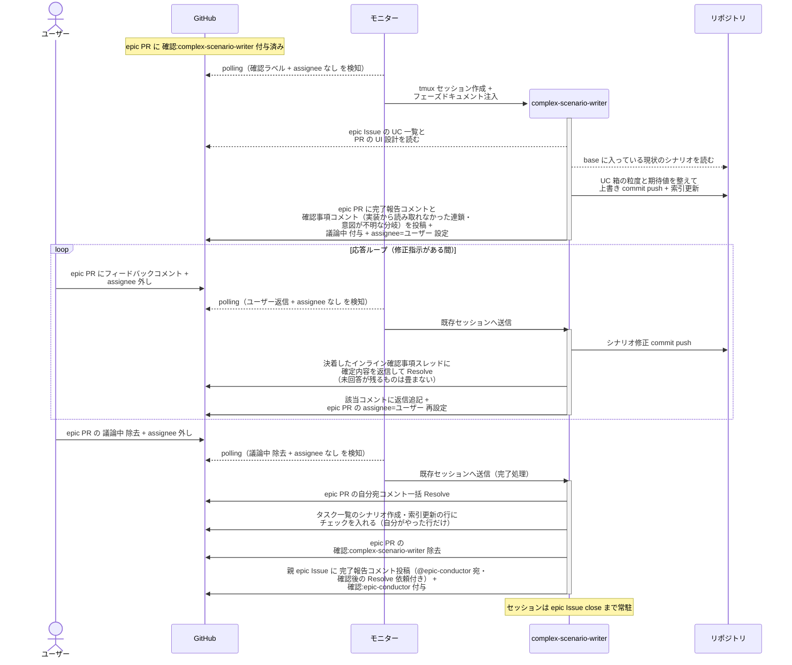

# 複合シナリオ設計

complex-scenario-writer が epic 本文のユースケース一覧をもとに複合ユースケースシナリオ（UC を箱として連鎖させた業務フロー）を設計し、epic ブランチに commit する単一ユースケース。

対応エージェント: `complex-scenario-writer`

- 対応テストファイル: `tests/e2e/単一ユースケース/test_複合シナリオ設計.py`

## 正常シナリオ

### セットアップ

| セットアップ | 説明 | 補足 |
| --- | --- | --- |
| Mock | なし（実環境で実行） | - |
| epic Draft PR | `確認:complex-scenario-writer` 付与済み | 本文は `## 紐づく Issue` のみ |
| epic Issue | 5 セクション確定済み | ユースケース一覧が UC 名の SoT |
| 画面の方向性 | 画面変更ありの epic では epic PR の `## UI 設計` + モック確定済み | シナリオは確定済み画面を前提に書く |
| assignee | PR に未設定 | エージェント起動条件 |

### フロー

### 期待値

- epic ブランチに `docs/wiki/設計図/シナリオ/複合ユースケース/{機能名}.md` が commit されている（正常 + 異常シナリオ、中間ノードは UC 名と 1:1 の粒度ルール準拠）
- `## タスク一覧` のシナリオ作成・索引更新の行がチェック済み（E2E テスト実行の行は未チェック）
- 確認事項が 1 論点 = 1 コメントで投稿され、シナリオの特定箇所に紐づく論点は該当行のインライン、紐づかない論点は会話欄に振り分けられている
- `設計図/シナリオ/README.md` の索引に行が追加されている
- 親 epic Issue に `確認:epic-conductor` が付与され、完了報告コメント（@epic-conductor 宛・未解決）が投稿されている
- epic PR の自分宛コメントが全て Resolve 済み
- 応答ループの各ターンで、決着したインライン確認事項スレッドが確定内容の返信付きで Resolve されている
- 完了処理に入った時点で未解決のインライン確認事項が残っていない（残る場合は `議論中` を戻して聞き直す）

## 正常シナリオ（エスカレーション由来のシナリオ修正）

### セットアップ

| セットアップ | 説明 | 補足 |
| --- | --- | --- |
| Mock | なし（実環境で実行） | - |
| epic PR | `確認:complex-scenario-writer` 付与済み + epic-conductor のシナリオ修正指示コメント（自分宛・未解決）あり | エスカレーション対応で決まった方針 |
| 複合 UC シナリオ | 確定済みのものが epic ブランチにある | 修正対象 |
| epic Issue | 決定内容で本文が更新済み | 修正の前提 |
| assignee | PR に未設定 | エージェント起動条件 |

### フロー

### 期待値

- 修正後の複合 UC シナリオの commit が epic ブランチに積まれている
- シナリオ修正指示コメントに修正内容が返信追記され、Resolve 済み
- 親 epic Issue に `確認:epic-conductor` + シナリオ修正の完了報告コメント（@epic-conductor 宛・未解決）が付与・投稿されている
- epic PR の `確認:complex-scenario-writer` が除去されている

## 正常シナリオ（リバースエンジニアリング）

### セットアップ

| セットアップ | 説明 | 補足 |
| --- | --- | --- |
| Mock | なし（実環境で実行） | - |
| `リバースエンジニアリング` ラベル | 対象の Issue / PR に付与済み | 本経路を選ぶ判定材料。ユーザーが system Issue に付け、子 Issue へ引き継がれる |
| epic Draft PR | `確認:complex-scenario-writer` 付与済み | 本文は `## 紐づく Issue` + `## UI 設計`（画面ありの場合） |
| epic Issue | `type:docs` で 5 セクション確定済み | ユースケース一覧が UC 名の SoT |
| 画面の方向性 | 画面ありの epic では epic PR の `## UI 設計` が実装から採取済み | シナリオは採取済み画面を前提に書く |
| assignee | PR に未設定 | エージェント起動条件 |
| 現状のシナリオ | 当該 epic のシナリオが現状の内容で base に存在 | RE PR がマージ済みであることが前提 |

### フロー

### 期待値

- epic ブランチに `docs/wiki/設計図/シナリオ/複合ユースケース/{機能名}.md` が commit されている
- `## タスク一覧` のシナリオ作成・索引更新の行がチェック済み（E2E テスト実行の行は未チェック）
- complex-scenario-writer が実装コードを読み出した記録がない（入力は UC 一覧・UI 設計・base のシナリオに閉じる）
- 本 PR の Files changed が現状からあるべき姿への変更範囲になっている
- 図の中間ノードが epic Issue のユースケース一覧の UC 名と 1:1 で対応している
- 各シナリオの期待値が実装の現在の振る舞いと一致している
- 実装から意図が読み取れなかった分岐が確認事項コメントに挙がり、ユーザー判断がシナリオに反映されている
- `設計図/シナリオ/README.md` の索引に行が追加されている
- 親 epic Issue に `確認:epic-conductor` が付与され、完了報告コメント（@epic-conductor 宛・未解決）が投稿されている
- epic PR の自分宛コメントが全て Resolve 済み
- 応答ループの各ターンで、決着したインライン確認事項スレッドが確定内容の返信付きで Resolve されている
- 完了処理に入った時点で未解決のインライン確認事項が残っていない（残る場合は `議論中` を戻して聞き直す）

## 異常シナリオ

なし
