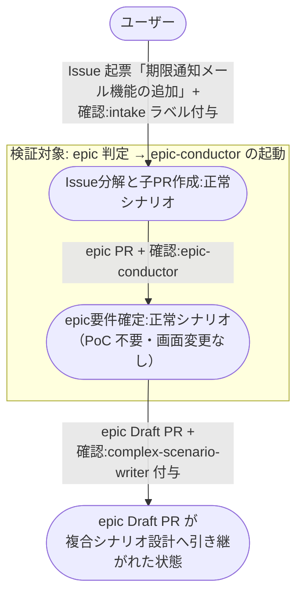

# Issue起票からepic起動まで

ユーザーが起票した新規機能相当の Issue が intake で `epic` 判定され、epic-conductor が要件を確定して epic Draft PR を作り、複合シナリオ設計へ引き継がれるまでの複合ユースケース。

**E2E テストの位置付け:** 機能開発の入口となる最頻経路。
epic 以降の工程は他の複合ユースケースが受け持つため、epic Draft PR の作成で終端する。

- 対応テストファイル: `tests/e2e/複合ユースケース/test_Issue起票からepic起動まで.py`

## 正常シナリオ

### セットアップ

| セットアップ | 説明 | 補足 |
| --- | --- | --- |
| Mock | なし（実環境で実行） | - |
| sandbox リポ存在 | `shuhei1101/ai-monitor-e2e` が存在 | Pages 有効 |
| ai-monitor プラグイン | marketplace 経由でインストール済みかつ最新版に更新済み | モニターが tmux 内で `claude` を起動するのが前提 |
| ラベル定義 | `AI_MONITOR_LABEL_*` 全て作成済み | - |
| intake Issue | ユーザー起票の Issue に `確認:intake-issue-triager` 付与済み | 本文は epic 1 件に分解される規模の新規機能で書く |
| ユーザー回答（分解案） | intake の分解案を修正なしで承認する | 分解結果を epic 1 件に決定的に誘導 |
| ユーザー回答（要件確定） | epic の応答ループで PoC 不要・画面変更なしと回答する | 分岐を決定的に誘発 |
| ai-monitor 起動 | モニターが sandbox を polling 中 | - |
| ユーザーログイン | write 権限あり | - |

### フロー

### 期待値

- intake Issue に紐づく epic PR が作成され、`layer:epic` + `type:*` が付与されている
- intake Issue の本文がユーザー起票時のまま書き換わっていない
- epic PR 本文に `## 概要` / `## 背景` / `## 単一ユースケース` / `## 複合ユースケース` が揃い、単一ユースケースの `対応 story` 列が全行 `未作成`
- epic Draft PR（base=master・本文は `## 紐づく Issue` のみ）が作成され、`確認:complex-scenario-writer` が付与されている
- epic PR の番号が epic-conductor セッションの監視面（モニターの台帳）に登録されている
- intake Issue と epic PR がともに open のまま（`確認:*` はどちらにも残っていない）
- 両 Issue の自分宛コメントが全て Resolve 済み

## 異常シナリオ

なし
